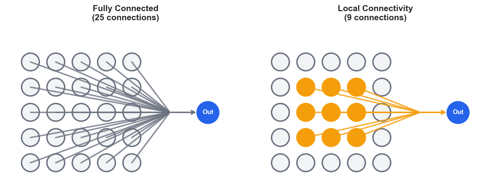
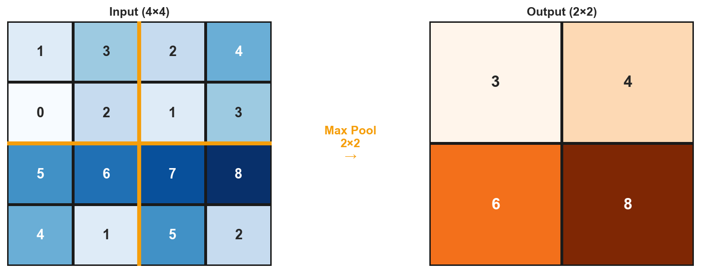

# Deep Dive: CNN Architecture

*Extends Module 7: Computer Vision & CNNs*

!!! note "Supplemental reading"

    Optional unless explicitly assigned in your section. Quiz and assignment content draws from the parent module, not from Deep Dives.


---

## Introduction

In Module 7, we learned that CNNs are far more parameter-efficient than fully connected networks for images. But *why*? What makes convolution so special?

This deep dive explores the three principles that make CNNs work, walks through the convolution operation with concrete numbers, and shows exactly where parameters live in PyTorch's `nn.Conv2d`.

By the end, you'll understand not just *how* CNNs work, but *why* they're designed the way they are.

CNNs were discovered early (LeNet, 1989) but required computational resources that did not yet exist. The 2012 AlexNet breakthrough combined sufficient data (ImageNet), compute (GPUs), and architecture improvements (ReLU, dropout). Before that, CNNs were impractical; fully connected networks and hand-crafted features (SIFT, HOG) were what people could actually train.

---

## The Parameter Explosion Problem

To appreciate why CNNs exist, you first need to understand the scale of the problem that fully connected networks face when applied to images.

### Why Fully Connected Networks Fail for Images

Consider a standard image classification task: classifying a 224 × 224 RGB image into 1000 categories. If we flatten the image and connect to a hidden layer:

```
Input pixels: 224 × 224 × 3 = 150,528 features
Hidden layer: 1,000 neurons
Parameters: 150,528 × 1,000 = 150,528,000 (just the first layer!)
```

That amounts to 150 million parameters for a single layer.

A typical network might have several hidden layers:

| Layer | Input Size | Output Size | Parameters |
|-------|-----------|-------------|------------|
| FC1 | 150,528 | 4,096 | 616,566,784 |
| FC2 | 4,096 | 4,096 | 16,781,312 |
| FC3 | 4,096 | 1,000 | 4,097,000 |
| **Total** | | | **637,445,096** |

That totals 637 million parameters just to process a 224x224 image.

### The Problems This Creates

This many parameters causes four serious problems. First, memory becomes a bottleneck: each parameter occupies 4 bytes in float32, so 637 million parameters require 2.5 GB just for weights, plus gradients and optimizer states push memory usage past 10 GB. Second, overfitting becomes nearly inevitable because there are far more parameters than training examples; ImageNet has 1.2 million training images, and 637 million parameters would overfit severely. Third, computation is expensive because each forward pass multiplies huge matrices, requiring billions of multiply-add operations per image. Finally, the network has no spatial understanding: pixel (0,0) and pixel (223,223) are treated as equally "distant," so a cat in the corner looks completely different from a cat in the center.

!!! example "Numerical Example: FC vs CNN Parameter Comparison"

    ```python
    # Fully connected layer for 224×224×3 image
    input_size = 224 * 224 * 3  # 150,528
    fc_hidden = 1000
    fc_params = input_size * fc_hidden + fc_hidden  # 150,529,000

    # Convolutional layer: 64 filters, 3×3 kernel
    conv_params = (3 * 3 * 3 * 64) + 64  # 1,792

    print(f"FC layer (1000 neurons): {fc_params:,} parameters")
    print(f"Conv layer (64 3×3):     {conv_params:,} parameters")
    print(f"Ratio: {fc_params / conv_params:,.0f}×")
    ```

    **Output:**

    ```
    FC layer (1000 neurons): 150,529,000 parameters
    Conv layer (64 3×3):     1,792 parameters
    Ratio: 84,001×
    ```

    **Interpretation:** A single FC layer needs 84,000× more parameters than a conv layer for the same input. This is why FC networks are impractical for images—even one layer would have 150 million parameters.

    *Source: `computations/deep_dive_cnn_examples.py` — `demo_fc_vs_cnn_parameters()`*


---

## The Three Principles That Save Parameters

CNNs achieve over 99.9% parameter reduction through three key principles.

### Principle 1: Local Connectivity (Sparse Connections)

The core insight is that nearby pixels are related while distant pixels are less so. Instead of connecting every input pixel to every hidden neuron, each neuron only "sees" a small local region called the **receptive field**.

To illustrate the difference, consider a connectivity comparison. In a fully connected layer:
```
Every input pixel → Every hidden neuron
Connections: 150,528 × 1,000 = 150,528,000
```

In a locally connected layer with a 3x3 receptive field:
```
Each hidden neuron sees only 3×3×3 = 27 input values
Connections per neuron: 27
```



The diagram's left side shows fully connected architecture where all 25 input pixels (5×5 grid) connect to a single output neuron—25 connections total. The right side shows local connectivity where only the 9 orange pixels (3×3 region) connect to the output—a 64% reduction in connections. The orange highlighting shows the *receptive field*: the region of input that influences this particular output. In a fully connected layer, every output "sees" every input. In a locally connected layer, each output only "sees" its local neighborhood. This mirrors how your eye works—you focus on a small region at a time, not the entire visual field simultaneously.

This mirrors the visual cortex: neurons in V1 respond to small regions of the visual field, a discovery for which Hubel & Wiesel won the Nobel Prize. CNNs were directly inspired by this neuroscience finding. Other brain-inspired ideas include the neuron model (McCulloch-Pitts), ReLU (firing thresholds), dropout (neural noise), and attention (selective focus). Caution is warranted, however: backpropagation has no clear biological analog, and transformers are not obviously brain-like.

### Principle 2: Weight Sharing (Translation Equivariance)

The core insight is that the same pattern can appear anywhere in an image. A "vertical edge detector" should work whether the edge is in the top-left or bottom-right. Why learn separate detectors for each position?

Without weight sharing, in a locally connected layer with different weights at each position:

```
For 224×224 output with 3×3 filters:
Positions: 224 × 224 = 50,176
Parameters per position: 3 × 3 × 3 = 27
Total: 50,176 × 27 = 1,354,752 parameters (per filter)
```

That is still a large number. With weight sharing, the same 3x3x3 filter is applied at every position:

```
Parameters: 3 × 3 × 3 + 1 (bias) = 28 parameters (per filter)
```

That represents a 50,000x reduction.

> A helpful analogy is the cookie cutter. Think of a convolutional filter as a cookie cutter. Without weight sharing, you'd need to design 50,176 different cookie cutters—one custom shape for every position on your baking sheet. With weight sharing, you use one cookie cutter and just move it around. The cookie cutter (filter weights) is the same everywhere; only its position changes. This is why a vertical edge detector learned in the top-left corner automatically works in the bottom-right corner—it's literally the same detector, applied in a different location.

!!! example "Numerical Example: Weight Sharing Savings"

    ```python
    # Setup: 224×224 RGB image, 64 filters, 3×3 kernel
    positions = 222 * 222  # output positions (no padding)
    params_per_position = 3 * 3 * 3  # 27 weights per 3×3×3 filter

    # Locally connected: different weights at each position
    locally_connected = positions * params_per_position * 64
    # = 85,162,752 parameters

    # Convolutional: same weights everywhere
    convolutional = params_per_position * 64
    # = 1,728 parameters

    print(f"Locally connected: {locally_connected:,}")
    print(f"Convolutional:     {convolutional:,}")
    print(f"Reduction: {locally_connected / convolutional:,.0f}×")
    ```

    **Output:**

    ```
    Locally connected: 85,162,752
    Convolutional:     1,728
    Reduction: 49,284×
    ```

    **Interpretation:** Weight sharing reduces parameters by nearly 50,000×. The same 27 weights (one 3×3×3 filter) are reused at 49,284 different positions—like using one cookie cutter 49,284 times instead of making 49,284 different cookie cutters.

    *Source: `computations/deep_dive_cnn_examples.py` — `demo_weight_sharing_savings()`*


#### Translation Equivariance

Weight sharing enables a property called translation equivariance: if you shift the input, the output shifts by the same amount:

$$f(\text{shift}(x)) = \text{shift}(f(x))$$

> To see what this means in practice, suppose your network learned a vertical edge detector. If there's a vertical edge at pixel position (10, 10), the detector fires and produces a strong activation at output position (10, 10). Now shift the entire image 100 pixels to the right. The edge is now at (10, 110). Because the same filter weights are used everywhere, the detector fires at output position (10, 110)—the activation "moved with" the edge. This is translation equivariance: the output shifts when the input shifts. The network doesn't need to learn separate edge detectors for 50,000 different positions; one detector works everywhere.

In practical terms, this means a cat detector fires whether the cat is at position (10, 10) or (200, 200), because the same learned weights are applied everywhere.

### Principle 3: Hierarchical Feature Learning

The core insight is that complex features are built from simpler ones. Through multiple layers, CNNs build a hierarchy:

| Layer Depth | Receptive Field | What's Learned | Example |
|-------------|-----------------|----------------|---------|
| Layer 1 | 3×3 | Edges, colors | Horizontal line, blue patch |
| Layer 2 | 5×5 | Textures, corners | Fur texture, eye corner |
| Layer 3 | 7×7 | Parts | Eye, ear, nose |
| Layer 4 | 9×9 | Objects | Cat face, dog face |
| Layer 5 | 11×11 | Scenes | Cat on couch |

#### Effective Receptive Field Calculation

For a network with L layers of K×K convolutions:

$$\text{Receptive Field} = 1 + L \times (K - 1)$$

For example, with 3x3 convolutions the receptive field grows as follows: after 1 layer it is 1 + 1x2 = 3x3, after 2 layers it is 1 + 2x2 = 5x5, after 5 layers it is 1 + 5x2 = 11x11, and after 10 layers it is 1 + 10x2 = 21x21. With pooling (stride 2), the receptive field grows much faster because each pooling layer doubles the effective receptive field.

> Receptive field size matters because it determines what each layer "sees." Layer 1 neurons have a 3×3 receptive field—they detect tiny patterns like single edges or color gradients. By layer 5, neurons have an 11×11 receptive field—now they can recognize textures, corners, and simple shapes. By layer 10, with pooling, neurons may have a 100+ pixel receptive field—enough to see an entire eye, nose, or ear. This is why depth matters: shallow networks can only detect local patterns; deep networks can recognize objects by combining those patterns. A single 3×3 filter can never see a cat; but many 3×3 filters stacked together eventually can.

!!! example "Numerical Example: Receptive Field Growth"

    ```python
    # RF formula (no pooling): RF = 1 + L × (K - 1)
    # Using 3×3 convolutions (K=3)

    for layers in [1, 2, 5, 10, 20]:
        rf = 1 + layers * (3 - 1)
        print(f"After {layers:2} layers: RF = {rf}×{rf}")
    ```

    **Output:**

    ```
    After  1 layers: RF = 3×3
    After  2 layers: RF = 5×5
    After  5 layers: RF = 11×11
    After 10 layers: RF = 21×21
    After 20 layers: RF = 41×41
    ```

    **Interpretation:** Each 3×3 layer adds 2 pixels to the receptive field. After 5 layers, a neuron can "see" an 11×11 region of the input—enough to detect texture patterns. After 20 layers (without pooling), RF reaches 41×41. With pooling, RF grows much faster—a typical VGG network reaches 200+ pixel receptive fields.

    *Source: `computations/deep_dive_cnn_examples.py` — `demo_receptive_field_growth()`*


The calculation above is without pooling — practical networks reach 200+ pixel receptive fields via pooling. More importantly, the network does not need every neuron to see the whole object. Hierarchical structure means different neurons specialize at different scales, and global average pooling aggregates information across all positions, giving the classifier access to features detected anywhere.

---

## The Savings Breakdown

Let's compare a CNN to an equivalent fully connected network:

### CNN Architecture (VGG-16 style, simplified)

The following table traces parameter counts through a simplified VGG-16-style architecture.

| Layer | Output Shape | Parameters | Calculation |
|-------|-------------|------------|-------------|
| Input | 224×224×3 | 0 | - |
| Conv1 (3×3, 64) | 224×224×64 | 1,792 | 3×3×3×64 + 64 |
| Conv2 (3×3, 64) | 224×224×64 | 36,928 | 3×3×64×64 + 64 |
| MaxPool | 112×112×64 | 0 | - |
| ... | ... | ... | ... |
| Flatten | 25,088 | 0 | 7×7×512 |
| FC1 | 4,096 | 102,764,544 | 25,088×4,096 + 4,096 |
| **Conv layers total** | | **~9.5M** | |
| **FC layers total** | | **~123M** | |

The convolution layers have roughly 9.5 million parameters, compared to potential trillions for equivalent fully connected layers. The table below summarizes the savings each principle contributes.

| Principle | Savings Factor |
|-----------|----------------|
| Local Connectivity | ~150,000× (150,528 → ~27 connections) |
| Weight Sharing | ~50,000× (one filter for all positions) |
| Combined | **~84,000×** (see FC vs CNN comparison above) |

---

## Why Convolution Works for Images

Convolution succeeds for images because of three statistical properties that natural images share.

> Finding a cat in an image illustrates all three CNN design principles in action. Spatial locality means you only need a few adjacent pixels to detect a cat's whisker—the whisker is defined by a local pattern of dark lines on a lighter background, and distant pixels don't matter. Stationarity means whiskers look similar whether they're on the left or right side of the image, and fur texture repeats across the cat's body, so you don't need to learn "left-side fur" and "right-side fur" separately. Compositionality means whiskers + nose + eyes combine into a face, and face + ears + body combine into a cat—complex objects are built from simpler parts as early layers detect edges, middle layers combine edges into parts, and deep layers recognize the whole cat.
>
> CNNs succeed because images naturally have these three properties. When these properties don't hold (e.g., satellite imagery where "up" means north), CNNs struggle.

### Property 1: Spatial Locality

Nearby pixels are statistically related. Adjacent pixels often have similar values in smooth regions, edges are local phenomena arising from sharp transitions between neighbors, and texture is defined by local patterns. This justifies local connectivity: most useful information is local.

### Property 2: Stationarity

The same patterns appear throughout the image: edges can occur anywhere, textures repeat across regions, and objects can appear at any location. This justifies weight sharing: one detector works everywhere.

### Property 3: Compositionality

Complex patterns are built from simpler ones. Eyes are made of edges, curves, and colors; faces are made of eyes, nose, and mouth; and scenes are made of objects. This justifies hierarchical layers: the network builds complexity gradually.

### When Convolution Doesn't Work Well

CNNs struggle when these properties do not hold. First, when absolute position matters — as in satellite imagery where "top" means north or document layouts where the header is always at the top — the translation equivariance assumption breaks down; adding positional encoding or coordinates can help. Second, when global context is needed immediately, such as recognizing objects from single distinctive features or reasoning about an entire image at once, local receptive fields are insufficient; attention mechanisms and Vision Transformers address this limitation. Third, CNNs assume grid-structured input and do not naturally handle graphs, point clouds, or irregular meshes; graph neural networks and PointNet are designed for these data types instead.

---

## The Convolution Operation In-Depth

Let's trace through a convolution with concrete numbers.

### Setup

We will work with the following dimensions throughout this example. The input is 1 image with 3 channels (RGB) at 8×8 pixels, giving shape `(1, 3, 8, 8)` for (batch, channels, height, width). The filter is a single 3×3 kernel with shape `(1, 3, 3, 3)` for (out_channels, in_channels, kernel_h, kernel_w). The output is 1 feature map at 6×6, with shape `(1, 1, 6, 6)` for (batch, out_channels, height, width).

### The Sliding Window Process

The convolution computes one output value at a time by sliding the filter across the input.

> In plain terms, at each output position the filter performs three steps:
> 1. **Multiply**: Overlay the filter on the input patch and multiply each filter weight by the corresponding input value
> 2. **Sum**: Add up all those products across all channels (R, G, B) and all spatial positions (3×3)
> 3. **Slide**: Move to the next position and repeat
>
> The result is a single number at each output location. This number is large and positive when the input patch "matches" the filter pattern, near zero when there's no match, and large and negative when the pattern is inverted.

For each position (i, j) in the output:

$$\text{output}[0, 0, i, j] = \sum_{c=0}^{2} \sum_{m=0}^{2} \sum_{n=0}^{2} \text{filter}[0, c, m, n] \times \text{input}[0, c, i+m, j+n] + \text{bias}[0]$$

### Concrete Example

Let's compute one output value at position (0, 0):

The input patch covers the top-left 3×3 of each channel:
```
Red channel:        Green channel:      Blue channel:
┌─────────────┐     ┌─────────────┐     ┌─────────────┐
│ 0.1 0.2 0.3 │     │ 0.4 0.5 0.6 │     │ 0.7 0.8 0.9 │
│ 0.2 0.3 0.4 │     │ 0.5 0.6 0.7 │     │ 0.8 0.9 1.0 │
│ 0.3 0.4 0.5 │     │ 0.6 0.7 0.8 │     │ 0.9 1.0 1.1 │
└─────────────┘     └─────────────┘     └─────────────┘
```

The filter weights follow a Sobel-like vertical edge detector pattern:
```
Red weights:        Green weights:      Blue weights:
┌─────────────┐     ┌─────────────┐     ┌─────────────┐
│ 1   0  -1   │     │ 1   0  -1   │     │ 1   0  -1   │
│ 2   0  -2   │     │ 2   0  -2   │     │ 2   0  -2   │
│ 1   0  -1   │     │ 1   0  -1   │     │ 1   0  -1   │
└─────────────┘     └─────────────┘     └─────────────┘
```

The computation proceeds as follows:
```python
# Red channel contribution
red = (0.1×1 + 0.2×0 + 0.3×(-1) +
       0.2×2 + 0.3×0 + 0.4×(-2) +
       0.3×1 + 0.4×0 + 0.5×(-1))
    = 0.1 - 0.3 + 0.4 - 0.8 + 0.3 - 0.5
    = -0.8

# Similarly for green and blue...
# Total (sum across channels) + bias
output[0,0,0,0] = red + green + blue + bias = -2.4
```

The filter slides across all valid positions to fill the 6×6 output. Each position produces one number through the same multiply-and-sum process shown above, so the complete output is a 6x6 grid of activation values.

!!! example "Numerical Example: Convolution Verification"

    ```python
    import numpy as np
    import torch.nn as nn

    # Input patch (from document)
    red = np.array([[0.1, 0.2, 0.3], [0.2, 0.3, 0.4], [0.3, 0.4, 0.5]])
    green = np.array([[0.4, 0.5, 0.6], [0.5, 0.6, 0.7], [0.6, 0.7, 0.8]])
    blue = np.array([[0.7, 0.8, 0.9], [0.8, 0.9, 1.0], [0.9, 1.0, 1.1]])

    # Sobel vertical edge detector
    sobel = np.array([[1, 0, -1], [2, 0, -2], [1, 0, -1]])

    # Manual computation
    red_contrib = np.sum(red * sobel)    # -0.8
    green_contrib = np.sum(green * sobel) # -0.8
    blue_contrib = np.sum(blue * sobel)   # -0.8
    total = red_contrib + green_contrib + blue_contrib  # -2.4

    print(f"Red channel:   {red_contrib:.1f}")
    print(f"Green channel: {green_contrib:.1f}")
    print(f"Blue channel:  {blue_contrib:.1f}")
    print(f"Total:         {total:.1f}")
    ```

    **Output:**

    ```
    Red channel:   -0.8
    Green channel: -0.8
    Blue channel:  -0.8
    Total:         -2.4
    ```

    **Interpretation:** The Sobel filter produces -0.8 for each channel, totaling -2.4. A negative value indicates the input patch has the *opposite* of the pattern the filter detects (here: a leftward gradient instead of rightward). PyTorch's `nn.Conv2d` produces the identical result, confirming our manual calculation.

    *Source: `computations/deep_dive_cnn_examples.py` — `demo_convolution_verification()`*


### Output Size Formula

The spatial dimensions of the output depend on the kernel size, padding, and stride according to the following formula:

$$\text{output\_size} = \left\lfloor \frac{\text{input\_size} - \text{kernel\_size} + 2 \times \text{padding}}{\text{stride}} \right\rfloor + 1$$

Applying this formula to the 8x8 input with a 3x3 kernel, no padding, and stride 1 confirms the 6x6 output size:

$$\frac{8 - 3 + 2 \times 0}{1} + 1 = 6$$

!!! example "Numerical Example: Output Size Formula"

    ```python
    # Formula: output = floor((input - kernel + 2×padding) / stride) + 1

    configs = [
        (8, 3, 0, 1, "Basic (from document)"),
        (224, 3, 1, 1, "Same padding"),
        (224, 3, 0, 1, "No padding"),
        (224, 3, 0, 2, "Stride 2"),
        (224, 7, 3, 2, "7×7 kernel (AlexNet)"),
    ]

    for inp, k, p, s, desc in configs:
        output = (inp - k + 2*p) // s + 1
        print(f"{desc:<25} ({inp}-{k}+2×{p})/{s}+1 = {output}")
    ```

    **Output:**

    ```
    Basic (from document)     (8-3+2×0)/1+1 = 6
    Same padding              (224-3+2×1)/1+1 = 224
    No padding                (224-3+2×0)/1+1 = 222
    Stride 2                  (224-3+2×0)/2+1 = 111
    7×7 kernel (AlexNet)      (224-7+2×3)/2+1 = 112
    ```

    **Interpretation:** With padding=1 and stride=1, output equals input size ("same" padding). Without padding, each layer shrinks the output by (kernel-1) pixels. Stride 2 halves spatial dimensions—often used instead of pooling. The 7×7 kernel with stride 2 is AlexNet's first layer, reducing 224→112.

    *Source: `computations/deep_dive_cnn_examples.py` — `demo_output_size_formula()`*


---

## Annotated nn.Conv2d Walkthrough

The following annotated code shows how PyTorch's `nn.Conv2d` maps to the concepts discussed above, and where every parameter lives.

```python
import torch
import torch.nn as nn

# Create a convolutional layer
conv = nn.Conv2d(
    in_channels=3,      # RGB input
    out_channels=64,    # Number of filters (feature maps)
    kernel_size=3,      # 3×3 filter
    stride=1,           # Move 1 pixel at a time
    padding=1,          # Add 1 pixel border of zeros
    bias=True           # Include bias term
)

# WHERE THE PARAMETERS LIVE
print(f"Weight shape: {conv.weight.shape}")
# Output: torch.Size([64, 3, 3, 3])
# Interpretation: [out_channels, in_channels, kernel_height, kernel_width]
# - 64 different filters
# - Each filter has 3 channels (one for R, G, B)
# - Each channel is 3×3

print(f"Weight parameters: {conv.weight.numel()}")
# Output: 1728
# Calculation: 64 × 3 × 3 × 3 = 1,728

print(f"Bias shape: {conv.bias.shape}")
# Output: torch.Size([64])
# One bias per output channel (filter)

print(f"Total parameters: {sum(p.numel() for p in conv.parameters())}")
# Output: 1792
# = 1,728 (weights) + 64 (biases)
```

### Understanding the Weight Tensor

You can index into the weight tensor to inspect individual filters and their per-channel components.

```python
# Access filter 0 (first of 64 filters)
filter_0 = conv.weight[0]  # Shape: [3, 3, 3]

# Filter 0's red channel weights
filter_0_red = conv.weight[0, 0]  # Shape: [3, 3]

# Filter 0's green channel weights
filter_0_green = conv.weight[0, 1]  # Shape: [3, 3]

# Filter 0's blue channel weights
filter_0_blue = conv.weight[0, 2]  # Shape: [3, 3]
```

### Visualizing Parameter Sharing

The following code illustrates how the same filter weights are reused across every spatial position.

```python
# The same weights are used for every spatial position
# This is what makes CNNs parameter-efficient

# These two output positions use the SAME filter weights:
# y[0, 0, 0, 0] uses conv.weight[0] applied at position (0,0)
# y[0, 0, 5, 5] uses conv.weight[0] applied at position (5,5)

# Without weight sharing (padding=1, so output is 8×8), we'd need:
# 64 filters × (8×8) positions × (3×3×3) weights = 64 × 64 × 27 = 110,592 parameters
# With weight sharing:
# 64 filters × (3×3×3) weights = 1,728 parameters
# That's a 64× reduction!
```

---

## Pooling: Trading Resolution for Invariance

Pooling layers reduce spatial dimensions while preserving the most salient information, creating a trade-off between spatial precision and computational efficiency.

### What Max Pooling Does

After convolution extracts features, pooling reduces the spatial dimensions. Max pooling takes the maximum value in each patch:



The diagram's left side shows a 4×4 input grid with numerical values; the orange lines divide it into four 2×2 regions. The right side shows the 2×2 output after max pooling. For each 2×2 region, we take the maximum value: the top-left region contains [1,3,0,2] so the max is 3; top-right [2,4,1,3] gives max 4; bottom-left [5,6,4,1] gives max 6; bottom-right [7,8,5,2] gives max 8. Notice the output is exactly half the size in each dimension (4×4 → 2×2), reducing the data by 4x. The color intensity in the output corresponds to the value magnitude.

### Why Max Pooling Works

Max pooling provides four benefits. It introduces (i) translation invariance, because the feature's exact position within the pooling region does not matter, (ii) dimensionality reduction, because it halves spatial dimensions and reduces computation, (iii) an increased receptive field, because each pooled output sees a larger input region, and (iv) slight noise robustness, because small perturbations do not change the maximum value.

> Each benefit is worth understanding concretely. Translation invariance means that if an edge is at pixel (10,10) or (11,11), both fall in the same pooling region—the output is the same, making the network less sensitive to exact feature positions. Dimensionality reduction means a 224×224 feature map becomes 112×112 after one pool—4x fewer values to process in subsequent layers. The increased receptive field arises because each output pixel in the pooled layer corresponds to a 2×2 region of input, so after pooling, a 3×3 convolution on the pooled output effectively "sees" a 6×6 region of the original input. Finally, noise robustness holds because if pixel values are [4.9, 5.0, 5.1, 5.2], the max is 5.2; add small noise to get [4.8, 5.1, 5.0, 5.3], and the max is 5.3—the change is minimal compared to the signal.

### Pooling vs Stride Trade-off

Modern networks often use strided convolutions instead of pooling. The following table compares the three common approaches to spatial downsampling. Strided convolution can learn what information to preserve, but it requires more parameters than the parameter-free alternatives.

| Approach | Operation | Parameters | Learned |
|----------|-----------|------------|---------|
| Max Pool | Take max | 0 | No |
| Avg Pool | Take mean | 0 | No |
| Strided Conv | Conv with stride 2 | kernel² × in_channels × out_channels | Yes |

!!! example "Numerical Example: Pooling Dimension Reduction"

    ```python
    import torch
    import torch.nn as nn

    x = torch.randn(1, 64, 224, 224)  # Starting: 224×224×64
    pool = nn.MaxPool2d(kernel_size=2, stride=2)

    print(f"Input:       {x.shape}")
    for i in range(5):
        x = pool(x)
        print(f"After pool {i+1}: {x.shape}")
    ```

    **Output:**

    ```
    Input:       torch.Size([1, 64, 224, 224])
    After pool 1: torch.Size([1, 64, 112, 112])
    After pool 2: torch.Size([1, 64, 56, 56])
    After pool 3: torch.Size([1, 64, 28, 28])
    After pool 4: torch.Size([1, 64, 14, 14])
    After pool 5: torch.Size([1, 64, 7, 7])
    ```

    **Interpretation:** Each 2×2 max pool halves spatial dimensions: 224→112→56→28→14→7. After 5 pooling layers, we've reduced 224×224=50,176 pixels to 7×7=49 pixels—a 1,024× reduction in spatial data. The channel count (64) stays the same. This is why VGG-style networks can have huge 7×7×512 feature maps at the end: the spatial dimensions have been aggressively reduced.

    *Source: `computations/deep_dive_cnn_examples.py` — `demo_pooling_dimensions()`*


---

## Common Misconceptions

The following table corrects several widely held but inaccurate beliefs about CNNs.

| Misconception | Reality |
|--------------|---------|
| "CNNs learn the filters by hand" | Filters are learned automatically through backpropagation, not designed by humans |
| "More filters is always better" | Diminishing returns; excess filters learn redundant or noise patterns |
| "CNNs work on any image task" | CNNs assume spatial locality and translation equivariance; they struggle when these don't hold |
| "The first layer must have 3 input channels" | Input channels match your data: 1 for grayscale, 3 for RGB, any number for multi-spectral |
| "Pooling is necessary" | Modern architectures often use strided convolutions instead |
| "Deeper is always better" | Without residual connections, very deep CNNs fail to train |

---

## Reflection Questions

1. If we didn't share weights across positions, how many parameters would a 3×3 conv layer have for a 224×224 image with 64 filters?

2. Why might a CNN struggle with satellite imagery where "up" always means north?

3. How does the receptive field grow through layers? Why does this matter?

4. A 7×7 conv has 49 weights per channel. Three stacked 3×3 convolutions have 3 × (3 × 3) = 27 weights but achieve the same 7×7 receptive field. What's the trade-off?

5. What happens if you set padding=0 with a 3×3 kernel on a 224×224 input?

6. Why do we typically increase the number of filters as we go deeper while decreasing spatial size?

---

## Practice Problems

1. Calculate parameters for VGG-16 from scratch

2. Compute output size for: input 64×64, kernel 5×5, stride 2, padding 2

3. Design a CNN for 64×64 grayscale images with target receptive field of 32×32

---

## Summary

CNNs achieve dramatic parameter efficiency through three complementary principles. Local connectivity reduces connections from millions to dozens per neuron, weight sharing reduces parameters by 50,000x for a single filter, and hierarchical learning builds complex features from simple ones. These principles work because natural images exhibit spatial locality, stationarity, and compositionality — properties that make local, shared, and layered processing a natural fit. The combined savings is on the order of 84,000x fewer parameters compared to fully connected alternatives. Understanding where these parameters live in practice helps you reason about model capacity and make informed architecture design decisions.
