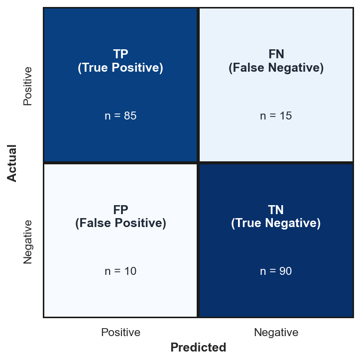
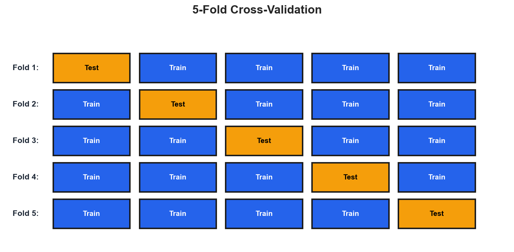
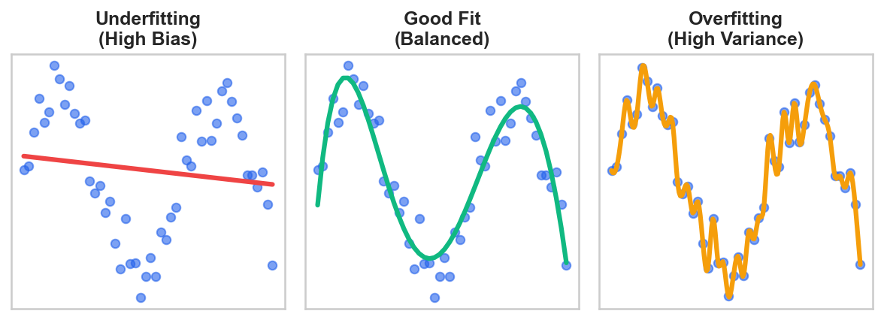

# Deep Dive: Model Evaluation and Validation

*Extends Module 1: Foundations of Machine Learning*

!!! note "Supplemental reading"

    Optional unless explicitly assigned in your section. Quiz and assignment content draws from the parent module, not from Deep Dives.


---

## Introduction

### Why Evaluation Matters

How do we know if a model is actually good? This seems straightforward, but it's actually subtle. The answer depends on three considerations: good on *what metric* (different metrics capture different aspects of performance), good compared to *what baseline* (85% accuracy might be great or terrible depending on context), and whether it will work on *new, unseen data* (performance on training data is meaningless if it doesn't generalize).

Always compare to a **meaningful baseline**: for regression, predict the mean (any positive R² on the training set beats this, though test-set R² can be negative if the model generalizes poorly); for classification, predict the majority class (90% accuracy from always predicting the majority in a 90/10 dataset). In time series, "predict yesterday's value" is a common baseline. If your model doesn't substantially beat these simple baselines, either the problem is harder than expected or something is wrong with your setup.

### Regression Metrics

#### Mean Squared Error (MSE)

$$MSE = \frac{1}{n}\sum_{i=1}^{n}(y_i - \hat{y}_i)^2$$

MSE penalizes large errors heavily because of the squaring, but its units are squared (e.g., dollars-squared), making it hard to interpret directly.

#### Root Mean Squared Error (RMSE)

$$RMSE = \sqrt{MSE}$$

RMSE is the most common regression metric because it shares the same units as the target variable, making it directly interpretable. It represents a typical error magnitude, with large errors weighted more heavily than small ones (unlike MAE, which weights all errors equally).

#### Mean Absolute Error (MAE)

$$MAE = \frac{1}{n}\sum_{i=1}^{n}|y_i - \hat{y}_i|$$

MAE applies a linear penalty to errors, making it less sensitive to outliers than RMSE.

#### R-squared (Coefficient of Determination)

$$R^2 = 1 - \frac{\sum(y_i - \hat{y}_i)^2}{\sum(y_i - \bar{y})^2}$$

R-squared measures the proportion of variance explained by the model. A value of 1 indicates a perfect fit, 0 means the model is no better than predicting the mean, and negative values indicate the model performs worse than simply predicting the mean.

#### Mean Absolute Percentage Error (MAPE)

$$MAPE = \frac{100\%}{n}\sum_{i=1}^{n}\left|\frac{y_i - \hat{y}_i}{y_i}\right|$$

MAPE is scale-independent, expressing error as a percentage, which makes it easy for stakeholders to grasp ("predictions are off by 5% on average"). It is undefined when y = 0.

The following table summarizes when to use each metric.

| Metric | Use When |
|--------|----------|
| RMSE | Default choice, care about large errors |
| MAE | Outliers in target, want robustness |
| R² | Comparing models, explaining to stakeholders |
| MAPE | Need percentage interpretation, values not near zero |

When communicating with stakeholders, translate metrics into business language: RMSE becomes "predictions are off by $15,000 on average," MAPE becomes "predictions are typically within 5%," and R² becomes "our model captures 75% of the predictive signal." The best practice is to connect these numbers to business outcomes—"we'll avoid $200K in overstock costs annually." Stakeholders care about business impact, not statistical properties.

### Classification Metrics

Everything starts with the **confusion matrix**:



This diagram shows results from a fraud detection model evaluated on 200 transactions. The rows represent *actual* outcomes (was it really fraud?), and the columns represent what the model *predicted*. Reading each cell:

| Cell | Count | Meaning (Fraud Example) |
|------|-------|-------------------------|
| **TP = 85** | Top-left (dark) | Model said "fraud" and it was fraud. Caught it! |
| **FN = 15** | Top-right (dark) | Model said "not fraud" but it was fraud. Missed it—costly. |
| **FP = 10** | Bottom-left (white) | Model said "fraud" but it wasn't. False alarm—investigation wasted. |
| **TN = 90** | Bottom-right (dark) | Model said "not fraud" and it wasn't. Correctly ignored. |

!!! note "Note on confusion matrix layout"

    The layout above places the positive class (fraud) in the top row with TP in the top-left. Be aware that scikit-learn's `confusion_matrix()` uses a different default convention: it places TN in the top-left and TP in the bottom-right (rows = actual, columns = predicted, with class 0 first). Always check which convention is being used when reading confusion matrices.

From these numbers, we can calculate key metrics. The total actual fraud cases equal TP + FN = 85 + 15 = 100 (the top row), and the total actual legitimate transactions equal FP + TN = 10 + 90 = 100 (the bottom row). **Precision** is TP / (TP + FP) = 85 / 95 = **89.5%**, meaning "when we flag fraud, we're right 89.5% of the time." **Recall** is TP / (TP + FN) = 85 / 100 = **85%**, meaning "we catch 85% of actual fraud." **Accuracy** is (TP + TN) / Total = 175 / 200 = **87.5%**, meaning "overall, 87.5% of predictions are correct."

Notice the tradeoff: this model has high precision (few false alarms) but misses 15% of fraud cases. Whether that's acceptable depends on business costs—how much does missed fraud cost versus investigation costs?

!!! example "Numerical Example: Computing Metrics from Confusion Matrix Values"

    ```python
    # Given confusion matrix values
    TP, FN = 85, 15  # Top row: actual positives
    FP, TN = 10, 90  # Bottom row: actual negatives

    # Calculate metrics
    precision = TP / (TP + FP)
    recall = TP / (TP + FN)
    accuracy = (TP + TN) / (TP + FN + FP + TN)
    f1 = 2 * (precision * recall) / (precision + recall)

    print(f"Precision: {precision:.1%}")
    print(f"Recall:    {recall:.1%}")
    print(f"Accuracy:  {accuracy:.1%}")
    print(f"F1 Score:  {f1:.1%}")
    ```

    **Output:**

    ```
    Precision: 89.5%
    Recall:    85.0%
    Accuracy:  87.5%
    F1 Score:  87.2%
    ```

    **Interpretation:** These calculations match our manual work above. In practice, use `sklearn.metrics.classification_report(y_test, y_pred)` to compute all metrics at once.

    *Source: `computations/deep_dive_evaluation_examples.py` — `demo_confusion_matrix_metrics()`*


The four cells have standard names. A **True Positive (TP)** is a correct positive prediction—the model predicted positive and the actual value was positive. A **True Negative (TN)** is a correct negative prediction. A **False Positive (FP)**, also called a Type I error, is a false alarm—the model predicted positive but the actual value was negative. A **False Negative (FN)**, also called a Type II error, is a miss—the model predicted negative but the actual value was positive.

#### Accuracy

$$Accuracy = \frac{TP + TN}{TP + TN + FP + FN}$$

Accuracy measures the proportion of correct predictions overall. It can be misleading with imbalanced classes: a model predicting "not fraud" for everything achieves 99% accuracy if 99% of transactions are legitimate, yet it catches zero fraud.

#### Precision

$$Precision = \frac{TP}{TP + FP}$$

Precision answers the question "Of those we predicted positive, how many were actually positive?" High precision means few false alarms.

#### Recall (Sensitivity)

$$Recall = \frac{TP}{TP + FN}$$

Recall answers the question "Of actual positives, how many did we catch?" High recall means few missed positives.

A fishing net analogy helps clarify the distinction. Imagine you're fishing for a specific species. Precision is about your net's selectivity—of the fish you catch, what fraction are the species you want? A very fine mesh might catch everything (low precision, lots of unwanted fish), while a specialized trap catches only the target species (high precision). Recall is about your net's coverage—of all target fish in the lake, what fraction do you catch? A small net in one spot has low recall (misses most fish), while a massive net across the whole lake has high recall.

The tradeoff: a tight, selective net (high precision) might miss target fish that don't fit perfectly (lower recall). A huge, loose net (high recall) catches everything but includes lots of bycatch (lower precision). You can't maximize both simultaneously—improving one typically hurts the other. Your business context determines which matters more.

#### F1 Score

$$F1 = 2 \times \frac{Precision \times Recall}{Precision + Recall}$$

The F1 score is the harmonic mean of precision and recall. Use it when you need to balance both metrics.

The harmonic mean penalizes extreme imbalances more than the arithmetic mean. With precision=0.99 and recall=0.01, the arithmetic mean is 0.50 (suggesting "medium" performance), but F1 is just 0.02—correctly reflecting the model is nearly useless. A model can't compensate for terrible recall with great precision; F1 remains low. If you care more about one metric (e.g., recall for medical diagnosis), optimize that directly.

#### AUC-ROC

AUC-ROC (Area Under the ROC Curve) measures a model's ranking ability across all classification thresholds, where 0.5 indicates random performance and 1.0 indicates perfect discrimination. The ROC curve itself plots True Positive Rate vs. False Positive Rate at different classification thresholds; the diagonal line represents random guessing, and a perfect model hugs the top-left corner.

AUC has a clean probabilistic interpretation—it's the probability that the model ranks a random positive example higher than a random negative example. If AUC=0.8, imagine pulling one fraud case and one legitimate transaction from your dataset. 80% of the time, the model assigns a higher fraud probability to the actual fraud case.

This interpretation explains the benchmarks. An AUC of 0.5 means the model ranks randomly—a coin flip would do equally well. At 0.7, the model shows decent discrimination and is learning something useful. At 0.8 or above, discrimination is good, and for most business problems this is solid performance. At 0.9 or above, discrimination is excellent, suggesting either an easy problem or very predictive features. An AUC of 1.0 indicates perfect separation where every positive ranks above every negative, which often indicates data leakage and warrants checking your pipeline. Because AUC is threshold-independent, it is useful for comparing models before you've decided on a classification threshold; once you choose a threshold, precision/recall become more directly interpretable for that operating point.

```python
from sklearn.metrics import (
    accuracy_score, precision_score, recall_score,
    f1_score, roc_auc_score, confusion_matrix,
    classification_report
)

# All-in-one report
print(classification_report(y_test, y_pred))
```

---

## Cross-Validation

A single train/test split can be lucky or unlucky. Cross-validation addresses this by providing (i) a more reliable performance estimate, (ii) a confidence interval (mean ± standard deviation), and (iii) the ability to use all data for both training and validation.

### K-Fold Cross-Validation



Each row in the diagram represents one "fold" or iteration. The orange block is the test set; blue blocks are training data. Notice how the orange block moves across columns—in Fold 1, the first 20% of data is held out for testing; in Fold 2, the second 20% is held out, and so on.

This rotation matters because a single train/test split might be lucky (easy test examples) or unlucky (hard ones). By rotating through 5 different test sets, you evaluate your model on *every* data point exactly once. If your model scores 85%, 82%, 88%, 84%, 86% across the five folds, you report 85% ± 2.2%—both the average performance and how much it varies. High variance across folds suggests your model is sensitive to which data it sees, which is a warning sign.

The procedure involves four steps. First, split the data into K folds (K=5 shown). Next, train on K-1 folds and validate on the remaining fold. Then repeat K times, using each fold as the validation set once. Finally, average the results across all folds.

!!! example "Numerical Example: Why Cross-Validation Beats Single Splits"

    ```python
    import numpy as np
    from sklearn.datasets import make_classification
    from sklearn.model_selection import train_test_split, cross_val_score, StratifiedKFold
    from sklearn.linear_model import LogisticRegression

    X, y = make_classification(
        n_samples=200, n_features=10, n_informative=5, random_state=42
    )

    # Run 50 different random single train/test splits
    single_split_scores = []
    for seed in range(50):
        X_train, X_test, y_train, y_test = train_test_split(
            X, y, test_size=0.2, random_state=seed
        )
        model = LogisticRegression(random_state=42, max_iter=1000)
        model.fit(X_train, y_train)
        single_split_scores.append(model.score(X_test, y_test))

    # Compare to 5-fold CV
    cv = StratifiedKFold(n_splits=5, shuffle=True, random_state=42)
    model = LogisticRegression(random_state=42, max_iter=1000)
    cv_scores = cross_val_score(model, X, y, cv=cv)

    print(f"50 random single splits:")
    print(f"  Range: {min(single_split_scores):.1%} to {max(single_split_scores):.1%}")
    print(f"  Mean: {np.mean(single_split_scores):.1%}")
    print(f"\n5-fold CV: {cv_scores.mean():.1%} ± {cv_scores.std():.1%}")
    ```

    **Output:**

    ```
    50 random single splits:
      Range: 57.5% to 87.5%
      Mean: 73.1%

    5-fold CV: 75.0% ± 6.3%
    ```

    **Interpretation:** A single random split could report anywhere from 57.5% to 87.5%—a 30 percentage point range depending on luck. Cross-validation reports 75.0% ± 6.3%, giving both an estimate and a confidence interval. The CV mean is close to the true average across all possible splits.

    *Source: `computations/deep_dive_evaluation_examples.py` — `demo_cv_variance_reduction()`*


Stratified K-Fold is essential for imbalanced data because it maintains the class distribution in each fold. Without stratification, regular K-Fold can create folds with very different class distributions, causing unreliable estimates (high variance CV scores) and training on unrealistic distributions. Use `StratifiedKFold` by default for classification—it never hurts.

Time Series Split respects temporal ordering by training on past data and validating on future data. Shuffling time series creates **temporal leakage**—using future information to predict the past, which is impossible in production. Models can report 90% accuracy with shuffled validation and 55% with proper temporal validation. Use `TimeSeriesSplit` to mimic production conditions.

```python
from sklearn.model_selection import (
    cross_val_score, KFold, StratifiedKFold, TimeSeriesSplit
)

# Basic K-Fold
scores = cross_val_score(model, X, y, cv=5, scoring='accuracy')
print(f"Mean: {scores.mean():.3f} (+/- {scores.std():.3f})")

# Stratified for classification
cv = StratifiedKFold(n_splits=5, shuffle=True, random_state=42)
scores = cross_val_score(model, X, y, cv=cv)

# Time series
tscv = TimeSeriesSplit(n_splits=5)
scores = cross_val_score(model, X, y, cv=tscv)
```

---

## Overfitting vs Underfitting



All three panels in the diagram show the same data points (blue dots) with an obvious curved pattern, but they differ in how each model attempts to fit that pattern.

In the left panel (red line), the underfitting model uses a straight line for curved data. It systematically misses the pattern—points at the peaks are far below the line, points at the valleys are far above it. The model is too simple to capture what's actually happening. This is **high bias**: the model has a built-in assumption (linearity) that doesn't match reality.

In the middle panel (green curve), the good fit captures the overall curved trend without chasing every individual point. Some points are above the curve, some below—that's fine, because those deviations are likely noise. This model will generalize well to new data.

In the right panel (orange jagged line), the overfitting model passes through (or very close to) every single training point. It treats noise as signal, contorting itself to explain random variation. On new data, those contortions will hurt—the model learned the training set's quirks, not the underlying pattern. This is **high variance**: the model would look completely different if trained on a different sample.

### Underfitting (High Bias)

Underfitting occurs when both training error and test error are high, indicating the model is too simple to capture the underlying patterns. Solutions include adding more features, using a more complex model, or reducing regularization.

### Overfitting (High Variance)

Overfitting occurs when training error is low but test error is high, indicating the model has memorized the training data including its noise. Solutions include gathering more data, using a simpler model, applying regularization, or employing early stopping.

The diagnostic pattern is to look at the gap between training and test error: both high indicates underfitting, while training low but test high indicates overfitting. If both training and test error are low, that's the goal—but it does not guarantee perfection. Still check for data leakage (too good to be true?), non-representative test sets, wrong metrics (high accuracy but terrible minority class performance), or overfitting to the test set from repeated model selection. Monitor performance after deployment for concept drift.

---

## The Bias-Variance Tradeoff

The bias-variance decomposition expresses total prediction error as the sum of three components: **Total Error = Bias² + Variance + Irreducible Noise**. Understanding each component helps you diagnose and address model performance issues.

Bias is systematic error—the model's tendency to miss patterns. High bias means underfitting, as when a linear model tries to fit a curved relationship. Variance is sensitivity to training data—how much the model changes with different training samples. High variance means overfitting, as with a very deep decision tree that memorizes its training set.

The tradeoff between these two components is fundamental: reducing bias usually increases variance (because you need a more complex model), and reducing variance usually increases bias (because you need a simpler model). The goal is to find the sweet spot that minimizes total error.

There are ways to reduce both simultaneously: **more data** lets you fit complex models without overfitting; **ensemble methods** like Random Forests reduce variance while boosting reduces bias; **better features** make patterns easier to learn. Irreducible noise sets a floor on total error, and at any given data size there is still a tradeoff—these techniques shift the curve inward but don't eliminate it.

### The Dart-Throwing Analogy

The following table illustrates the relationship between bias and variance using a dart-throwing metaphor.

| Scenario | Bias | Variance | Pattern |
|----------|------|----------|---------|
| High bias, low variance | Off-center | Clustered together | Consistent but wrong |
| Low bias, high variance | Centered on average | Scattered everywhere | Right on average but inconsistent |
| **Ideal** | **Centered** | **Clustered** | **Accurate and precise** |

---

## Business-Specific Evaluation

Not all errors cost the same, and a model's value depends on how its mistakes translate to business outcomes. The following table shows how the relative costs of false positives and false negatives vary across domains.

| Domain | False Positive Cost | False Negative Cost |
|--------|---------------------|---------------------|
| Spam filter | Important email missed | Spam in inbox |
| Medical diagnosis | Unnecessary treatment | Missed disease |
| Fraud detection | Investigation cost | Fraud loss |
| Manufacturing QC | Discarding good product | Shipping defect |

For spam filtering, a false positive (real email marked as spam) is much worse than a false negative, so you should optimize for precision. For medical diagnosis, a false negative (missed disease) is much worse, so you should optimize for recall. In general, choose metrics that reflect business costs—accuracy is misleading because it treats all errors as equal when they rarely are.

To quantify costs, work backwards from business outcomes: (i) identify the action taken for each prediction (predicted churn → retention offer), (ii) quantify costs for each outcome (false positive blocks a $200 customer, false negative lets $500 fraud through), (iii) build a cost matrix multiplying confusion matrix cells by costs, and (iv) optimize threshold for minimum total cost. Start with rough estimates, get stakeholder buy-in, and refine over time—approximate cost quantification beats implicitly assuming all errors cost the same.

---

## Common Misconceptions

Several common beliefs about model evaluation can lead practitioners astray.

| Misconception | Reality |
|--------------|---------|
| "Higher R² always means better model" | Can overfit to get high R². Test set R² is what matters. R² can be negative. |
| "Accuracy is the best metric for classification" | Misleading for imbalanced classes. Use precision/recall/F1/AUC instead. |
| "More complex models are always better" | Complexity increases variance. Simpler models often generalize better. |
| "Cross-validation eliminates the need for a test set" | CV estimates performance but you should still have a final holdout test set. |
