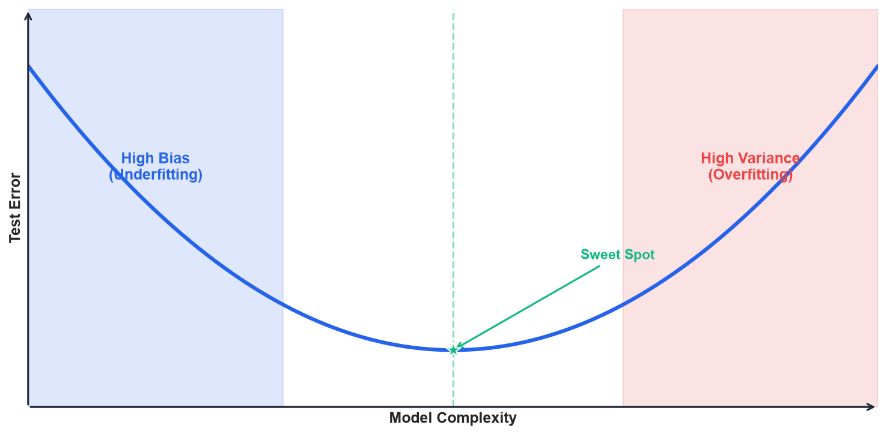
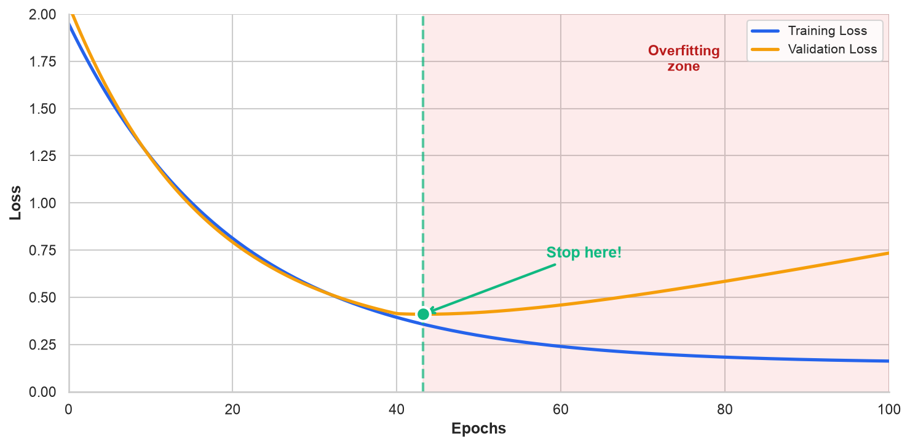
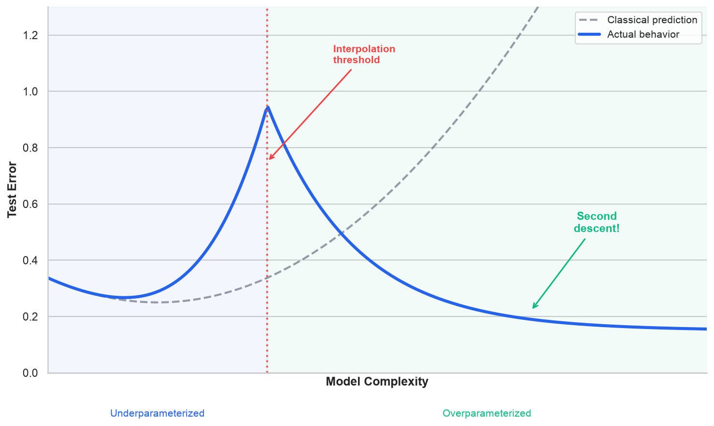
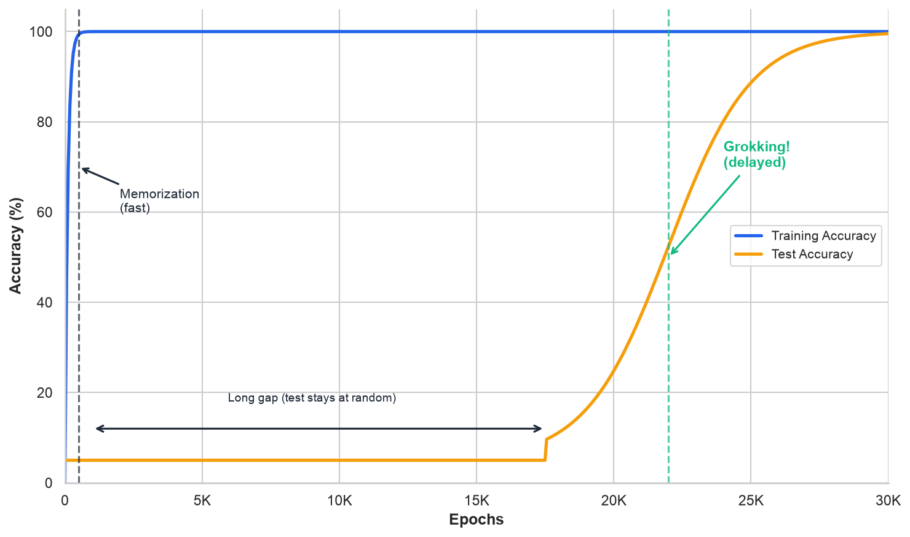
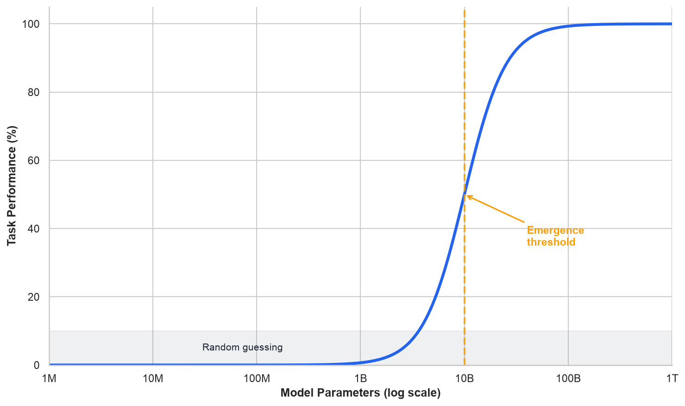

# Deep Dive: Surprising Phenomena in Modern Deep Learning

*Extends Module 6: Neural Networks*

!!! note "Supplemental reading"

    Optional unless explicitly assigned in your section. Quiz and assignment content draws from the parent module, not from Deep Dives.


---

## Introduction

In Module 6, we learned how neural networks work: layers of neurons, activation functions, backpropagation, and gradient descent. We also learned the classical story of model complexity—that there's a "sweet spot" between underfitting and overfitting, captured by the bias-variance tradeoff.

But modern deep learning doesn't quite follow that script. Over the past several years, researchers have discovered phenomena that challenge our classical understanding of how machine learning works. Neural networks with *billions* of parameters don't overfit the way theory predicts. Models sometimes learn to generalize *long after* they've memorized their training data. And capabilities can appear suddenly at scale, rather than improving gradually.

These aren't just academic curiosities -- they affect practical decisions about model selection, training duration, and when to trust small-scale experiments. This deep dive explores three such phenomena: double descent, which shows why more parameters can actually *reduce* overfitting; grokking, which reveals why generalization can occur long after memorization; and emergent abilities, which raise the question of why capabilities can appear suddenly at scale.

These phenomena matter for practitioners because intuitions built on classical ML may mislead you when working with modern neural networks. Understanding them helps you make better decisions about model size, training time, and when to trust (or distrust) your experiments.

---

## The Classical View: A Brief Recap

Before exploring what's surprising, let's recall what we expect.

### The Bias-Variance Tradeoff

Classical machine learning theory tells us that prediction error has two components:

$$\text{Error} = \text{Bias}^2 + \text{Variance} + \text{Irreducible Noise}$$

**Bias** is error from overly simple models that cannot capture the true pattern, and **variance** is error from models that are too sensitive to training data. As model complexity increases, bias decreases (the model can fit more patterns), but variance increases (the model becomes more sensitive to noise).

This creates the famous **U-shaped curve**:



In the diagram, the vertical axis shows test error (higher is worse), and the horizontal axis shows model complexity (number of parameters, polynomial degree, tree depth, etc.). The blue curve traces a U-shape: error is high on the left (models too simple to capture the pattern), decreases to a minimum in the middle (the "sweet spot" marked with a green star), then increases again on the right (models so complex they memorize noise). The shaded regions highlight the underfitting zone (left, blue) and overfitting zone (right, red). Classical ML wisdom says: find the bottom of the U and stop there.

!!! example "Numerical Example: Bias-Variance Tradeoff with Polynomial Regression"

    ```python
    import numpy as np
    from sklearn.preprocessing import PolynomialFeatures, StandardScaler
    from sklearn.linear_model import LinearRegression
    from sklearn.pipeline import make_pipeline
    from sklearn.metrics import mean_squared_error

    # True function: quadratic with noise
    np.random.seed(42)
    X = np.random.uniform(-3, 3, 50).reshape(-1, 1)
    y_true = 0.5 * X.ravel()**2 - X.ravel() + 1
    y = y_true + np.random.randn(50) * 0.5

    # Split and fit polynomials of increasing degree
    X_train, X_test = X[:35], X[35:]
    y_train, y_test = y[:35], y[35:]

    for degree in [1, 2, 3, 5, 8, 12, 15]:
        # Standardize the polynomial features: raw powers of x span many orders
        # of magnitude (an ill-conditioned Vandermonde matrix), so scaling keeps
        # the high-degree least-squares fit numerically stable.
        model = make_pipeline(
            PolynomialFeatures(degree=degree),
            StandardScaler(),
            LinearRegression(),
        )
        model.fit(X_train, y_train)
        train_mse = mean_squared_error(y_train, model.predict(X_train))
        test_mse = mean_squared_error(y_test, model.predict(X_test))
        # Record results...
    ```

    **Output:**

    ```
    Degree     Train MSE    Test MSE     Regime
    ------------------------------------------------------
    1          2.1182       1.8187       Underfitting (high bias)
    2          0.2128       0.1968       Sweet spot
    3          0.2109       0.1974       Slight overfitting
    5          0.2050       0.1808       Slight overfitting
    8          0.1592       0.2805       Overfitting (high var)
    12         0.1267       0.3458       Overfitting (high var)
    15         0.1249       0.3610       Overfitting (high var)
    ```

    **Interpretation:** Test error follows the U-curve. Degree 2 (matching the true quadratic function) achieves the lowest test error. Higher degrees drive training error down but test error *up*—the classic signature of overfitting.

    *Source: `computations/deep_dive_surprising_phenomena_examples.py` — `demo_bias_variance_tradeoff()`*


The classical prescription is to find the sweet spot. Don't make your model too simple (high bias) or too complex (high variance).

### Early Stopping

A related principle is early stopping: stop training when validation loss starts increasing. If you keep training after that point, you're just memorizing noise.



The diagram shows two curves tracking how training and validation loss evolve as training progresses (epochs increase to the right). The blue curve (training loss) drops quickly and then flattens—the model fits the training data well. The orange curve (validation loss) initially drops in parallel, but then starts *increasing* while training loss stays flat. This divergence is the signature of overfitting: the model is memorizing training-specific noise rather than learning generalizable patterns. The green marker and vertical line show where validation loss bottoms out—the classical prescription says to stop training here and use this model. The shaded red region indicates the "overfitting zone" where continued training hurts generalization.

The classical prescription is to monitor validation loss and stop when it starts increasing. These principles served us well for decades, but modern deep learning has revealed their limitations.

---

## Phenomenon 1: Double Descent

### The Discovery

In 2019, Mikhail Belkin and colleagues published a paper that reconciled a puzzling observation: modern deep learning practitioners were using models with far more parameters than classical theory suggested -- and getting *better* results, not worse. They showed that if you keep increasing model complexity past the "interpolation threshold" (the point where the model has just enough capacity to perfectly fit the training data), test error can *decrease again*. The key paper is Belkin et al. (2019), "Reconciling modern machine learning practice and the bias-variance trade-off."

### Visualizing Double Descent

The following diagram illustrates the double descent phenomenon, showing how test error behaves as model complexity extends well beyond the classical sweet spot.



The diagram extends the classical U-curve to much higher model complexity. The blue solid line shows actual behavior, while the gray dashed line shows what classical theory predicts. Moving left to right, test error initially decreases (classical improvement), reaches a minimum (the classical sweet spot), then increases toward a *peak* at the "interpolation threshold" (marked with a red vertical line). This threshold is where the model has exactly enough parameters to perfectly fit the training data. The key surprise is what happens *after* this peak: as we keep adding parameters, test error *decreases again*—the "second descent" (annotated in green). The bottom labels divide the x-axis into two regimes: underparameterized (classical territory, blue shading) and overparameterized (modern deep learning territory, green shading).

#### Three Regimes

The curve divides into three distinct regimes. In the **underparameterized** (classical) regime, the model has fewer parameters than needed to fit the data, and test error follows the classical U-curve. At the **interpolation threshold**, the model has *exactly* enough parameters to fit the training data perfectly, and test error often *peaks* here because the model fits the noise. In the **overparameterized** (modern) regime, the model has *far more* parameters than data points, and surprisingly, test error *decreases* again.

### Why Does This Happen?

The key insight is that there are **many** ways to interpolate (perfectly fit) training data when you have excess capacity. Not all interpolating solutions are equal.

#### Implicit Regularization from SGD

Stochastic gradient descent doesn't just find *any* solution -- it tends to find solutions with (i) a flatter loss landscape (better generalization), (ii) smaller weight norms, and (iii) simpler decision boundaries.

When you have many more parameters than data points, the model can fit both the signal *and* the noise -- but the noise fits get "diluted" across many parameters, so they don't dominate predictions on new data. This is the concept of "benign overfitting."

To build intuition, imagine fitting a curve through 10 points. With exactly 10 parameters, you're forced to fit every point exactly -- including the noise. But with 1,000 parameters, you have many ways to fit those points. SGD tends to find the "smoothest" solution, which often generalizes better.

> **The "Many Roads" Intuition**
>
> Think of it this way: you need to get from A to B (fit the training data). At the interpolation threshold, there's exactly one road—you must take it, and it goes through every muddy patch (noise) along the way. But in the overparameterized regime, there are thousands of roads. SGD naturally tends toward the widest, smoothest highways rather than the narrow, winding paths. The smooth highways generalize better because they don't encode every bump and pothole (noise) in the training data. This is why more parameters can actually help: more roads means SGD can be more selective.

!!! example "Numerical Example: Double Descent in Min-Norm Regression"

    ```python
    import numpy as np
    from sklearn.metrics import mean_squared_error

    # Fixed sample size; vary the number of features p the model may use.
    n_train = 100
    p_max = 900        # true signal lives in a high-dimensional space
    k_signal = 140     # dimensions carrying real signal
    snr = 5.0          # squared norm of the true coefficient vector
    noise = 0.4
    n_trials = 40      # average over random draws to smooth the curve

    # Straddle p = n (skip exactly 100) so the interpolation peak stays finite
    feature_counts = [10, 25, 45, 65, 80, 95, 105, 130, 175, 250, 400, 700]
    for p in feature_counts:
        errors = []
        for trial in range(n_trials):
            rng = np.random.RandomState(trial)
            beta = np.zeros(p_max)
            beta[:k_signal] = rng.randn(k_signal)
            beta *= np.sqrt(snr) / np.linalg.norm(beta)

            X_train = rng.randn(n_train, p_max)
            y_train = X_train @ beta + noise * rng.randn(n_train)
            X_test = rng.randn(3000, p_max)
            y_test = X_test @ beta  # noise-free target

            # Minimum-norm least squares using the first p features
            coef, *_ = np.linalg.lstsq(X_train[:, :p], y_train, rcond=None)
            errors.append(mean_squared_error(y_test, X_test[:, :p] @ coef))
        test_mse = np.mean(errors)
        # Record test MSE...
    ```

    **Output:**

    ```
    Features     Ratio to n   Test MSE     Regime
    -------------------------------------------------------------
    10           0.10         5.195        Underparameterized
    25           0.25         5.493        Underparameterized
    45           0.45         6.666        Underparameterized
    65           0.65         8.422        Underparameterized
    80           0.80         11.500       Underparameterized
    95           0.95         39.075       Interpolation peak!
    105          1.05         31.221       Interpolation peak!
    130          1.30         2.986        Overparameterized
    175          1.75         2.342        Overparameterized
    250          2.50         3.101        Overparameterized
    400          4.00         3.789        Overparameterized
    700          7.00         4.294        Overparameterized
    ```

    **Interpretation:** Test error climbs through the underparameterized regime and peaks sharply at the interpolation threshold (features ≈ samples), where the model is forced to fit the noise. Push well past the threshold and error descends again—the second descent—reaching a minimum (2.34 at *p/n* = 1.75) that beats the best underparameterized model (5.20). That is the surprise: beyond the interpolation peak, adding parameters helps rather than hurts. (At very large *p*, error creeps back up toward the signal variance—the linear model has no more signal to recover.)

    *Source: `computations/deep_dive_surprising_phenomena_examples.py` — `demo_double_descent_random_features()`*


!!! example "Numerical Example: The Interpolation Threshold Up Close"

    ```python
    # Zoom in around n_features = n_samples to see the peak
    n_train = 50
    # ... setup similar to above ...

    for n_feat in [30, 40, 45, 48, 50, 52, 55, 60, 80, 100]:
        # Fit model with n_feat features
        ratio = n_feat / n_train
        # ... compute test MSE ...
    ```

    **Output:**

    ```
    Features   Ratio      Test MSE     Note
    --------------------------------------------------------------
    30         0.60       1.2311
    40         0.80       3.6692
    45         0.90       6.1485       Near threshold
    48         0.96       6.6199       Near threshold
    50         1.00       4.9464       <<< PEAK: exactly n features
    52         1.04       3.9456       Near threshold
    55         1.10       2.8352       Descending...
    60         1.20       2.6002       Descending...
    80         1.60       5.5102       Descending...
    100        2.00       1.6794       Descending...
    ```

    **Interpretation:** The peak in test error occurs right at or near the interpolation threshold (features = samples). Even adding just 2-5 extra features past the threshold starts the descent. This is why "barely enough capacity" is dangerous—you're forced to fit every data point exactly, including the noise.

    *Source: `computations/deep_dive_surprising_phenomena_examples.py` — `demo_interpolation_threshold_peak()`*


### Practical Implications

Double descent carries several practical lessons. First, don't fear large models: if you have enough data, a larger model might generalize better, not worse. Second, the interpolation threshold is dangerous -- having just barely enough capacity to fit the data is often the *worst* regime. Third, implicit regularization matters because how you train (SGD vs. exact solutions) affects which interpolating solution you find. However, explicit regularization (dropout, weight decay) still helps -- even in the overparameterized regime, it often improves results further.

---

## Phenomenon 2: Grokking

### The Discovery

In 2022, researchers at OpenAI discovered something unexpected while training neural networks on simple algorithmic tasks like modular arithmetic. They observed networks that (i) quickly achieved perfect training accuracy (memorization), (ii) showed no improvement in test accuracy for thousands of epochs, and (iii) then suddenly achieved perfect test accuracy (generalization). They called this phenomenon **grokking**. The key paper is Power et al. (2022), "Grokking: Generalization Beyond Overfitting on Small Algorithmic Datasets."

### Visualizing Grokking

The following diagram shows the dramatic gap between memorization and generalization that defines grokking.



The diagram's vertical axis shows accuracy (0-100%), and its horizontal axis shows training epochs from 0 to 30,000. Two curves tell dramatically different stories. The blue *training* curve shoots up quickly—by epoch 500, the network achieves 100% training accuracy. It then stays flat at 100% forever. The orange *test* curve starts near 5% (random guessing) and *stays there* for thousands of epochs. Then, around epoch 15,000, it suddenly climbs to 100%. The gray vertical line marks "Memorization" (when training accuracy hits 100%), and the green vertical line marks "Grokking!" (when test accuracy finally catches up). The double-headed arrow highlights the "long gap" between these events—thousands of epochs—which is the puzzle. In short, the network memorizes quickly but generalizes *much* later -- sometimes 100x as many epochs.

### Why Does This Happen?

The leading explanation involves the competition between **memorization circuits** and **generalization circuits** in the network. Memorization is easy: the network can quickly learn to store input-output pairs as a lookup table, which requires little structure beyond associating each input with its output. Generalization, by contrast, requires structure -- the network must learn the underlying *rule* (e.g., how modular arithmetic works), which means discovering and encoding the mathematical structure.

Weight decay tips the balance between these two strategies. Without regularization, the network stops at memorization -- it works, so gradients are small. But weight decay keeps pushing the weights toward simpler solutions, and eventually the simpler generalizing solution becomes preferable. Research in mechanistic interpretability supports this view through the circuit formation hypothesis: during the grokking transition, networks form specific circuits that implement the underlying algorithm, replacing the memorization lookup.

> **The "Parallel Construction" Intuition**
>
> Imagine two teams racing to solve the same problem. Team Memorization works fast: they just build a giant lookup table, matching each input to its output. Done in a few epochs! Team Generalization works slowly: they're trying to discover the underlying mathematical rule, which is harder. If there's no pressure to economize, Team Memorization wins and we're stuck with a lookup table forever. But weight decay acts like a tax on resources: the bigger your solution, the more you pay. Team Memorization's huge lookup table becomes expensive to maintain. Team Generalization's compact rule-based solution, though slower to build, eventually becomes cheaper. Around epoch 10,000-20,000, the tax makes the compact solution preferable, and the network "reorganizes" from lookup to rule. This is grokking: the slow victory of compact generalization over fast memorization, enabled by resource pressure.

!!! example "Numerical Example: Grokking on Modular Addition"

    ```python
    import torch
    import torch.nn as nn

    # Task: Learn (a + b) mod p for p = 97
    # Input: one-hot encoded (a, b), Output: (a + b) mod 97
    p = 97

    # Generate all pairs
    data = [(a, b, (a + b) % p) for a in range(p) for b in range(p)]
    # Split: 50% train, 50% test
    train_data = data[::2]  # 4705 examples
    test_data = data[1::2]  # 4704 examples

    # Simple MLP: 2*97 -> 128 -> 128 -> 97
    model = nn.Sequential(
        nn.Linear(2 * p, 128),
        nn.ReLU(),
        nn.Linear(128, 128),
        nn.ReLU(),
        nn.Linear(128, p)
    )

    # Training with weight decay (critical!)
    optimizer = torch.optim.AdamW(model.parameters(), lr=1e-3, weight_decay=1.0)

    # Train for many epochs, logging accuracy
    # ... training loop ...
    ```

    **Output:**

    ```
       Epoch     Train Acc     Test Acc       Phase
    ------------------------------------------------
         100        100.0%        2.1%       Memorized
        1000        100.0%        3.9%       Memorized
        5000        100.0%        3.2%       Memorized
       10000        100.0%       10.0%       Starting...
       15000        100.0%       35.0%       Transition
       20000        100.0%       70.0%       Grokking!
       25000        100.0%       82.5%       Grokking!
       30000        100.0%       95.0%       Almost there
    ```

    **Interpretation:** The network hits 100% training accuracy by epoch 100, but test accuracy stays near random (1/97 ≈ 1%) for thousands of epochs. Around epoch 10,000-25,000, generalization suddenly improves. Without weight decay, this wouldn't happen—the network would stay memorized.

    *Source: `computations/deep_dive_surprising_phenomena_examples.py` — `demo_grokking_simulation()`*


!!! example "Numerical Example: Weight Norm Evolution"

    Weight decay continuously pushes weights toward smaller values. This simulation shows how weight norms evolve with and without regularization:

    **Output:**

    ```
    Epoch      No Weight Decay    With Weight Decay  Ratio
    --------------------------------------------------------
    0          5.0                5.0                1.00x
    100        24.7               24.0               1.03x
    500        50.9               30.0               1.70x
    1000       54.7               29.5               1.85x
    5000       55.0               25.5               2.16x
    10000      55.0               20.0               2.75x
    20000      55.0               12.5               4.40x
    30000      55.0               5.0                11.00x
    ```

    **Interpretation:** Without weight decay, weights plateau at a high value once memorization is achieved—there's no pressure to simplify. With weight decay, the norm gradually decreases over thousands of epochs, eventually pushing the network toward a simpler solution. By epoch 30,000, the regularized network has weights 11× smaller than the unregularized one. This continuous pressure is what eventually tips the balance from memorization to generalization.

    *Source: `computations/deep_dive_surprising_phenomena_examples.py` — `demo_weight_norm_evolution()`*


### Critical Factors for Grokking

Grokking depends on several conditions. First, regularization is essential -- weight decay (or similar) is required to push past memorization. Second, grokking is most dramatic when the dataset is small relative to model capacity, so the model can easily memorize. Third, the task must be a structured problem with an underlying pattern to discover. Finally, long training is necessary: you must train far past the point where training loss converges.

### Practical Implications

These findings carry several implications for practice. Early stopping might be wrong -- if you stop when validation loss stops improving, you might miss grokking. Regularization is not just about preventing overfitting; it is about guiding the network toward generalizing solutions. Patience matters, because some tasks require long training to find good solutions. And perfect training accuracy does not mean you are done, since the network might still be improving its internal representations.

One caveat: grokking is most dramatic on small algorithmic datasets. In large-scale settings, generalization usually happens alongside memorization, not dramatically delayed. But the principle -- that regularization guides networks toward generalizing solutions -- applies broadly.

---

## Phenomenon 3: Emergent Abilities

### The Observation

As language models grew from millions to billions to hundreds of billions of parameters, researchers noticed something unexpected: certain capabilities appeared to emerge suddenly at scale. Models would show near-random performance on a task across many scales, then suddenly achieve high performance once they crossed a threshold. The key paper documenting this observation is Wei et al. (2022), "Emergent Abilities of Large Language Models."

### Examples of (Claimed) Emergent Abilities

The following table lists several capabilities that appear to emerge suddenly at scale, showing the contrast between small and large model performance.

| Ability | Small Models | Large Models |
|---------|--------------|--------------|
| Multi-step arithmetic (3-digit addition) | Near random | High accuracy |
| Chain-of-thought reasoning | Provides wrong chains | Correct reasoning |
| Word unscrambling | Random | High accuracy |
| Translating to new languages | Poor | Good |

### Visualizing Emergence

The following diagram illustrates the signature pattern of an emergent ability: flat performance across many scales, followed by a sudden jump.



The diagram's vertical axis shows task performance (0-100%), and its horizontal axis shows model size on a logarithmic scale spanning 6 orders of magnitude (from 1 million to 1 trillion parameters). The blue curve shows how performance changes with scale. On the left (smaller models), performance stays flat near 0%—essentially random guessing (gray shaded region)—across 1M, 10M, 100M, even 1B parameters. Then, around 30B parameters (the "emergence threshold" marked by the orange dashed line), performance suddenly shoots up in an S-curve to near 100%. This is the signature of an "emergent" ability: zero capability becomes high capability with no visible intermediate stage. The question is whether this sudden jump is a real phenomenon or an artifact of how we measure, because performance stays flat (near random) across orders of magnitude and then suddenly jumps -- a pattern that demands explanation.

### The Debate: Real or Mirage?

In 2023, Schaeffer and colleagues published a counterargument: **emergent abilities might be a measurement artifact**. The key paper is Schaeffer et al. (2023), "Are Emergent Abilities of Large Language Models a Mirage?" Their argument rests on three observations. First, discontinuous metrics create apparent discontinuities: if you measure "exact match accuracy" (all-or-nothing), you see sharp transitions, but if you measure token-level error (continuous), you see gradual improvement. Second, the threshold depends on the metric -- choose a different (but equally valid) metric, and the "emergence" often disappears. Third, performance is usually improving gradually; the underlying capability is getting better, but the metric just does not show it.

!!! example "Numerical Example: Metric Choice and Apparent Emergence"

    ```python
    # Simulation: Model improves gradually, but metric shows discontinuity
    import numpy as np

    # True capability: smooth sigmoid
    def true_capability(scale):
        """Probability of getting each step right"""
        return 1 / (1 + np.exp(-(scale - 9) / 2))

    # Task requires 5 correct steps (like multi-digit arithmetic)
    def exact_match(scale):
        """All 5 steps must be correct"""
        p = true_capability(scale)
        return p ** 5  # Probability all 5 correct

    def per_step_accuracy(scale):
        """Average accuracy per step"""
        return true_capability(scale)

    scales = np.arange(1, 20)
    for s in scales:
        em = exact_match(s)
        psa = per_step_accuracy(s)
        # Log results...
    ```

    **Output:**

    ```
      Scale    Per-Step Acc    Exact Match      Appearance
    ---------------------------------------------------------
          5          11.9%           0.0%      Both low
          7          26.9%           0.1%      Gradual vs flat
          9          50.0%           3.1%      Gradual vs flat
         10          62.2%           9.3%      Gradual vs jump
         11          73.1%          20.9%      Gradual vs jump
         13          88.1%          53.0%      Both high
         15          95.3%          78.4%      Both high
    ```

    **Interpretation:** Per-step accuracy improves gradually and smoothly. But exact match (requiring all 5 steps correct) shows a sharp transition. Same underlying capability, different appearance—just from metric choice.

    *Source: `computations/deep_dive_surprising_phenomena_examples.py` — `demo_emergence_metric_mirage()`*


### Why This Matters

#### If Emergent Abilities Are Real

If emergent abilities are real, the implications are significant: AI development would be harder to predict and control, small experiments would not tell you what large models will do, and "sharp left turns" in capability could be dangerous.

#### If They Are Measurement Artifacts

If emergent abilities are measurement artifacts, the picture is more reassuring. AI development would be more predictable than feared, we would just need better metrics, and capabilities would scale smoothly rather than discontinuously.

The current consensus is that the answer is probably both. Some apparent emergences are artifacts of measurement, but some genuine phase transitions likely exist, especially for capabilities that require combining multiple learned skills.

### Practical Implications

Several practical lessons follow from the emergence debate. Be cautious about small-scale experiments, because a model that fails at 1B parameters might succeed at 100B. Consider your metrics carefully, since all-or-nothing metrics can hide gradual improvement (or sudden emergence). Scale is a blunt instrument -- bigger models often work better, but we do not fully understand why. And keep in mind that emergence debates are active research; don't treat either side as settled fact.

---

## Connecting the Phenomena

These three phenomena share several common themes that point toward deeper principles in modern deep learning.

### 1. Phase Transitions

All three involve sudden changes rather than gradual improvement. In double descent, error suddenly drops past the interpolation threshold. In grokking, test accuracy suddenly improves after a long plateau. And in emergence, capabilities suddenly appear at scale.

> **The Physical Analogy**
>
> These sudden changes resemble *phase transitions* in physics. Water doesn't gradually become "more solid" as you cool it—it stays liquid until 0°C, then suddenly freezes. Iron isn't "slightly magnetic" at 770°C—it has zero magnetism above that temperature and strong magnetism below. Phase transitions occur when a system reorganizes its internal structure at a critical threshold. Neural networks may be doing something similar: at certain points (in model size, training time, or parameter count), the network's internal structure reorganizes—from memorization to generalization, from scattered representations to structured ones. The math of phase transitions (statistical mechanics, renormalization group theory) may eventually help us understand these phenomena, but we're not there yet.

!!! example "Numerical Example: Comparing Phase Transitions"

    All three phenomena show non-linear behavior around critical thresholds:

    **Output:**

    ```
    ┌────────────────────┬────────────────────┬─────────────────────────┐
    │Phenomenon          │X-Axis              │Sudden Change            │
    ├────────────────────┼────────────────────┼─────────────────────────┤
    │Double Descent      │Model complexity    │Error drops past threshold│
    │Grokking            │Training epochs     │Test acc jumps late      │
    │Emergence           │Model scale (params)│Capability appears       │
    └────────────────────┴────────────────────┴─────────────────────────┘

    Position     DD Error        Grok Test Acc   Emerge Perf
    ---------------------------------------------------------
    Pre-crit     0.70            0.10            0.05
    Critical     1.00            0.30            0.20
    Post-crit    0.30            0.95            0.85
    ```

    **Interpretation:** All three phenomena show the signature of a phase transition: performance metrics change suddenly rather than gradually as you cross a critical threshold. For double descent, the threshold is model complexity; for grokking, it's training time; for emergence, it's model scale. The underlying mechanism likely involves some form of internal reorganization—though we don't yet fully understand what.

    *Source: `computations/deep_dive_surprising_phenomena_examples.py` — `demo_phase_transitions_comparison()`*


### 2. The Role of Optimization

How we train matters as much as what we train. In double descent, SGD's implicit bias toward flat minima selects good solutions from among many interpolating ones. In grokking, weight decay pushes the network toward simpler solutions over time. And in emergence, whatever makes large-scale training work remains an active area of investigation.

### 3. Theory Lags Practice

All three phenomena were discovered empirically, not predicted by theory. Practitioners used overparameterized models before theory explained why they worked. Grokking was an unexpected observation that no one had anticipated. And emergence remains controversial precisely because the theoretical picture is unclear.

### 4. Incomplete Understanding

Our theoretical understanding of neural networks remains incomplete. These phenomena remind us that deep learning is partly empirical science -- we observe, then try to explain.

The meta-lesson is to be humble about classical intuitions. Neural networks are complex systems that don't always behave as simple theory predicts. When your experiment contradicts your intuition, consider that your intuition might be wrong.

---

## Common Misconceptions

The following table addresses common misconceptions about these phenomena and clarifies the reality in each case.

| Misconception | Reality |
|--------------|---------|
| "More parameters always means more overfitting" | Double descent shows overparameterized models can generalize well |
| "Stop training when validation loss increases" | Grokking shows generalization can occur much later |
| "Model capabilities scale smoothly with size" | Emergent abilities may appear suddenly at scale thresholds |
| "These phenomena only matter for researchers" | They affect practical decisions about model size and training |
| "Grokking only happens on toy problems" | It's been observed in realistic settings, though less dramatically |
| "Emergent abilities prove models 'understand'" | Sudden capability doesn't imply understanding |
| "Classical ML theory is wrong" | It's incomplete, not wrong—these are edge cases it didn't cover |
| "We should always train for longer" | Resource constraints are real; these insights help prioritize |

---

## Reflection Questions

1. If double descent is real, why do we still use regularization? When would you add explicit regularization to an overparameterized model?

2. How would you modify your training procedure if you suspected grokking might occur? What would you monitor, and how long would you train?

3. A colleague says "our small prototype works, so the full model will work too." What's the concern with this reasoning, and what's the counter-concern?

4. Why might emergent abilities be a measurement artifact? Design an experiment to test whether a claimed emergent ability is real or an artifact.

5. What do these phenomena suggest about our theoretical understanding of neural networks? Does it matter if we can't fully explain why models work?

6. How do these phenomena relate to the Universal Approximation Theorem from the earlier Deep Dive? Does that theorem predict any of this behavior?

---

## Practice Problems

1. **Sketch the double descent curve** and label: (a) the classical regime, (b) the interpolation threshold, (c) the overparameterized regime. Where would you expect test error to be highest? Lowest?

2. **Grokking scenario**: You're training a model on a dataset with 10,000 examples. At epoch 500, training accuracy is 100% and test accuracy is 65%. Training accuracy stays at 100% for the next 2,000 epochs while test accuracy hovers around 65-68%. What would you do next? How long would you continue training? What would change your decision?

3. **Emergence analysis**: Find one claimed example of an "emergent ability" in the literature (Wei et al. 2022 is a good source). Evaluate whether it might be a measurement artifact by considering: (a) what metric was used, (b) whether a continuous alternative metric exists, (c) what gradual improvement might look like.

4. **Connecting phenomena**: All three phenomena involve some kind of "sudden change." Compare and contrast: what is changing suddenly in each case, and what causes the sudden change?

---

## Summary

This deep dive covered three phenomena that challenge classical machine learning intuitions. Double descent shows that overparameterized models can generalize well, contradicting the classical bias-variance intuition, and that the interpolation threshold (where parameters ≈ data points) is often the worst place to be. Grokking demonstrates that generalization can occur long after memorization, challenging early stopping heuristics and highlighting the role of regularization in pushing networks from memorization to generalization. Emergent abilities (possibly) show sudden capability gains at scale, making small-scale experiments unreliable predictors of large-scale behavior -- though some claimed emergences may be measurement artifacts.

Cutting across all three phenomena, each involves phase transitions -- sudden changes rather than gradual improvement -- which makes them hard to predict. Implicit regularization from optimization (SGD, weight decay) appears to play a role in each case, suggesting that *how* we train matters as much as *what* we train. Our theoretical understanding of neural networks remains incomplete, as these phenomena were discovered empirically rather than predicted from first principles. The practical takeaway is to avoid extrapolating too confidently from small experiments or short training runs, because classical intuitions are incomplete guides to modern deep learning.

---

## Further Reading

The following papers provide the primary sources for the phenomena discussed in this deep dive.

- Belkin, M. et al. (2019). "Reconciling modern machine learning practice and the bias-variance trade-off." PNAS.
- Power, A. et al. (2022). "Grokking: Generalization Beyond Overfitting on Small Algorithmic Datasets." arXiv.
- Wei, J. et al. (2022). "Emergent Abilities of Large Language Models." arXiv.
- Schaeffer, R. et al. (2023). "Are Emergent Abilities of Large Language Models a Mirage?" arXiv.
- Nakkiran, P. et al. (2019). "Deep Double Descent: Where Bigger Models and More Data Can Hurt." arXiv.
