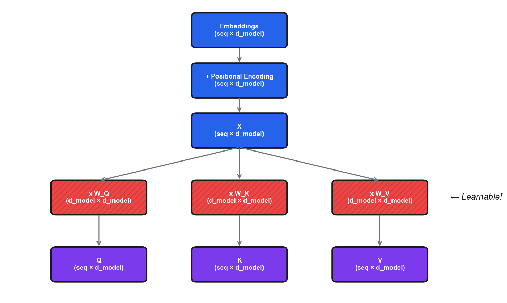
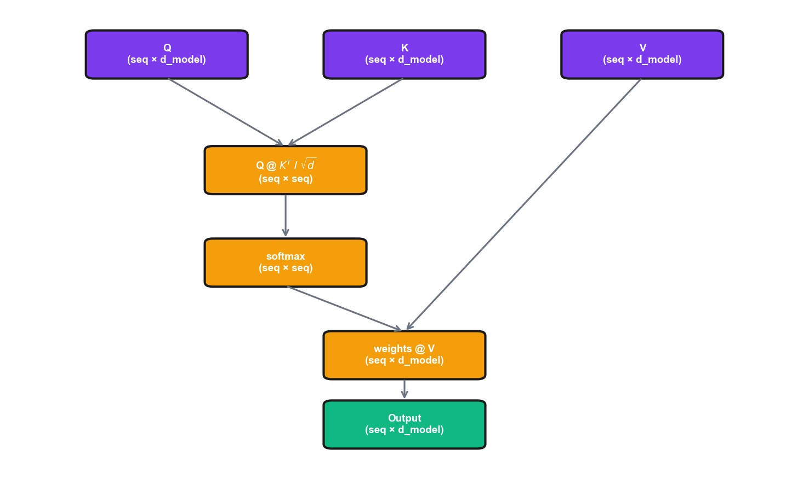

# Deep Dive: Transformer Architecture

*Extends Module 8: Natural Language Processing*

!!! note "Supplemental reading"

    Optional unless explicitly assigned in your section. Quiz and assignment content draws from the parent module, not from Deep Dives.


---

## Introduction

In Module 8, we learned that transformers use self-attention to process sequences and covered the high-level concepts of Query, Key, Value and the attention formula. This deep dive goes deeper, tracing through the exact matrix dimensions at each step, showing exactly where the learnable parameters live, and building a complete transformer from scratch in PyTorch. By the end, you'll understand not just *what* transformers do, but *how* they do it—down to the individual matrix operations.

#### What Parameters Learn

Token embeddings learn dense representations where similar words cluster together. Attention projections (W_Q, W_K, W_V) learn relevance between tokens—W_Q learns what tokens "look for," W_K what they "offer," and W_V what information to pass. FFNs appear to store factual knowledge as distributed key-value memories. Layer norms stabilize training.

---

## Where Parameters Live in a Transformer

Understanding where the learnable parameters actually reside is crucial for understanding what the model "learns" during training.

### Parameter Overview

For a transformer with:
- `vocab_size` = 30,000 (vocabulary)
- `d_model` = 512 (model dimension)
- `n_heads` = 8 (attention heads)
- `d_k = d_v` = 64 (dimension per head = d_model / n_heads)
- `d_ff` = 2048 (feedforward hidden dimension, typically 4× d_model)
- `n_layers` = 6 (number of transformer blocks)
- `max_seq_len` = 512 (maximum sequence length)

The 4× expansion in the FFN is largely empirical—it worked well in the original paper. The expansion provides "intermediate reasoning space." Too small (2×) limits expressivity; too large (8×) adds parameters with diminishing returns. Some efficient transformers use 2-2.67×; the ratio is not sacred if you have specific constraints.

### Token Embedding Matrix

The token embedding matrix has shape `(vocab_size, d_model)` = `(30000, 512)`, giving 15,360,000 parameters. It learns a dense vector representation for each token in the vocabulary—the "lookup table" that converts token IDs to continuous vectors.

Word relationships emerge from the training objective (distributional hypothesis). Tokens in similar contexts ("cat" and "dog" both appear in "the ___ ran across the yard") get similar embeddings. The model learns they're interchangeable in many contexts. Subtle relationships emerge too: "king" – "man" + "woman" ≈ "queen." None of this is programmed—it falls out of optimizing prediction accuracy.

```python
self.token_embedding = nn.Embedding(
    num_embeddings=vocab_size,  # 30,000
    embedding_dim=d_model        # 512
)
# Weight shape: (30000, 512)
```

!!! example "Numerical Example: Embedding Lookup"

    ```python
    import torch
    import torch.nn as nn

    torch.manual_seed(42)
    embedding = nn.Embedding(num_embeddings=10, embedding_dim=4)

    # Look up token IDs [2, 5, 7]
    token_ids = torch.tensor([2, 5, 7])
    output = embedding(token_ids)

    print("Token ID 2 →", output[0].detach().numpy().round(4))
    print("Verify: embedding.weight[2] →", embedding.weight[2].detach().numpy().round(4))
    ```

    **Output:**

    ```
    Token ID 2 → [-0.7521  1.6487 -0.3925 -1.4036]
    Verify: embedding.weight[2] → [-0.7521  1.6487 -0.3925 -1.4036]
    ```

    **Interpretation:** Embedding is just table lookup—token ID 2 retrieves row 2 of the weight matrix. Each token gets its own learned vector. Similar tokens (learned during training) will have similar vectors.

    *Source: `computations/deep_dive_transformer_examples.py` — `demo_embedding_lookup()`*


### Positional Encoding / Embedding

The sinusoidal encoding from the original transformer has no learnable parameters—it is computed deterministically. A learned positional embedding, by contrast, has shape `(max_seq_len, d_model)` = `(512, 512)`, totaling 262,144 parameters.

```python
# Learned positional embeddings
self.pos_embedding = nn.Embedding(
    num_embeddings=max_seq_len,  # 512
    embedding_dim=d_model         # 512
)
```

### Attention Layer Parameters (Per Layer)

Each attention layer has four weight matrices:

| Matrix | Shape | Parameters | Purpose |
|--------|-------|------------|---------|
| W_Q | `(d_model, d_model)` | 512 × 512 = 262,144 | Projects input to queries |
| W_K | `(d_model, d_model)` | 512 × 512 = 262,144 | Projects input to keys |
| W_V | `(d_model, d_model)` | 512 × 512 = 262,144 | Projects input to values |
| W_O | `(d_model, d_model)` | 512 × 512 = 262,144 | Projects concatenated heads to output |
| **Biases** | 4 × `(d_model)` | 4 × 512 = 2,048 | One bias per projection |

The total per attention layer is 1,050,624 parameters. Even though we have 8 heads, the total parameter count is the same as if we had one big head. The "heads" are created by reshaping, not by adding parameters.

Multiple heads help because they enable attending to different relationships simultaneously—syntactic, semantic, positional. Research finds heads that specialize: one attends to grammatical antecedents, another to adjacent tokens. This specialization emerges during training. The trade-off is that each head has smaller d_k, but specialization benefits outweigh capacity reduction.

### Feed-Forward Network (Per Layer)

The FFN applies two linear transformations with a non-linearity:

$$\text{FFN}(x) = \text{ReLU}(xW_1 + b_1)W_2 + b_2$$

!!! note "Note"

    The original transformer paper (Vaswani et al., 2017) used ReLU; modern implementations typically use GELU.

| Matrix | Shape | Parameters | Purpose |
|--------|-------|------------|---------|
| W_1 | `(d_model, d_ff)` | 512 × 2048 = 1,048,576 | Expand to higher dimension |
| b_1 | `(d_ff)` | 2,048 | Bias for expansion |
| W_2 | `(d_ff, d_model)` | 2048 × 512 = 1,048,576 | Contract back to model dimension |
| b_2 | `(d_model)` | 512 | Bias for contraction |

The total per FFN is roughly 2,099,712 parameters.

Research supports the hypothesis that FFNs serve as knowledge storage. Specific FFN neurons activate for specific concepts ("The capital of France is ___" triggers neurons contributing "Paris"). Researchers have edited factual knowledge by modifying FFN weights. Attention handles "routing" (context-dependent); FFN handles fixed transformations. Fixed parameters suit stable facts; dynamic computation suits context-dependent processing.

A useful way to understand why 4× expansion works is the "committee of specialists" intuition. Think of the expanded dimension as a committee of 2,048 specialists, each detecting a specific pattern. When input x arrives, it "consults" all specialists (W_1 multiplication), but ReLU/GELU silences those who don't recognize the pattern (negative activations → zero). Typically only 30-50% of neurons activate for any given input—this sparsity means different inputs engage different specialist subsets. The contraction (W_2) then combines the active specialists' opinions. More specialists (larger d_ff) means finer-grained pattern detection, but with diminishing returns and increased compute cost.

!!! example "Numerical Example: FFN Forward Pass"

    ```python
    import torch
    import torch.nn as nn

    torch.manual_seed(42)
    d_model, d_ff = 4, 16  # 4× expansion
    W1 = torch.randn(d_ff, d_model) * 0.5
    W2 = torch.randn(d_model, d_ff) * 0.5

    x = torch.tensor([1.0, -0.5, 0.8, 0.2])

    # Step 1: Expand
    h1 = x @ W1.T
    print(f"After W1 (16 dims): {h1[:8].numpy().round(3)}...")

    # Step 2: ReLU
    h2 = torch.relu(h1)
    print(f"After ReLU: {(h2 > 0).sum().item()}/16 neurons active")

    # Step 3: Contract
    output = h2 @ W2.T
    print(f"Output (4 dims): {output.numpy().round(3)}")
    ```

    **Output:**

    ```
    After W1 (16 dims): [ 0.741  0.47  -1.086 -0.455  0.706 -0.16   0.693 -0.141]...
    After ReLU: 5/16 neurons active
    Output (4 dims): [ 0.575  0.434 -0.103 -0.405]
    ```

    **Interpretation:** ReLU zeros out 11 of 16 neurons (~69%)—only 5 "specialists" recognized this input. Different inputs would activate different subsets. The sparse activation means each input engages a different combination of learned patterns stored in W_2.

    *Source: `computations/deep_dive_transformer_examples.py` — `demo_ffn_forward()`*


### Layer Normalization (Per Layer)

Each transformer block typically has 2 layer norms:

| Component | Shape | Parameters |
|-----------|-------|------------|
| Scale (γ) | `(d_model)` | 512 |
| Shift (β) | `(d_model)` | 512 |

Each layer norm has 1,024 parameters, and each transformer block contains two layer norms for a total of 2,048 parameters.

Layer norm matters because without it, activations grow or shrink exponentially through layers, causing gradient explosion or vanishing. Layer norm keeps activations stable regardless of depth. The learned γ and β parameters let the model recover useful mean and variance. It appears twice per block (before attention and before FFN) because both operations can distort statistics.

!!! example "Numerical Example: Layer Normalization"

    ```python
    import torch

    x = torch.tensor([[10.0, 20.0, 30.0, 40.0]])  # Varying magnitudes
    print(f"Input: {x[0].numpy()}, mean={x.mean():.1f}, std={x.std():.1f}")

    # Normalize to mean=0, std=1
    mean = x.mean(dim=-1, keepdim=True)
    std = torch.sqrt(x.var(dim=-1, unbiased=False, keepdim=True) + 1e-6)
    x_norm = (x - mean) / std
    print(f"Normalized: {x_norm[0].numpy().round(4)}")
    print(f"New mean={x_norm.mean():.6f}, std={x_norm.std():.4f}")

    # Apply learned scale (γ) and shift (β)
    gamma = torch.tensor([1.0, 2.0, 0.5, 1.5])
    beta = torch.tensor([0.0, 1.0, -0.5, 0.0])
    output = gamma * x_norm + beta
    print(f"After γ, β: {output[0].numpy().round(4)}")
    ```

    **Output:**

    ```
    Input: [10. 20. 30. 40.], mean=25.0, std=11.2
    Normalized: [-1.3416 -0.4472  0.4472  1.3416]
    New mean=0.000000, std=1.0000
    After γ, β: [-1.3416  0.1056 -0.2764  2.0125]
    ```

    **Interpretation:** Input with mean 25 and std 11 gets normalized to mean 0 and std 1. The learned γ and β then rescale—dimension 1 gets doubled (γ=2) and shifted up (β=1), dimension 2 gets halved (γ=0.5) and shifted down (β=-0.5). This lets the model learn which dimensions need larger/smaller variance.

    *Source: `computations/deep_dive_transformer_examples.py` — `demo_layer_norm()`*


### Parameter Count Summary

The following table summarizes the parameter counts for each component of the transformer.

| Component | Count | Parameters Each | Total |
|-----------|-------|-----------------|-------|
| Token Embedding | 1 | 15,360,000 | 15,360,000 |
| Positional Embedding | 1 | 262,144 | 262,144 |
| Attention Layers | 6 | ~1,050,624 | ~6,303,744 |
| FFN Layers | 6 | ~2,099,712 | ~12,598,272 |
| Layer Norms | 12 | 1,024 | 12,288 |
| Output Head | 1 | 15,360,000 | 15,360,000* |

The total comes to roughly 50 million parameters (or roughly 35 million with tied embeddings).

*Often tied with token embedding

---

## What Each Component Does (The "Why")

This section explains the motivation behind each major component of the transformer architecture.

### Why Positional Encoding?

The core problem is that self-attention is **permutation-invariant**. Without position information, "Dog bites man," "Man bites dog," and "Bites man dog" would be identical to the model. The attention mechanism only cares about *what* tokens are present and their relationships, not *where* they appear.

#### Sinusoidal Positional Encoding

$$PE_{(pos, 2i)} = \sin\left(\frac{pos}{10000^{2i/d_{model}}}\right)$$

$$PE_{(pos, 2i+1)} = \cos\left(\frac{pos}{10000^{2i/d_{model}}}\right)$$

Sine and cosine functions are chosen for several reasons: (i) values stay in [-1, 1], preventing position from dominating, (ii) each position gets a unique encoding, (iii) for any fixed offset k, $PE_{pos+k}$ can be represented as a linear function of $PE_{pos}$, enabling the model to learn relative positions, and (iv) the encoding generalizes to sequences longer than those seen during training.

A useful intuition is the "clock hands" analogy: each dimension pair (sin, cos) is like a clock hand rotating at a different speed. Dimension 0-1 rotates quickly (completes a full cycle in ~6 positions), while dimension 510-511 rotates very slowly (cycle length ~10,000 positions). Position 0 has all clock hands at the same starting angle. As position increases, fast hands spin rapidly while slow hands barely move. Any position creates a unique combination of hand angles—like reading a clock with 256 hands of different speeds. This multi-frequency encoding lets the model learn both local patterns (via fast-changing dimensions) and global structure (via slow-changing dimensions).

!!! example "Numerical Example: Positional Encoding Values"

    ```python
    import numpy as np

    def get_pe(pos, d_model=8):
        pe = np.zeros(d_model)
        for i in range(d_model):
            if i % 2 == 0:
                pe[i] = np.sin(pos / (10000 ** (i / d_model)))
            else:
                pe[i] = np.cos(pos / (10000 ** ((i-1) / d_model)))
        return pe

    for pos in [0, 1, 10, 100]:
        print(f"Position {pos:3d}: {get_pe(pos).round(4)}")
    ```

    **Output:**

    ```
    Position   0: [ 0.      1.      0.      1.      0.      1.      0.      1.    ]
    Position   1: [ 0.8415  0.5403  0.0998  0.995   0.01    1.      0.001   1.    ]
    Position  10: [-0.544  -0.8391  0.8415  0.5403  0.0998  0.995   0.01    1.    ]
    Position 100: [-0.5064  0.8623 -0.544  -0.8391  0.8415  0.5403  0.0998  0.995 ]
    ```

    **Interpretation:** Position 0 has a distinctive [0,1,0,1,...] pattern. Each position creates a unique encoding. Low dimensions (left) change rapidly—notice positions 1 and 10 have very different dim0 values. High dimensions (right) change slowly—dim6-7 are nearly identical for positions 0, 1, and 10. All values stay bounded in [-1, 1].

    *Source: `computations/deep_dive_transformer_examples.py` — `demo_positional_encoding()`*


Learned embeddings are often preferred over sinusoidal because, although sinusoidal encodings generalize to arbitrary lengths, fixed context windows make this rarely matter in practice. Learned embeddings perform slightly better and can capture task-specific patterns (code structure, conversation turns). Neither approach extrapolates well beyond training lengths. Modern architectures use relative positional encodings (RoPE, ALiBi) that generalize better via relative distances.

### Why Self-Attention?

Self-attention offers three advantages over recurrent architectures.

The first advantage is O(1) path length. To connect position 1 to position 100, an RNN must pass information through 99 sequential steps, whereas attention provides a direct connection in one step. This solves the long-range dependency problem.

The second advantage is parallelization. An RNN must process sequentially (h₁ → h₂ → h₃ → ...), but attention computes all positions simultaneously, enabling massive speedups on GPUs.

The third advantage is dynamic, content-dependent connections. RNNs have fixed connections (previous → current), whereas attention weights are computed based on the *content* of the sequence:

```
"The cat sat on the mat because it was soft"
                                    ↑
                              "it" attends strongly to "mat"

"The cat sat on the mat because it was tired"
                                    ↑
                              "it" attends strongly to "cat"
```

The same architecture produces different attention patterns based on meaning, illustrating the dynamic nature of self-attention. To make the "library search" analogy concrete, imagine processing "The capital of France is ___." The blank position generates a **Query** ("I need information about capitals and France"), while "France" offers a **Key** ("I have information about a European country") along with a **Value** (the actual semantic content—geography, culture, language facts). Meanwhile, "capital" offers its own **Key** ("I relate to cities and governance"). The Query-Key comparison finds high similarity between the blank's query and the "France"/"capital" keys, and the attention weights then retrieve Values from those high-similarity positions.

This is why Q, K, V are separate: the question you ask (Q) may differ from what you advertise (K), which may differ from what you actually contribute (V). A pronoun like "it" asks "what noun am I referring to?" (Q), advertises "I'm a pronoun needing resolution" (K), and contributes "third-person singular reference" (V).

Contextual attention is learned entirely during training via backpropagation. When the model predicts incorrectly (attended to "mat" instead of "cat"), gradients adjust W_Q, W_K, W_V so "it" generates queries with higher similarity to "cat" when context suggests animacy. Different heads learn different aspects (proximity, syntax, semantics), enabling sophisticated disambiguation.

### Why the FFN (MLP)?

The attention mechanism is powerful but has two limitations: (i) after softmax, attention is linear—just weighted sums of values, and (ii) the W_Q, W_K, W_V matrices don't change per position, making attention the same transformation for all positions.

The FFN provides three capabilities. First, the ReLU (or GELU) activation adds non-linear transformations that attention alone cannot provide. Next, each position gets the same transformation but independently, enabling position-wise processing. Finally, research suggests FFN layers store factual knowledge—when you ask "The capital of France is ___", the FFN layers help retrieve "Paris."

#### Why the Expansion to 4×?

The expansion (512 → 2048 → 512) creates a "bottleneck" architecture. First, the input is projected to a higher dimension, allowing richer intermediate representations. Next, the non-linearity (ReLU/GELU) is applied. Finally, the result is compressed back to model dimension.

The FFN can also be interpreted as key-value memory. The W_1 rows are "keys"—patterns to match—and the input is compared via matrix multiplication while GELU sparsifies activations. W_2 stores "values" retrieved when keys match. Computing FFN(x) = GELU(x W_1) W_2 amounts to finding matching keys, weighting by match strength, and retrieving values. Ablating specific W_2 rows removes specific facts, providing strong evidence for this interpretation.

---

## Self-Attention Step-by-Step with Matrix Dimensions

Let's trace through self-attention with concrete numbers:

For this walkthrough, we use the following setup: `batch_size (B)` = 2, `seq_len (T)` = 4, `d_model` = 8, `n_heads` = 2, and `d_k = d_v` = 4 (= d_model / n_heads).

### Step 1: Input

The input **X** has shape `(B, T, d_model)` = `(2, 4, 8)`, representing 2 sequences, each with 4 tokens, each token represented by 8 dimensions.

### Step 2: Linear Projections

The learnable weight matrices are W_Q: `(8, 8)`, W_K: `(8, 8)`, and W_V: `(8, 8)`. We compute Q, K, and V as follows:
```
Q = X @ W_Q: (2, 4, 8) @ (8, 8) → (2, 4, 8)
K = X @ W_K: (2, 4, 8) @ (8, 8) → (2, 4, 8)
V = X @ W_V: (2, 4, 8) @ (8, 8) → (2, 4, 8)
```

### Step 3: Reshape for Multi-Head Attention

We split d_model=8 into n_heads=2 heads, each with d_k=4 dimensions.

We reshape from `(B, T, d_model)` → `(B, T, n_heads, d_k)` → `(B, n_heads, T, d_k)`:

```
Q: (2, 4, 8) → (2, 4, 2, 4) → (2, 2, 4, 4)
K: (2, 4, 8) → (2, 4, 2, 4) → (2, 2, 4, 4)
V: (2, 4, 8) → (2, 4, 2, 4) → (2, 2, 4, 4)
```

After reshaping, we have 2 batches, 2 heads per batch, 4 tokens per head, and 4 dimensions per token.

The reason for multiple heads can be understood through a "committee of experts" analogy. Each head operates on a different d_k-dimensional subspace of the embedding. With d_model=512 and 8 heads, each head sees only 64 dimensions—a different "view" of the data. One head might specialize in syntactic relationships (subject-verb agreement), another in semantic similarity (synonyms, related concepts), another in positional patterns (attending to adjacent tokens). This emerges naturally from training: different random initializations + gradient descent = different specializations. The output projection W_O then combines these diverse perspectives. Single-head attention with d_k=512 could theoretically learn the same patterns, but multi-head makes it easier—each head has a simpler job.

!!! example "Numerical Example: Multi-Head Reshape"

    ```python
    import torch

    # Create input: 1 batch, 4 tokens, 8 dimensions
    x = torch.zeros(1, 4, 8)
    for t in range(4):
        for d in range(8):
            x[0, t, d] = t + d * 0.1  # Recognizable pattern

    print(f"Input shape: {tuple(x.shape)} (batch, seq, d_model)")
    print(f"Token 0: {x[0, 0].numpy().round(1)}")

    # Reshape for 2 heads
    x_reshaped = x.view(1, 4, 2, 4).transpose(1, 2)
    print(f"\nAfter reshape: {tuple(x_reshaped.shape)} (batch, heads, seq, d_head)")
    print(f"Head 0, Token 0: {x_reshaped[0, 0, 0].numpy().round(1)}")
    print(f"Head 1, Token 0: {x_reshaped[0, 1, 0].numpy().round(1)}")
    ```

    **Output:**

    ```
    Input shape: (1, 4, 8) (batch, seq, d_model)
    Token 0: [0.  0.1 0.2 0.3 0.4 0.5 0.6 0.7]

    After reshape: (1, 2, 4, 4) (batch, heads, seq, d_head)
    Head 0, Token 0: [0.  0.1 0.2 0.3]
    Head 1, Token 0: [0.4 0.5 0.6 0.7]
    ```

    **Interpretation:** The 8-dimensional embedding gets split: Head 0 sees dims 0-3, Head 1 sees dims 4-7. Each head processes a different "view" of each token. No new parameters are created—it's pure reshaping. The heads then compute attention independently on their respective subspaces.

    *Source: `computations/deep_dive_transformer_examples.py` — `demo_multihead_reshape()`*


### Step 4: Compute Attention Scores

The attention score formula is scores = Q @ K^T / √d_k.

```
Q @ K^T: (2, 2, 4, 4) @ (2, 2, 4, 4)^T → (2, 2, 4, 4)
```

The result `(2, 2, 4, 4)` means: for each batch, for each head, we have a 4×4 matrix where entry (i,j) is how much token i attends to token j.

We then scale by √d_k = √4 = 2:
```
scores = scores / 2
```

This prevents the dot products from growing too large (which would make softmax saturate).

Without √d_k scaling, dot products grow with d_k, pushing softmax into saturated regions (nearly one-hot). This causes several problems: gradients vanish (softmax derivative approaches zero), attention becomes too "sharp" (loses weighted combination), and the model becomes brittle (small changes flip attention). Scaling maintains consistent softmax behavior regardless of dimensionality.

To see what saturation looks like, consider attention scores [8, 4, 2, 1] (typical for d_k=64). Softmax gives [0.98, 0.02, 0.00, 0.00]—the model attends almost entirely to the first token and ignores the rest. Now scale by √64=8: scores become [1, 0.5, 0.25, 0.125]. Softmax now gives [0.40, 0.24, 0.19, 0.17]—a much smoother distribution where all tokens contribute. The smooth version allows nuanced weighted combinations and provides meaningful gradients for all positions. The saturated version essentially makes attention a hard selection, losing the benefits of soft attention.

!!! example "Numerical Example: Scaling Effect on Softmax"

    ```python
    import numpy as np

    def softmax(x):
        exp_x = np.exp(x - np.max(x))
        return exp_x / exp_x.sum()

    # Typical dot product magnitudes for d_k=64 and d_k=512
    scores_64 = np.array([8.0, 4.0, 2.0, 1.0])
    scores_512 = scores_64 * np.sqrt(512/64)  # Scale up for larger d_k

    print("WITHOUT scaling:")
    print(f"  d_k=64:  {np.round(softmax(scores_64), 4)}")
    print(f"  d_k=512: {np.round(softmax(scores_512), 4)}")

    print("\nWITH scaling by sqrt(d_k):")
    print(f"  d_k=64:  {np.round(softmax(scores_64 / np.sqrt(64)), 4)}")
    print(f"  d_k=512: {np.round(softmax(scores_512 / np.sqrt(512)), 4)}")
    ```

    **Output:**

    ```
    WITHOUT scaling:
      d_k=64:  [0.9788 0.0179 0.0024 0.0009]
      d_k=512: [1. 0. 0. 0.]

    WITH scaling by sqrt(d_k):
      d_k=64:  [0.4007 0.243  0.1893 0.167 ]
      d_k=512: [0.4007 0.243  0.1893 0.167 ]
    ```

    **Interpretation:** Without scaling, d_k=512 produces a nearly one-hot distribution—the model attends only to token 0. With scaling, both d_k values produce identical smooth distributions. This consistency across embedding dimensions is why scaling by √d_k is critical.

    *Source: `computations/deep_dive_transformer_examples.py` — `demo_scaling_effect()`*


### Step 5: Apply Softmax

Softmax normalizes each row of attention scores into a probability distribution.

```
attn_weights = softmax(scores, dim=-1)
Shape: (2, 2, 4, 4) → (2, 2, 4, 4)
```

Each row now sums to 1:

```
Example attention matrix for one head:
        Token0  Token1  Token2  Token3
Token0:  0.4     0.3     0.2     0.1    = 1.0
Token1:  0.1     0.5     0.3     0.1    = 1.0
Token2:  0.2     0.2     0.4     0.2    = 1.0
Token3:  0.1     0.1     0.2     0.6    = 1.0
```

!!! example "Numerical Example: Attention Scores Step by Step"

    ```python
    import numpy as np

    # 4 tokens, d_k=4
    Q = np.array([[1,0,1,0], [0.5,0.5,0,1], [0,1,0.5,0.5], [1,1,0,0]], dtype=float)
    K = np.array([[1,0,0.5,0.5], [0,1,0,1], [0.5,0.5,1,0], [0,0,1,1]], dtype=float)

    # Raw scores: Q @ K^T
    scores = Q @ K.T
    print("Raw scores (Q @ K^T):")
    print(scores.round(2))

    # Scale by sqrt(d_k)
    scaled = scores / np.sqrt(4)

    # Softmax each row
    def softmax_rows(x):
        exp_x = np.exp(x - np.max(x, axis=1, keepdims=True))
        return exp_x / exp_x.sum(axis=1, keepdims=True)

    attn = softmax_rows(scaled)
    print("\nAttention weights (softmax of scaled scores):")
    print(attn.round(3))
    ```

    **Output:**

    ```
    Raw scores (Q @ K^T):
    [[1.5  0.   1.5  1.  ]
     [1.   1.5  0.5  1.  ]
     [0.5  1.5  1.   1.  ]
     [1.   1.   1.   0.  ]]

    Attention weights (softmax of scaled scores):
    [[0.308 0.145 0.308 0.24 ]
     [0.246 0.316 0.192 0.246]
     [0.192 0.316 0.246 0.246]
     [0.277 0.277 0.277 0.168]]
    ```

    **Interpretation:** Row i shows how much token i attends to each token. Token 0 attends equally (0.308) to tokens 0 and 2. Token 1 attends most (0.316) to token 1. Each row sums to 1—it's a probability distribution over which tokens to attend to.

    *Source: `computations/deep_dive_transformer_examples.py` — `demo_attention_scores()`*


### Step 6: Apply Attention to Values

The attention weights are multiplied with the value matrix to produce the output.

```
attn_weights @ V: (2, 2, 4, 4) @ (2, 2, 4, 4) → (2, 2, 4, 4)
```

Each token's output is now a weighted sum of all value vectors.

### Step 7: Concatenate Heads

We reshape from `(B, n_heads, T, d_k)` → `(B, T, n_heads, d_k)` → `(B, T, d_model)`:

```
context: (2, 2, 4, 4) → (2, 4, 2, 4) → (2, 4, 8)
```

### Step 8: Output Projection

The concatenated heads are passed through the output projection matrix.

```
output = context @ W_O: (2, 4, 8) @ (8, 8) → (2, 4, 8)
```

The final output has the same shape as the input: `(2, 4, 8)`. This shape preservation enables many layers (GPT-3 has 96), but practical limits exist: compute and memory scale linearly, training stability degrades, performance shows diminishing returns (12→24 helps more than 96→192), and latency matters for real-time applications. For fixed compute budgets, there is an optimal balance between depth, width, and data.

### Dimension Flow Diagram

The following diagrams illustrate how data flows through the attention mechanism, showing tensor shapes at each stage.



The first diagram shows the first half of attention—from input to Q/K/V projections. Blue boxes represent data tensors that flow through the network: embeddings arrive with shape (seq × d_model), get positional encoding added, then become X. The key insight is the three-way split: X passes through three separate learnable projection matrices (red hatched boxes labeled W_Q, W_K, W_V), each transforming the same input into a different representation. The "Learnable!" annotation emphasizes these are the trained parameters—the attention weights themselves are computed dynamically. Purple boxes show the outputs: Q (queries—what each token is looking for), K (keys—what each token offers to match against), and V (values—the actual information to pass along). All three maintain the same (seq × d_model) shape.



The second diagram continues from Q/K/V to the final output. Purple boxes (Q, K, V) are the inputs from the previous diagram. The orange boxes show the computation steps: first, Q and K interact via matrix multiplication (Q @ K^T) and scaling by √d to produce attention scores with shape (seq × seq)—a matrix where entry (i,j) indicates how much token i should attend to token j. Softmax normalizes each row to sum to 1, creating a probability distribution. Notice V "waits" on the side—it doesn't participate until after softmax. Then the attention weights multiply V (weights @ V), creating a weighted combination of value vectors for each position. The green output box has the same shape as the input (seq × d_model), showing how attention transforms representations while preserving dimensions. This shape preservation enables stacking many transformer layers.

---

## From-Scratch PyTorch Implementation

This section provides a complete, working PyTorch implementation of a decoder-only transformer, built up one module at a time.

### Self-Attention Module

The following class implements multi-head self-attention from scratch.

```python
import torch
import torch.nn as nn
import torch.nn.functional as F
import math


class MultiHeadSelfAttention(nn.Module):
    """Multi-head self-attention from scratch."""

    def __init__(self, d_model: int, n_heads: int, dropout: float = 0.1):
        super().__init__()

        assert d_model % n_heads == 0, "d_model must be divisible by n_heads"

        self.d_model = d_model
        self.n_heads = n_heads
        self.d_k = d_model // n_heads

        # Learnable projection matrices
        self.W_Q = nn.Linear(d_model, d_model)
        self.W_K = nn.Linear(d_model, d_model)
        self.W_V = nn.Linear(d_model, d_model)
        self.W_O = nn.Linear(d_model, d_model)

        self.dropout = nn.Dropout(dropout)

    def forward(self, x: torch.Tensor, mask: torch.Tensor = None) -> torch.Tensor:
        batch_size, seq_len, _ = x.shape

        # Step 1: Linear projections
        Q = self.W_Q(x)
        K = self.W_K(x)
        V = self.W_V(x)

        # Step 2: Reshape for multi-head attention
        Q = Q.view(batch_size, seq_len, self.n_heads, self.d_k).transpose(1, 2)
        K = K.view(batch_size, seq_len, self.n_heads, self.d_k).transpose(1, 2)
        V = V.view(batch_size, seq_len, self.n_heads, self.d_k).transpose(1, 2)

        # Step 3: Compute attention scores
        scores = torch.matmul(Q, K.transpose(-2, -1)) / math.sqrt(self.d_k)

        # Step 4: Apply mask (optional)
        if mask is not None:
            scores = scores.masked_fill(mask == 0, float('-inf'))

        # Step 5: Softmax
        attn_weights = F.softmax(scores, dim=-1)
        attn_weights = self.dropout(attn_weights)

        # Step 6: Apply attention to values
        context = torch.matmul(attn_weights, V)

        # Step 7: Concatenate heads
        context = context.transpose(1, 2).contiguous()
        context = context.view(batch_size, seq_len, self.d_model)

        # Step 8: Output projection
        output = self.W_O(context)

        return output
```

### Feed-Forward Network

The position-wise feed-forward network applies the same two-layer transformation independently at each position.

```python
class FeedForward(nn.Module):
    """Position-wise feed-forward network."""

    def __init__(self, d_model: int, d_ff: int, dropout: float = 0.1):
        super().__init__()
        self.fc1 = nn.Linear(d_model, d_ff)
        self.fc2 = nn.Linear(d_ff, d_model)
        self.dropout = nn.Dropout(dropout)

    def forward(self, x: torch.Tensor) -> torch.Tensor:
        x = self.fc1(x)           # Expand
        x = F.gelu(x)             # Non-linearity
        x = self.dropout(x)
        x = self.fc2(x)           # Contract
        return x
```

### Transformer Block

A single transformer block combines attention and feed-forward layers with residual connections and layer normalization.

```python
class TransformerBlock(nn.Module):
    """A single transformer block."""

    def __init__(self, d_model: int, n_heads: int, d_ff: int, dropout: float = 0.1):
        super().__init__()

        self.attention = MultiHeadSelfAttention(d_model, n_heads, dropout)
        self.ffn = FeedForward(d_model, d_ff, dropout)
        self.ln1 = nn.LayerNorm(d_model)
        self.ln2 = nn.LayerNorm(d_model)
        self.dropout = nn.Dropout(dropout)

    def forward(self, x: torch.Tensor, mask: torch.Tensor = None) -> torch.Tensor:
        # Attention with residual connection
        normed = self.ln1(x)
        attn_out = self.attention(normed, mask=mask)
        x = x + self.dropout(attn_out)

        # FFN with residual connection
        normed = self.ln2(x)
        ffn_out = self.ffn(normed)
        x = x + self.dropout(ffn_out)

        return x
```

### Complete Decoder-Only Transformer (GPT-style)

The full model stacks transformer blocks between token/positional embeddings and an output head.

```python
class TransformerDecoder(nn.Module):
    """A complete decoder-only transformer (GPT-style)."""

    def __init__(
        self,
        vocab_size: int,
        d_model: int,
        n_heads: int,
        n_layers: int,
        d_ff: int,
        max_seq_len: int,
        dropout: float = 0.1,
        tie_weights: bool = True
    ):
        super().__init__()

        self.token_embedding = nn.Embedding(vocab_size, d_model)
        self.pos_embedding = nn.Embedding(max_seq_len, d_model)

        self.layers = nn.ModuleList([
            TransformerBlock(d_model, n_heads, d_ff, dropout)
            for _ in range(n_layers)
        ])

        self.ln_final = nn.LayerNorm(d_model)
        self.output_head = nn.Linear(d_model, vocab_size, bias=False)

        if tie_weights:
            self.output_head.weight = self.token_embedding.weight

    def forward(self, input_ids: torch.Tensor) -> torch.Tensor:
        batch_size, seq_len = input_ids.shape

        # Create causal mask
        mask = torch.tril(torch.ones(seq_len, seq_len, device=input_ids.device))

        # Why this mask: The lower triangular matrix (tril) has 1s below and on
        # the diagonal, 0s above. Position i can only attend to positions ≤ i.
        # During training on "The cat sat", when predicting "sat", the model
        # sees ["The", "cat"] but not "sat" itself or anything after.
        # This matches generation: when producing token 3, you only have tokens 0-2.
        # Without masking, the model would "cheat" during training by looking ahead,
        # then fail at generation when future tokens don't exist.

        # Embeddings
        positions = torch.arange(seq_len, device=input_ids.device)
        x = self.token_embedding(input_ids) + self.pos_embedding(positions)

        # Transformer blocks
        for layer in self.layers:
            x = layer(x, mask=mask)

        # Output
        x = self.ln_final(x)
        logits = self.output_head(x)

        return logits
```

Weight tying works because the input embedding maps tokens to semantic space and the output projection maps back. Sharing weights (saves ~15M parameters) makes sense since they are conceptually inverse operations. Empirically, tying usually helps or is neutral—the shared weights get more training signal, providing regularization. Some very large models untie for more expressivity, but tying is a sensible default.

!!! example "Numerical Example: Causal Masking"

    ```python
    import numpy as np

    # Attention scores before masking (4 tokens)
    np.random.seed(42)
    scores = np.random.randn(4, 4).round(2)
    print("Raw attention scores:")
    print(scores)

    # Create causal mask (upper triangle = -inf)
    mask = np.triu(np.ones((4, 4)) * float('-inf'), k=1)
    masked = scores + mask

    # Softmax each row
    def softmax_rows(x):
        exp_x = np.exp(np.where(x == float('-inf'), -1e9, x))
        return exp_x / exp_x.sum(axis=1, keepdims=True)

    attn = softmax_rows(masked)
    print("\nAttention weights after masking:")
    print(attn.round(3))
    ```

    **Output:**

    ```
    Raw attention scores:
    [[ 0.5  -0.14  0.65  1.52]
     [-0.23 -0.23  1.58  0.77]
     [-0.47  0.54 -0.46 -0.47]
     [ 0.24 -1.91 -1.72 -0.56]]

    Attention weights after masking:
    [[1.    0.    0.    0.   ]
     [0.5   0.5   0.    0.   ]
     [0.21  0.577 0.212 0.   ]
     [0.586 0.068 0.083 0.263]]
    ```

    **Interpretation:** Token 0 can only attend to itself (weight 1.0). Token 1 splits attention between tokens 0-1. Token 2 distributes attention across 0-2. Token 3 sees everything. The upper triangle zeros (from -inf → exp(-inf) ≈ 0) enforce left-to-right causality—no peeking at future tokens during generation.

    *Source: `computations/deep_dive_transformer_examples.py` — `demo_causal_masking()`*


---

## Common Misconceptions

| Misconception | Reality |
|--------------|---------|
| "The attention weights are the main learnable parameters" | W_Q, W_K, W_V, W_O are learned. Attention weights are computed dynamically. |
| "More attention heads is always better" | Each head gets smaller d_k. Diminishing returns exist. |
| "Self-attention is expensive because of parameters" | It's expensive because of O(n²) computation in the attention matrix. |
| "Transformers understand language" | Transformers learn statistical patterns, not "understanding." |
| "Attention visualizations show what the model 'thinks'" | Attention weights don't always correlate with importance. |

---

## Reflection Questions

1. If you increase the number of attention heads but keep d_model fixed, what happens to d_k? What's the trade-off?

2. Why does the FFN typically expand to 4× the model dimension?

3. Where would you expect most of the "knowledge" to be stored—attention weights or FFN weights?

4. Why do we scale by √d_k in the attention formula?

5. Why do we need the output projection W_O after concatenating heads?

6. What happens if we remove the residual connections?

---

## Practice Problems

1. Calculate the total parameter count for GPT-2 (d_model=768, n_heads=12, n_layers=12, vocab=50257)

2. Trace the dimensions through cross-attention (encoder-decoder attention)

3. Implement masked self-attention for causal language modeling

---

## Summary

In small transformers, token embeddings contain the most parameters (~15M for a 30K vocabulary), while in larger transformers FFN parameters dominate at roughly 2× the attention parameters per layer. The attention projection matrices W_Q, W_K, W_V, and W_O are the true learnable parameters—they project inputs to queries, keys, and values and combine head outputs—whereas multi-head attention itself adds no new parameters, only reshaping existing projections. Throughout the architecture, data follows a consistent dimension flow: (B, T, d_model) → project → reshape for heads → attention → concatenate → project → (B, T, d_model). The transformer succeeds because of O(1) path length between any two positions, full parallelization, content-dependent connections, and non-linearity from the FFN. Understanding these architectural details helps you reason about model capacity, compute requirements, and what the model might be learning at each layer.
