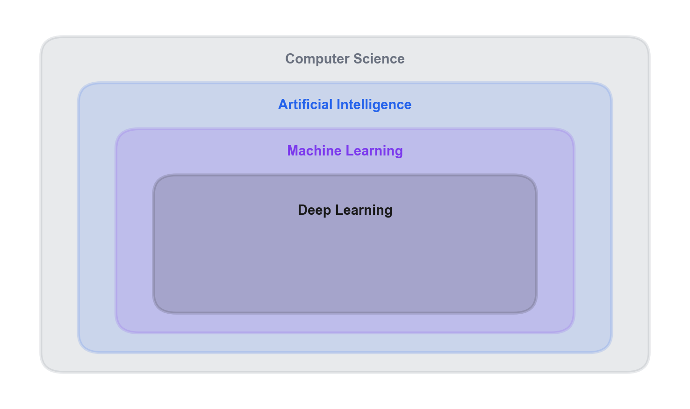
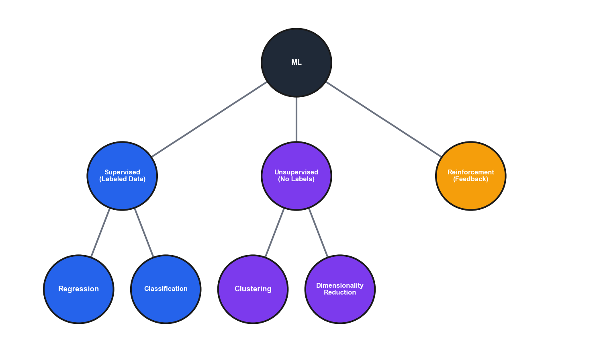

# Module 1: Foundations of Machine Learning

## Introduction

This foundational module builds the vocabulary and conceptual scaffolding you'll use throughout the course. Before fitting a single model, you need to know what machine learning actually is, where it came from, which kinds of problems it addresses, and how to set up a working environment. That's what this module delivers.

We begin with definitions—the relationships between AI, Machine Learning, and Data Science—and a historical timeline that explains why the field developed the way it did. We then categorize ML problems (supervised regression and classification, unsupervised clustering and dimensionality reduction, reinforcement learning) and connect each category to real business applications. The second half of the module covers practical tooling: Python environments with pixi, reactive notebooks with marimo, the polars library for data manipulation, and a standard exploratory data analysis workflow.

Evaluation methodology—how to measure whether a model actually works, avoid data leakage, and choose metrics that reflect business costs—is one of the most important topics in applied ML. We introduce it as context here, but the full treatment comes in later modules once you have concrete models to evaluate. Think of this module as building the stage; the subsequent modules will fill it.

---

## Learning Objectives

By the end of this module, you should be able to:

1. **Differentiate** between AI, Machine Learning, Data Science, and related fields
2. **Classify** business problems into appropriate ML task categories (supervised, unsupervised, reinforcement)
3. **Configure** a reproducible Python environment using pixi and marimo
4. **Apply** a standard EDA workflow to inspect, summarize, and visualize a new dataset
5. **Recognize** common misconceptions about AI and ML and explain why each is misleading

---

## 1.1 Introduction & Historical Context

### The AI/ML/Data Science Landscape

Understanding how these concepts relate to each other matters because these terms are thrown around loosely in industry, and you need to cut through the hype.



The nested rectangles show that each inner field is a *subset* of the outer one—not a separate domain. Deep Learning sits inside Machine Learning, which sits inside Artificial Intelligence, which sits inside Computer Science. This means every deep learning system is also a machine learning system, but not every machine learning system uses deep learning. Similarly, every ML system is AI, but rule-based expert systems are AI without being ML. Keep this hierarchy in mind when you encounter these terms—they're often used interchangeably in marketing, but they have distinct technical meanings.

At the outermost level, we have **Computer Science**—the study of computation, information, and automation. More precisely, computer science is concerned with the theory, design, and application of algorithms: step-by-step procedures for solving problems and processing information.

Within that sits **Artificial Intelligence**—machines that exhibit intelligent behavior. The term was coined in 1956, but the foundations go back further—Alan Turing's 1950 paper "Computing Machinery and Intelligence" proposed the Turing test: can a machine's responses be indistinguishable from a human's? AI is a broad umbrella that includes rule-based systems, expert systems, and machine learning.

Inside AI, we have **Machine Learning**—systems that learn from data without being explicitly programmed. This is our focus for the course. The key distinction is *learning from data*. Instead of a human writing rules, the system discovers patterns from examples.

Throughout this course we analyze every ML method through a consistent three-component framework: the **Decision Model** (what function or structure does the method use to make predictions?), the **Quality Measure** (how does it evaluate how well those predictions fit?), and the **Update Method** (how does it improve its parameters to reduce error?). You'll see this framework applied repeatedly starting in Module 2—for now, keep it in the back of your mind as a lens for understanding why algorithms are designed the way they are.

And inside ML, we have **Deep Learning**—machine learning using neural networks with many layers. Deep learning has driven most of the recent AI breakthroughs, but it's just one approach within ML.

**Data Science** sits alongside and overlaps with all of these. Data Science is about extracting insights from data—it combines statistics, domain expertise, and programming. A data scientist might use ML, or might use traditional statistical methods, or might just create visualizations. It's about the goal (insights from data), not the method.

In practice, these boundaries are fuzzy and a single project often spans multiple domains. A customer churn project might involve data science (exploratory analysis), machine learning (predictive model), and software engineering (deployment). The skills transfer across domains: wrangling data, building models, evaluating rigorously, and communicating effectively.

### Key Definitions

The following table provides concise definitions for the core terms introduced above.

| Term | Definition |
|------|------------|
| **Artificial Intelligence** | Machines that exhibit intelligence (broad umbrella) |
| **Machine Learning** | Systems that learn from data without being explicitly programmed |
| **Deep Learning** | ML using neural networks with many layers |
| **Data Science** | Extracting insights from data (may or may not use ML) |

An important nuance is that these terms are used loosely in industry. Job postings for "AI Engineer" and "ML Engineer" and "Data Scientist" often describe the same role. Help yourself by understanding what people actually mean, not just what they say. When evaluating roles, look at specific tools (SQL, Python, TensorFlow), deliverables (reports, dashboards, deployed models), and team structure rather than job titles.

### Historical Timeline

Understanding where ML came from helps you understand why it works the way it does—and why we've seen cycles of hype and disappointment.

#### Early Years

| Year | Milestone | Significance |
|------|-----------|--------------|
| 1847 | Gradient descent published (Cauchy) | The optimization algorithm that powers nearly all modern ML |
| 1950 | Turing Test proposed | Defined the question "Can machines think?" |
| 1957 | Perceptron invented | First neural network, sparked initial optimism |
| 1969 | Minsky & Papert's "Perceptrons" | Showed limitations, contributed to AI Winter |
| 1980s | Expert Systems boom | Rule-based AI, eventually hit scalability limits |
| 1984 | CART published | Foundation for all tree-based methods |
| 1986 | Backpropagation popularized | Enabled training multi-layer networks |
| 1997 | Deep Blue beats Kasparov | Specialized AI success, but not learning |

#### Modern Era

| Year | Milestone | Significance |
|------|-----------|--------------|
| 2001 | Random Forests published | Go-to algorithm for tabular data |
| 2006 | Deep learning revival; CUDA released | New training techniques and GPU computing |
| 2012 | AlexNet wins ImageNet | Deep learning breakthrough, GPU training |
| 2014 | XGBoost released | Dominates Kaggle, still state-of-the-art for tabular data |
| 2016 | AlphaGo beats Lee Sedol | Reinforcement learning milestone |
| 2017 | "Attention Is All You Need" | Transformer architecture, foundation for GPT/BERT |
| 2018 | BERT released | Transfer learning comes to NLP |
| 2020 | GPT-3 | Scaling produces emergent capabilities |
| 2022 | ChatGPT released | Large language models go mainstream |

The 1969 Minsky & Papert finding deserves a moment of attention. They proved that the single-layer perceptron cannot learn the XOR function—a problem that requires a curved decision boundary, not a straight line. This sounds narrow, but it struck at the theoretical heart of neural networks: if one layer can't solve XOR, what are multiple layers good for? The field lost confidence. What researchers didn't yet have was a practical method for training those deeper networks. Backpropagation, popularized by Rumelhart, Hinton, and Williams in 1986, provided that method: it computes how much each weight in the network contributed to the error, working backwards layer by layer, and adjusts weights via gradient descent. This made it feasible to train networks with hidden layers, which can represent the curved boundaries that a single layer cannot.

AI Winters were caused by overpromising followed by underdelivering—researchers making bold claims to secure funding, then hitting fundamental limitations. These cycles repeated multiple times, and the lesson they teach is to be realistic about what current technology can and cannot do.

The key insight for business is that most AI projects fail due to poor problem definition, not technical limitations. Getting the problem right matters more than getting the algorithm right. Poor problem definition manifests as vague objectives ("use AI to improve customer experience"), wrong target variables (predicting email responses when the business needs conversions), or misaligned success metrics (optimizing call duration when customer satisfaction is the goal). Before writing any code, get crystal clear on: What exactly are we predicting? How will predictions be used? What decisions will change?

### ML Task Categories



The tree in this diagram shows how ML problems are categorized based on *what kind of feedback the algorithm receives*. Start at the top (ML) and ask: "Do I have labeled examples showing the right answer?" If yes, go left to **Supervised** (blue)—the algorithm learns from correct answers. If no labels exist, go to **Unsupervised** (purple)—the algorithm finds structure on its own. The third branch, **Reinforcement** (orange), is different: the algorithm learns through trial-and-error feedback (rewards and penalties) rather than from a static dataset.

Within supervised learning, the next question is: "Am I predicting a number or a category?" Numbers lead to **Regression**; categories lead to **Classification**. Within unsupervised, ask: "Am I grouping similar items (**Clustering**) or compressing features (**Dimensionality Reduction**)?" Machine Learning branches into three main categories, each defined by the type of feedback the algorithm receives.

**Supervised Learning** applies when you have labeled data and want to predict labels for new data. The "supervision" comes from the labels—they tell the algorithm what the right answer is. Supervised learning divides further into **Regression** (predicting continuous values such as sales forecasting, price prediction, and demand estimation) and **Classification** (predicting categories such as spam detection, customer churn, and fraud detection).

**Unsupervised Learning** applies when there are no labels and you are trying to find hidden structure in the data. It divides into **Clustering** (grouping similar items together, as in customer segmentation, document grouping, and anomaly detection) and **Dimensionality Reduction** (compressing many features into fewer features, as in visualization, noise reduction, and feature extraction).

**Reinforcement Learning** involves an algorithm that learns optimal actions through trial and error, receiving rewards or penalties for its choices. Examples include game playing, robotics, and recommendation systems. This course provides a brief overview only; reinforcement learning is not a primary focus.

The choice between regression and classification depends on what decision the prediction enables. If the business needs a specific number ("How many units will we sell?"), that's regression. If it needs a category ("Will this customer churn?"), that's classification. Many problems could be framed either way—a common pattern is to build a regression model (predict probability) and threshold it for classification decisions, giving you both continuous scores for prioritization and discrete classes for action.

**Worked example — the same problem, two framings.** A bank wants to act on loan default risk. Framed as **regression**: predict the *probability* that a borrower defaults (a number between 0 and 1). Output: 0.73. Framed as **classification**: predict whether a borrower *will* default (a category—Yes or No). Output: Yes. Both models could be built from the same features. The regression framing gives loan officers a ranked score for prioritizing outreach; the classification framing gives an automated approve/deny decision. Often you build the regression model first and apply a threshold (e.g., flag anyone above 0.60 as high-risk), getting the benefits of both in one model. The key point is that the business question—what action will follow the prediction?—should drive which framing you choose.

### Business Applications by Industry

The following table illustrates how different ML task types map to common business applications across industries.

| Industry | Application | ML Type |
|----------|-------------|---------|
| Retail | Demand forecasting | Regression |
| Finance | Fraud detection | Classification |
| Marketing | Customer segmentation | Clustering |
| Healthcare | Disease diagnosis | Classification |
| Manufacturing | Predictive maintenance | Classification |
| E-commerce | Product recommendations | Collaborative filtering / Clustering |

Classification appears frequently in business because we often need to make decisions: approve or deny, flag or pass, target or ignore. Pedagogically, we learn regression first because it's simpler—you can visualize a line through points, and the loss function (MSE) is intuitive. Many core concepts (features, coefficients, overfitting, regularization) work identically in both settings, so learning them in the simpler regression context means you can focus on concepts rather than classification-specific complications.

**Case study — retail demand forecasting.** A national grocery chain wants to reduce food waste while keeping shelves stocked. Each store carries thousands of SKUs, and orders placed today arrive in two days. The chain trains a regression model that predicts units sold per SKU per store for each day, using features like historical sales, day of week, upcoming holidays, local weather, and promotional calendars. The model outputs a number—predicted demand—which the ordering system rounds to case quantities. Before ML, buyers used spreadsheet-based rules that required constant manual adjustment. After deployment, spoilage dropped because the model learned seasonal patterns the rules missed, and stockouts also decreased because the model reacted faster to demand signals. The business value came not from an exotic algorithm but from consistent, systematic prediction at a scale no human team could match.

### Common Misconceptions

Several misconceptions about AI and ML persist in industry and popular culture.

| Misconception | Reality |
|--------------|---------|
| "AI and ML are the same thing" | ML is a subset of AI. AI includes rule-based systems that don't learn from data. |
| "ML will replace all human decision-making" | ML augments human decisions. Many problems require human judgment, ethics, and contextual understanding. |
| "Deep Learning is always better than traditional ML" | Deep learning requires lots of data and compute. For tabular business data, traditional ML (XGBoost, Random Forest) often wins. |
| "More data always leads to better models" | Data quality matters more than quantity. Biased or noisy data leads to biased or noisy models. |

A natural question is how much data is "enough." For classical ML, a common rule of thumb is 10-20 samples per feature for linear models (Harrell, 2001). For deep learning, you typically need thousands to millions of samples, though transfer learning reduces this. The practical test: plot learning curves. A learning curve plots model performance (training error and validation error) on the vertical axis against the size of the training set on the horizontal axis—you progressively train the model on larger subsets and record performance at each size. If validation performance is still improving as you add data, you likely need more. If it has plateaued and training error is also low, more data won't help—look to better features or a different model class instead.

---

## 1.2 Python Environment Setup

### Jupyter Notebooks and Google Colab

#### Jupyter Notebooks

Jupyter Notebooks provide an interactive computing environment that lets you mix code, output, and documentation in a single document, making them well suited for exploration and teaching.

#### Google Colab

Google Colab offers several advantages: it requires no local setup, provides free GPU access, supports easy sharing, and comes with common packages pre-installed.

#### Best Practices

When working with notebooks, use markdown cells for documentation, keep cells focused on one logical step, restart and run all before sharing to verify reproducibility, and use consistent naming conventions throughout.

"Restart and Run All" prevents hidden state issues: cells run out of order, deleted cells leaving ghost variables, or imports removed but modules still loaded. If it fails, your notebook has hidden dependencies. If it succeeds, anyone can reproduce your results. Do this before every commit or share.

### marimo Notebooks

**marimo** is a next-generation Python notebook that solves many of Jupyter's pain points. Unlike Jupyter's manual cell execution, marimo notebooks are **reactive**—when you change a variable, all cells that depend on it automatically re-execute. This eliminates the hidden state problems that plague Jupyter notebooks.

#### Key Differences from Jupyter

| Feature | Jupyter | marimo |
|---------|---------|--------|
| Execution | Manual cell runs | Reactive (auto-updates) |
| File format | JSON (.ipynb) | Pure Python (.py) |
| Reproducibility | State can diverge from code | Reproducible by default (random seeds still required for stochastic code) |
| Version control | Difficult diffs | Clean git diffs |
| Cell ordering | Can run out of order | Execution order enforced |

Use **Jupyter/Colab** for quick exploration, collaboration with non-technical stakeholders, and free GPU access (Colab). Use **marimo** for production notebooks, version control, reproducibility, and teaching environments where you want guaranteed consistency.

In this course, we use marimo for most notebooks because the reactive execution model prevents the "run cells out of order" bugs that commonly confuse students. The pure Python format also means you can use standard development tools like linters and formatters.

**marimo cell syntax:** Each cell in a marimo notebook is defined by an `@app.cell` decorator on a function. Variables are shared between cells via function return values and signatures—not through global scope:

```python
@app.cell
def _():
    import polars as pl
    return pl,

@app.cell
def _(pl):
    _df = pl.read_csv("data.csv")
    _df.head()
    return
```

The first cell imports `polars` and returns it. The second cell receives `pl` through its function signature. Variables prefixed with `_` (like `_df`) are local to the cell and not exported to other cells. The underscore prefix is a signal to marimo's runtime: "this value is intermediate and nothing outside this cell should depend on it." Variables you want to share across cells must be returned without the underscore prefix and received via the function signature of any cell that needs them. This explicit dependency graph is what makes marimo notebooks reproducible—the runtime knows exactly which cells depend on which variables and re-executes only what's necessary when something changes.

### pixi Package Manager

**pixi** is a modern package manager that handles Python environments with speed and reproducibility. It uses the same package repository as conda but with faster dependency resolution and a cleaner project structure.

pixi is well suited for this course for several reasons. It is fast, resolving dependencies in seconds rather than minutes. It is reproducible, using lock files to ensure everyone has identical environments. It is cross-platform, with the same configuration working on Windows, Mac, and Linux. And it is simple, with one configuration file (`pixi.toml`) defining your entire project.

#### Installation

```bash
# macOS/Linux
curl -fsSL https://pixi.sh/install.sh | bash

# Windows (PowerShell)
iwr -useb https://pixi.sh/install.ps1 | iex
```

After installation, restart your terminal and verify with `pixi --version`.

#### Project Structure

A pixi project is defined by a `pixi.toml` file. The example below shows a minimal project skeleton; pin the versions to whatever your project actually needs (the BAN 501 course environment specifically uses Python 3.14+ and the pinned versions in the repo's root `pixi.toml`):

```toml
[project]
name = "ban501-module1"
version = "0.1.0"
channels = ["conda-forge"]
platforms = ["linux-64", "osx-arm64", "win-64"]

[dependencies]
python = ">=3.14"
polars = ">=1.38"
scikit-learn = ">=1.8"
matplotlib = ">=3.10"
seaborn = ">=0.13"
marimo = ">=0.20"
```

#### Common Commands

The following table summarizes the most frequently used pixi commands.

| Command | Description |
|---------|-------------|
| `pixi install` | Install all dependencies from pixi.toml |
| `pixi add polars` | Add a new dependency |
| `pixi run python script.py` | Run Python in the project environment |
| `pixi run marimo edit notebook.py` | Open marimo notebook in project environment |
| `pixi shell` | Activate the environment in your shell |

#### Typical Workflow

```bash
# Clone or create a project
cd my-project

# Install dependencies (creates/updates lock file)
pixi install

# Run your code
pixi run python analysis.py

# Or activate the environment for interactive work
pixi shell
python
```

### polars Essentials

This section covers the core polars operations you need for data exploration and preparation.

```python
import polars as pl
import numpy as np

# Reading data
df = pl.read_csv('data.csv')

# Basic exploration
df.head()           # First 5 rows
df.schema           # Data types (column name -> dtype mapping)
df.describe()       # Statistical summary
df.shape            # (rows, columns)

# Selection
df.select('column')              # Single column
df.select(['col1', 'col2'])      # Multiple columns
df.row(0)                        # Single row by index (returns a tuple, not a DataFrame)
df[0:5]                          # Slice rows

# Filtering
df.filter(pl.col('age') > 30)
df.filter((pl.col('age') > 30) & (pl.col('income') > 50000))

# Aggregation
# pl.all().mean() computes the mean of every non-grouped column.
# Prefer naming columns explicitly for clarity and safety with mixed-type data:
df.group_by('category').agg([
    pl.col('sales').mean(),
    pl.col('price').mean(),
])
df.group_by('category').agg([
    pl.col('sales').sum(),
    pl.col('customers').count()
])

# Handling missing values
df.null_count()                    # Count nulls per column
df.drop_nulls()                    # Drop rows with any nulls
df.fill_null(0)                    # Fill with constant
df.fill_null(strategy='mean')      # Fill with mean
```

### Basic EDA Workflow

A standard exploration sequence begins with loading and inspecting the data—checking shape, data types, and head/tail for obvious issues. Next, assess missing values by counting nulls per column and visualizing missingness patterns. Then conduct univariate analysis to examine distributions and identify outliers, followed by bivariate analysis to explore correlations and feature-target relationships. Finally, document your findings, including key insights, data quality issues, and feature engineering ideas.

The following code illustrates each of the five steps in sequence:

```python
import polars as pl
import seaborn as sns
import matplotlib.pyplot as plt

# Step 1: Load and inspect
df = pl.read_csv("data.csv")
print(df.shape)       # (n rows, d columns)
print(df.schema)      # column names and dtypes
df.head()

# Step 2: Assess missing values
print(df.null_count())   # nulls per column

# Step 3: Univariate analysis — distribution of one column
plt.figure(figsize=(8, 5))
sns.histplot(df["sales"].to_list(), kde=True)
plt.xlabel("Sales")
plt.title("Distribution of Sales")
plt.show()

# Step 4: Bivariate analysis — scatter of two columns
sns.scatterplot(
    x=df["feature"].to_list(),
    y=df["target"].to_list(),
)
plt.xlabel("Feature")
plt.ylabel("Target")
plt.show()

# Step 5: Document — print a brief summary
print(df.describe())
```

Write EDA documentation for your future self six months from now—you'll have forgotten everything. Minimum viable documentation: what questions were you answering? What did you find? What decisions did you make based on findings? What concerns remain? Document conclusions and decisions, not every chart. For formal projects, a separate EDA report for stakeholders should tell a story; the working notebook is for reproducibility.

### Visualization with matplotlib/seaborn

The following examples demonstrate common visualization patterns using matplotlib and seaborn.

```python
import matplotlib.pyplot as plt
import seaborn as sns

# Distribution
plt.figure(figsize=(10, 6))
sns.histplot(df['column'].to_list(), kde=True)
plt.title('Distribution of Column')
plt.show()

# Correlation heatmap
plt.figure(figsize=(12, 8))
sns.heatmap(df.to_pandas().corr(numeric_only=True), annot=True, cmap='coolwarm', center=0)
# Note: polars exposes DataFrame.corr(), but mixed-type frames (any non-numeric column)
# raise a TypeError. Convert to pandas with numeric_only=True (required on mixed-type
# frames in pandas 3.0), or restrict to numeric columns via
# df.select(pl.selectors.numeric()).corr(). The polars-native pl.corr() expression
# (e.g., df.select(pl.corr("col1", "col2"))) returns pairwise correlations directly.
plt.title('Correlation Matrix')
plt.show()

# Scatter plot with hue (seaborn accepts polars DataFrames directly)
sns.scatterplot(data=df, x='feature1', y='feature2', hue='target')

# Box plot for outliers
sns.boxplot(data=df, x='category', y='value')

# Pair plot (for small number of features) — pairplot requires pandas, so convert
sns.pairplot(df.to_pandas(), hue='target')
```

When creating visualizations, always label axes, use appropriate chart types, consider colorblind-friendly palettes, and limit each chart to one clear message.

### GPU Computing and CUDA

In Section 1.1, we mentioned that NVIDIA released CUDA in 2006 and that AlexNet's 2012 ImageNet victory was enabled by GPU training. Understanding why GPUs matter for machine learning is essential context for the deep learning modules later in this course. Module 6 (Neural Networks) is where this background becomes directly applicable—we'll use PyTorch with CUDA-enabled hardware to train networks that would be impractical on a CPU alone.

#### Why GPUs Matter for ML

CPUs (Central Processing Units) are designed for sequential tasks—they have a few powerful cores that excel at complex operations one at a time. GPUs (Graphics Processing Units) take the opposite approach: thousands of simpler cores that perform many calculations simultaneously.

Neural network training involves the same operation (multiply-accumulate) applied to millions of numbers. A CPU has a small number of powerful cores optimized for sequential logic; a GPU has thousands of simpler cores designed for parallel arithmetic. For the matrix multiplications at the heart of neural network training, this parallelism typically produces speedups of 10–100x or more, turning a multi-day CPU job into something that finishes in hours. The exact speedup depends on the network architecture, batch size, and hardware generation.

#### CUDA and the Deep Learning Revolution

CUDA (Compute Unified Device Architecture) is NVIDIA's programming interface that lets general software—not just graphics—run on GPUs. Before CUDA, using GPUs for non-graphics tasks required awkward workarounds. CUDA made GPU computing accessible to researchers, and deep learning took off.

The 2012 AlexNet breakthrough wasn't just about a better algorithm—the same architecture trained on CPUs would have taken months. GPU training made rapid experimentation possible, accelerating the entire field.

#### Practical Considerations

The following table summarizes hardware recommendations by task type.

| Task | Hardware Recommendation |
|------|------------------------|
| Tabular data (small-medium datasets) | CPU sufficient |
| Traditional ML (Random Forest, XGBoost) | CPU sufficient |
| Deep learning training | GPU recommended |
| Large-scale inference | GPU beneficial |
| Image/video processing | GPU recommended |

For the early modules of this course (regression, classification, ensemble methods), you won't need GPU access—these algorithms run well on CPUs. When we reach the neural network modules (6-8), GPU access becomes valuable.

#### Accessing GPUs

You can access GPUs through several channels. **Google Colab**'s free tier includes limited GPU access—select "Runtime > Change runtime type > GPU." A **local GPU** requires an NVIDIA GPU and CUDA toolkit installation. **Cloud platforms** such as AWS, GCP, and Azure offer GPU instances for rent.

For this course, Colab's free tier is sufficient for the deep learning exercises. If you have a local NVIDIA GPU, you can configure pixi to use CUDA-enabled packages, but this is optional.

---

## Deep Dives

For supplementary material that extends this module:

- **[Deep Dive: Data Preparation and Feature Engineering](../appendices/data-preparation.md)** — practical techniques for handling missing values, encoding categoricals, scaling features, and creating interaction terms.
- **[Deep Dive: Model Evaluation and Validation](../appendices/model-evaluation.md)** — train/validation/test splits, k-fold cross-validation, the bias-variance trade-off, and common pitfalls in evaluation.

---

## Reflection Questions

1. A company says they're using "AI" for their chatbot. Is this AI? Machine Learning? Both? Neither? How would you find out?

2. You have a dataset where 30% of income values are missing. The missingness correlates with age (older people less likely to report). What imputation strategy would you use?

3. *(Preview — covered in Module 2)* A colleague scales the entire dataset before splitting into train/test. Why is this a problem? How would it affect your model evaluation? This is the concept of data leakage; we define it here as a term to watch for, and Module 2 works through the mechanics with concrete pipelines.

4. *(Preview — covered in Module 3)* Your manager asks: "Is 85% accuracy good?" How would you respond? Hold this question in mind until Module 3, where we cover classification metrics and the baseline comparison that makes accuracy meaningful.

5. *(Preview — covered in Module 2)* A model has R² = 0.95 on training data and R² = 0.60 on test data. What's happening? What would you do? This is the signature pattern of overfitting; the bias-variance framework that explains it is developed in Module 2.

6. *(Preview — covered in Module 3)* Which metric would you optimize for a medical diagnosis model where missing a disease (false negative) is much worse than a false alarm? Precision, recall, and F1 are introduced in Module 3 alongside classification methods.

---

## Practice Problems

1. Given a dataset description, identify whether each column needs scaling, encoding, or neither.

2. *(Module 3 preview)* Calculate precision, recall, and F1 from a confusion matrix. These metrics are formally introduced in Module 3. If you want to get ahead, look up the definitions of true positives, false positives, and false negatives—you'll need them there.

3. Interpret R² = 0.75 in business terms.

4. Identify potential data leakage in a described ML pipeline.

5. For each business problem, recommend an appropriate evaluation metric and justify:
   - Predicting next month's revenue
   - Identifying customers likely to cancel
   - Grouping products that are often bought together

---

## Chapter Summary

This module established the conceptual foundation for the entire course. Machine learning is a subset of AI that learns patterns from data, and it overlaps with—but is distinct from—Data Science; keeping these terms straight helps you cut through industry hype. A historical timeline showed why the field developed in cycles: the gap between promising ideas and practical tools has repeatedly driven booms and winters, and understanding that history makes the modern toolkit easier to appreciate.

Choosing the right task type is the first modeling decision: regression for continuous values, classification for categories, and clustering for grouping. The three-component framework—Decision Model, Quality Measure, Update Method—gives you a consistent lens for understanding any algorithm you encounter in the remaining modules.

On the practical side, this module introduced the core tools: pixi for reproducible environments, marimo for reactive notebooks with explicit dependency tracking, polars for data manipulation, and a five-step EDA workflow for systematically understanding any new dataset. These tools will appear throughout the course; the time invested learning them here pays dividends in every subsequent module.

---

## What's Next

In Module 2 we build the first concrete models—linear regression and its regularized variants (Ridge, Lasso). Module 2 will introduce several concepts mentioned in passing here: train-test splitting, RMSE/MAE/R² as evaluation metrics, cross-validation, and the bias-variance tradeoff. What you bring from Module 1 is the conceptual scaffolding—understanding that regression is a supervised task, familiarity with the three-component framework, and the ability to load and explore a dataset. Module 2 takes those foundations and adds the modeling mechanics on top.
