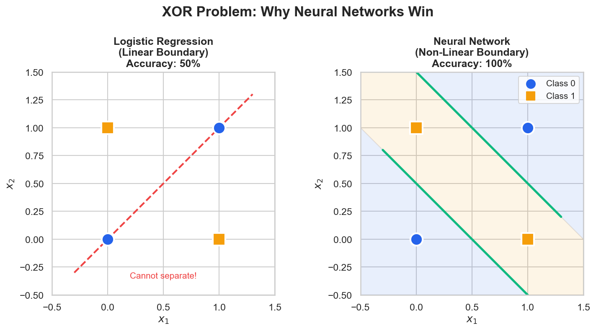
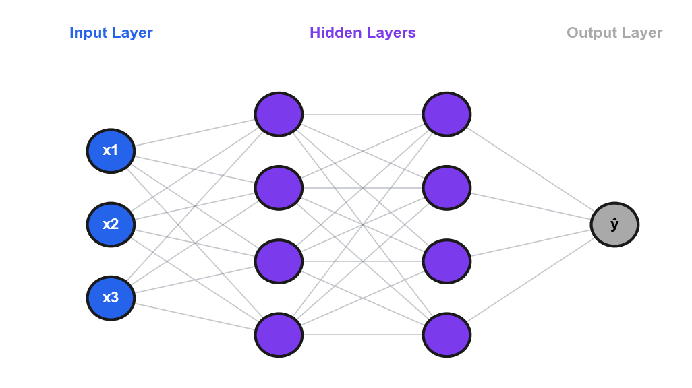

# Module 6: Neural Networks Fundamentals

## Introduction

Today we cross a threshold—we're entering deep learning. Everything we've covered so far—regression, classification, ensemble methods, unsupervised learning—those are "classical" machine learning. Powerful, interpretable, widely used. But deep learning has transformed what's possible with images, text, audio, and complex patterns.

Here's the key insight: **neural networks are not magic.** They're built on the same principles we've been learning. Remember gradient descent from Module 2? You'll see it again. Remember the bias-variance tradeoff from Module 1? It applies here too. What makes neural networks special is their ability to learn hierarchical representations—layer by layer, from simple patterns to complex concepts.

#### Hierarchical Learning Is Automatic

We design the architecture and loss function; the specific representations are discovered, not designed. Through backpropagation, weights organize themselves to extract useful features. Researchers visualizing trained networks find edges in layer 1, textures in layer 2, object parts in later layers—this emerges from optimization as the most efficient solution.

---

## Learning Objectives

By the end of this module, you should be able to:

1. **Explain** the historical development and architecture of neural networks
2. **Describe** the components of a neural network (weights, biases, activations)
3. **Understand** backpropagation and gradient-based optimization
4. **Implement** a simple neural network in PyTorch
5. **Train** and evaluate networks on classification tasks
6. **Apply** regularization techniques to prevent overfitting

---

## 6.1 Introduction to Neural Networks

This section covers what neural networks are, how they evolved, and why their architecture enables learning complex patterns.

### Three Components: Neural Networks

Neural networks follow the same three-component framework we have applied to every model in this course.

| Component | Neural Network |
|-----------|----------------|
| **Decision Model** | Stacked layers with non-linear activations |
| **Quality Measure** | Cross-entropy (classification) or MSE (regression) |
| **Update Method** | Backpropagation + gradient descent (SGD, Adam) |

The decision model defines what the network can represent: a composition of affine transformations and non-linear activations, layer by layer. The quality measure tells training which direction to move by quantifying prediction error. The update method—backpropagation—uses the chain rule to compute how each of the millions of parameters contributed to that error, and gradient descent adjusts them accordingly.

In Module 2, you implemented gradient descent for two parameters ($\beta_0$, $\beta_1$). Neural networks apply the same idea to millions of parameters. The algorithm is the same; the scale is different.

### Historical Context

Neural networks have a long and uneven history, marked by cycles of enthusiasm and disillusionment.

In 1957, Frank Rosenblatt invented the **Perceptron**—a single layer of weights that could learn simple patterns. The New York Times predicted thinking machines within a decade. Then in 1969, Minsky and Papert published "Perceptrons," proving single-layer networks can't learn XOR. Funding dried up, triggering the first "AI Winter." Progress resumed in 1986 when Rumelhart, Hinton, and Williams popularized **backpropagation**, making deep network training practical. The modern era began in 2012, when **AlexNet** won ImageNet by a massive margin, demonstrating that deep networks trained on GPUs could dramatically outperform traditional methods. Today, the field has advanced to Transformers, GPT, and large language models. The lesson of this timeline is that neural networks have existed for 70 years. What changed is data, compute, and better training techniques.

#### Why Deep Learning Works Now

Three factors combined: (i) **Data**—ImageNet provided 14M labeled images; the internet generated billions of documents, (ii) **GPUs**—parallel operations for matrix multiplication, turning weeks into hours, and (iii) **Better techniques**—ReLU solved vanishing gradients, dropout provided regularization, batch norm stabilized training, and Adam made optimization robust. AlexNet (2012) combined all three and won ImageNet decisively.

### The XOR Problem

The XOR function outputs 1 if exactly one input is 1:

| x₁ | x₂ | XOR |
|----|----|----|
| 0 | 0 | 0 |
| 0 | 1 | 1 |
| 1 | 0 | 1 |
| 1 | 1 | 0 |

A single-layer perceptron can only learn linearly separable patterns, and XOR isn't linearly separable—you can't draw a single straight line to separate the 1s from the 0s. The solution is to add a hidden layer, which "transforms" the space to make the problem linearly separable.



The two panels show the same four XOR points. On the left, a linear classifier (logistic regression) is forced to draw a single straight boundary; whichever way the line tilts, two of the four points end up on the wrong side, so accuracy stalls at 50%. On the right, a small neural network (one hidden layer with two ReLU units) learns *two* linear boundaries — visualized as a band — that together carve the input space into the correct three regions, classifying all four points correctly.

#### How the Hidden Layer Transforms Space

Each neuron computes a weighted sum (defining a hyperplane) plus activation (bending space around it). For XOR, one neuron might learn "x₁ + x₂ > 0.5" and another "x₁ + x₂ < 1.5"—together creating a representation where (0,1) and (1,0) map similarly while (0,0) and (1,1) map differently. The output layer can now draw a line in this transformed space.

!!! example "Numerical Example: XOR with a Hidden Layer"

    ```python
    import torch
    import torch.nn as nn
    import torch.optim as optim

    torch.manual_seed(42)

    # XOR data
    X = torch.tensor([[0.0, 0.0], [0.0, 1.0], [1.0, 0.0], [1.0, 1.0]])
    y = torch.tensor([[0.0], [1.0], [1.0], [0.0]])

    # Network: 2 inputs -> 4 hidden (tanh) -> 1 output (sigmoid)
    class XORNet(nn.Module):
        def __init__(self):
            super().__init__()
            self.hidden = nn.Linear(2, 4)
            self.output = nn.Linear(4, 1)

        def forward(self, x):
            h = torch.tanh(self.hidden(x))
            return torch.sigmoid(self.output(h))

    model = XORNet()
    optimizer = optim.Adam(model.parameters(), lr=0.5)  # Unusually high lr for this toy problem; typical Adam lr is ~0.001
    criterion = nn.BCELoss()

    for epoch in range(2000):
        optimizer.zero_grad()
        loss = criterion(model(X), y)
        loss.backward()
        optimizer.step()

    # Test
    model.eval()
    with torch.no_grad():
        for i in range(4):
            pred = model(X[i:i+1]).item()
            print(f"({X[i,0]:.0f}, {X[i,1]:.0f}) -> {pred:.3f} -> {1 if pred > 0.5 else 0}")
    ```

    **Output:**

    ```
    (0, 0) -> 0.000 -> 0
    (0, 1) -> 1.000 -> 1
    (1, 0) -> 1.000 -> 1
    (1, 1) -> 0.000 -> 0
    ```

    **Interpretation:** The network learns XOR perfectly. The hidden layer transforms the 2D input space so that (0,0) and (1,1) map to one region while (0,1) and (1,0) map to another—making the problem linearly separable for the output layer.

    *Source: `computations/module6_examples.py` — `demo_xor_hidden_layer()`*


### Multi-Layer Perceptron (MLP) Architecture

The multi-layer perceptron is the foundational neural network architecture, consisting of an input layer, one or more hidden layers, and an output layer.



The diagram shows a network with three input neurons (x1, x2, x3) in blue on the left, two hidden layers with four neurons each in purple in the middle, and a single output neuron (ŷ) in gray on the right. Every neuron in one layer connects to every neuron in the next layer—these gray lines represent the weights that the network learns during training. Information flows left to right: inputs enter, get transformed through hidden layers, and produce a prediction. The "depth" of this network is 2 (two hidden layers), and the "width" of each hidden layer is 4. Notice that the input layer is not counted when describing network depth—it's just the raw data entry point.

The standard terminology for these components is as follows. The input layer receives raw features and is not counted when describing the number of "layers." Hidden layers learn intermediate representations between input and output. The output layer produces the final predictions. The depth of a network refers to its number of hidden layers (counting hidden layers only), while the width refers to the number of neurons per layer.

| Network Type | Hidden Layers | Typical Use |
|-------------|---------------|-------------|
| Shallow | 1-2 | Simple patterns |
| Deep | 3+ | Complex patterns |
| Very Deep | 50+ | State-of-the-art |

### Why Depth Matters

Each layer in a deep network learns progressively more abstract features. Layer 1 typically captures edges and simple patterns, layer 2 combines those into textures and shapes, layer 3 assembles object parts, and later layers represent complete concepts. Deep networks learn hierarchical representations that match how complex patterns are actually structured.

### Universal Approximation Theorem

A feedforward network with a single hidden layer can approximate any continuous function, given enough neurons. What this means in practice is that any reasonable function can be approximated, but the theorem does not tell you how many neurons you need, how to find the weights, or that one layer is optimal. In practice, deep networks represent the same functions more efficiently than wide shallow ones.

#### Why Depth over Width

A function that a 10-layer network represents with 1,000 neurons might require millions in a single layer. Complex patterns are compositional (faces = eyes + nose + mouth; eyes = curves + colors)—deep networks represent this hierarchy naturally. Shallow networks must learn all combinations directly, which explodes exponentially. Deeper architectures outperform shallow ones with the same parameter count on complex benchmarks.

### Network Components

A neural network has three core components: (i) **weights (W)**, which are the learnable parameters connecting neurons, (ii) **biases (b)**, which provide a learnable offset per neuron, and (iii) **activation functions**, which apply non-linear transformations. The computation at each neuron combines all three:

$$output = activation(Wx + b)$$

### Activation Functions

The choice of activation function determines the kind of non-linearity each layer can express.

The most common activation is the Rectified Linear Unit (ReLU):

$$\text{ReLU}(x) = \max(0, x)$$

ReLU is simple—negative inputs map to 0, positive inputs pass through unchanged. It is the default choice for hidden layers and helps mitigate vanishing gradients.

The sigmoid function squashes its input to the range (0, 1):

$$\sigma(x) = \frac{1}{1 + e^{-x}}$$

This makes it well suited for binary output layers, but it suffers from vanishing gradients in deep networks because its derivative approaches zero for large-magnitude inputs.

Softmax generalizes sigmoid to multi-class settings:

$$\text{softmax}(x_i) = \frac{e^{x_i}}{\sum_j e^{x_j}}$$

Its outputs sum to 1, giving a probability distribution over $C$ classes. Softmax is applied in the final layer when predicting mutually exclusive categories—for example, identifying which digit (0 through 9) an image shows. The softmax output feeds directly into cross-entropy loss: cross-entropy measures how close the predicted probability distribution is to the true one-hot label. In PyTorch, `nn.CrossEntropyLoss()` combines a log-softmax step and the negative log-likelihood loss into one numerically stable operation, so you should not apply softmax manually before passing logits to this loss function.

### Why Non-linear Activations?

Non-linear activations are essential because without them, stacking layers collapses into a single linear transformation:

$$Layer_2(Layer_1(x)) = W_2(W_1 x) = (W_2 W_1)x = Wx$$

Multiple linear layers are equivalent to one linear layer. No matter how many linear layers you stack, the result is still linear. Non-linear activations allow each layer to transform representations in ways linear functions cannot.

#### Why ReLU Works

ReLU succeeds for three reasons: (i) it solves the vanishing gradient problem—sigmoid's gradient approaches zero for large inputs, whereas ReLU has gradient 1 for positives, letting gradients pass through unchanged, (ii) it is computationally efficient—just max(0, x), orders of magnitude faster than sigmoid, and (iii) it produces sparse activation—roughly 50% of neurons may output zero for any given input, improving efficiency. Despite being piecewise linear, stacking many ReLUs can approximate any continuous function.

#### Understanding "Dead" ReLU Neurons

When a neuron's input is negative, ReLU outputs 0 and its gradient is also 0. This means negative-input neurons contribute to neither predictions nor learning for that example. While this sounds problematic, it is beneficial for two reasons: (i) it creates **sparsity**—only a subset of neurons activate for any given input, making computation efficient, and (ii) different inputs activate different neuron subsets, so the network implicitly learns specialized sub-networks for different patterns. However, if a neuron's weights drift so that it *always* receives negative inputs (for all training examples), it becomes permanently "dead" and stops learning. This is the "dying ReLU" problem, which techniques like Leaky ReLU address.

!!! example "Numerical Example: ReLU vs Sigmoid Gradients"

    ```python
    import numpy as np

    def sigmoid(x):
        return 1 / (1 + np.exp(-x))

    def sigmoid_gradient(x):
        s = sigmoid(x)
        return s * (1 - s)

    def relu_gradient(x):
        return 1.0 if x > 0 else 0.0

    # Simulate gradient flowing backward through 10 layers
    # (assuming all neurons in saturated sigmoid region, z=2)
    print("Gradient flowing backward through 10 layers:")
    print(f"{'Layer':>6} {'Sigmoid grad':>15} {'ReLU grad':>15}")

    sigmoid_grad = 1.0
    relu_grad = 1.0
    for layer in range(10, 0, -1):
        print(f"{layer:>6} {sigmoid_grad:>15.6f} {relu_grad:>15.1f}")
        sigmoid_grad *= sigmoid_gradient(2.0)  # Saturated region
        relu_grad *= relu_gradient(2.0)        # Positive region

    print(f"\nAfter 10 layers: sigmoid={sigmoid_grad:.2e}, ReLU={relu_grad:.1f}")
    ```

    **Output:**

    ```
    Gradient flowing backward through 10 layers:
     Layer    Sigmoid grad        ReLU grad
        10        1.000000             1.0
         9        0.104994             1.0
         8        0.011024             1.0
         7        0.001157             1.0
         6        0.000122             1.0
         5        0.000013             1.0
         4        0.000001             1.0
         3        0.000000             1.0
         2        0.000000             1.0
         1        0.000000             1.0

    After 10 layers: sigmoid=1.63e-10, ReLU=1.0
    ```

    **Interpretation:** With sigmoid activations, the gradient shrinks by ~10x at each layer. After 10 layers, it's essentially zero (1.63×10⁻¹⁰)—early layers receive no learning signal. ReLU maintains gradient magnitude, enabling training of very deep networks. This is the **vanishing gradient problem** that plagued early deep learning.

    *Source: `computations/module6_examples.py` — `demo_relu_vs_sigmoid_gradients()`*


### Weight Initialization

Proper weight initialization prevents vanishing and exploding gradients at the start of training. Poor initialization can make deep networks effectively untrainable.

Xavier/Glorot initialization is designed for sigmoid and tanh activations. It draws weights from a distribution scaled by the number of input and output neurons, keeping variance roughly constant across layers.

$$W \sim \mathcal{U}\left(-\sqrt{\frac{6}{n_{in} + n_{out}}}\;,\; \sqrt{\frac{6}{n_{in} + n_{out}}}\right)$$

The goal is that the variance of activations should not change dramatically from one layer to the next. If weights start too large, activations saturate; if they start too small, signals vanish. Xavier achieves this balance for activations that are approximately linear near zero, which sigmoid and tanh satisfy.

He initialization is designed for ReLU activations. ReLU zeros out roughly half of its inputs (the negative half), which halves the variance of the signal passing through. He initialization compensates by using a scale that is $\sqrt{2}$ larger than Xavier:

$$W \sim \mathcal{N}\left(0, \sqrt{\frac{2}{n_{in}}}\right)$$

The rule of thumb is straightforward: use He initialization with ReLU hidden layers, and Xavier initialization with sigmoid or tanh. Using Xavier with ReLU tends to produce signals that shrink with depth; using He with sigmoid can cause saturation.

In PyTorch, these are applied as:

```python
import torch.nn as nn

# Xavier initialization (good for tanh/sigmoid)
nn.init.xavier_uniform_(layer.weight)

# He initialization (good for ReLU)
nn.init.kaiming_normal_(layer.weight, mode='fan_in', nonlinearity='relu')
```

PyTorch's default initialization works well for most cases, but explicitly setting He initialization for ReLU networks is considered best practice for deep architectures.

### Parameter Counting

The number of learnable parameters in a fully connected layer is given by:

$$Parameters = (input \times output) + output = weights + biases$$

For example, consider a network with layers [784, 256, 128, 10]:
- Layer 1: 784×256 + 256 = 200,960
- Layer 2: 256×128 + 128 = 32,896
- Layer 3: 128×10 + 10 = 1,290
- **Total: 235,146 parameters**

```python
def count_parameters(model):
    return sum(p.numel() for p in model.parameters() if p.requires_grad)
```

Whether 10 million parameters is "a lot" depends on your data. If you have 1,000 examples and 10 million parameters, you will overfit. If you have 10 million examples, it is reasonable. The ratio matters.

!!! example "Numerical Example: Parameter Counting Walkthrough"

    ```python
    def count_params(architecture):
        """Count parameters for a fully connected network."""
        total = 0
        for i in range(len(architecture) - 1):
            weights = architecture[i] * architecture[i + 1]
            biases = architecture[i + 1]
            total += weights + biases
            print(f"Layer {i+1}: {architecture[i]}x{architecture[i+1]} "
                  f"= {weights:,} weights + {biases} biases = {weights + biases:,}")
        return total

    # Three different architectures for MNIST (784 inputs, 10 outputs)
    print("Architecture 1: [784, 256, 128, 10]")
    total1 = count_params([784, 256, 128, 10])
    print(f"Total: {total1:,}\n")

    print("Architecture 2 (deeper): [784, 128, 64, 32, 16, 10]")
    total2 = count_params([784, 128, 64, 32, 16, 10])
    print(f"Total: {total2:,}\n")

    print("Architecture 3 (wider): [784, 512, 10]")
    total3 = count_params([784, 512, 10])
    print(f"Total: {total3:,}")
    ```

    **Output:**

    ```
    Architecture 1: [784, 256, 128, 10]
    Layer 1: 784x256 = 200,704 weights + 256 biases = 200,960
    Layer 2: 256x128 = 32,768 weights + 128 biases = 32,896
    Layer 3: 128x10 = 1,280 weights + 10 biases = 1,290
    Total: 235,146

    Architecture 2 (deeper): [784, 128, 64, 32, 16, 10]
    Layer 1: 784x128 = 100,352 weights + 128 biases = 100,480
    Layer 2: 128x64 = 8,192 weights + 64 biases = 8,256
    Layer 3: 64x32 = 2,048 weights + 32 biases = 2,080
    Layer 4: 32x16 = 512 weights + 16 biases = 528
    Layer 5: 16x10 = 160 weights + 10 biases = 170
    Total: 111,514

    Architecture 3 (wider): [784, 512, 10]
    Layer 1: 784x512 = 401,408 weights + 512 biases = 401,920
    Layer 2: 512x10 = 5,120 weights + 10 biases = 5,130
    Total: 407,050
    ```

    **Interpretation:** The first layer (connecting to high-dimensional input) dominates the parameter count. Deeper networks can actually have *fewer* parameters than wide shallow ones while achieving better representational power. Architecture 2 has 5 layers but only 111K parameters, while architecture 3 has just 2 layers but 407K parameters.

    *Source: `computations/module6_examples.py` — `demo_parameter_counting()`*


### Common Misconceptions

Several widespread beliefs about neural networks deserve correction.

| Misconception | Reality |
|--------------|---------|
| "Deep learning is different from ML" | Deep learning is machine learning. The same principles apply. |
| "More layers always better" | Deeper = harder to train, can overfit. Match depth to complexity. |
| "Neural networks are black boxes" | Many interpretability tools exist. The criticism is overstated. |
| "Need millions of data points" | Transfer learning enables NNs with small datasets. |

---

## 6.2 Training Neural Networks

With the architecture defined, the next step is training—iteratively adjusting the network's weights to minimize a loss function.

### Loss Functions

The loss function quantifies how far the model's predictions are from the true labels, and its choice depends on the task.

For regression, the standard choice is Mean Squared Error (MSE):

$$L = \frac{1}{n}\sum(y_i - \hat{y}_i)^2$$

For binary classification, Binary Cross-Entropy measures how well predicted probabilities match binary labels:

$$L = -\frac{1}{n}\sum[y\log(\hat{y}) + (1-y)\log(1-\hat{y})]$$

For multi-class problems with $C$ classes, Cross-Entropy extends this to multiple categories:

$$L = -\frac{1}{n}\sum_{i}\sum_{c} y_{ic}\log(\hat{y}_{ic})$$

Here $\hat{y}_{ic}$ is the predicted probability for class $c$ on example $i$, which comes from the softmax output layer. Because softmax ensures the predictions form a valid probability distribution, cross-entropy is the natural companion loss: together they measure how far the predicted distribution is from the true one-hot distribution. In PyTorch, `nn.CrossEntropyLoss()` handles this pair internally—pass raw logits (the pre-softmax output), not softmax outputs.

#### Why Cross-Entropy

The log function severely penalizes confident wrong predictions: $\log(1) = 0$ (no penalty for correct confidence), $\log(0.5) \approx -0.69$ (moderate penalty), and $\log(0.01) \approx -4.6$ (severe penalty).

From an information-theoretic perspective, cross-entropy measures "surprise." If you are 99% confident an email is spam and it turns out to be legitimate, that is very surprising—and the network should pay a heavy penalty for that confident mistake. MSE penalizes errors quadratically, so large errors are penalized disproportionately, but cross-entropy's log penalty means confident-wrong is exponentially worse than uncertain-wrong. This provides much stronger gradients to fix the most problematic predictions.

!!! example "Numerical Example: Cross-Entropy vs MSE for Classification"

    ```python
    import numpy as np

    def mse_gradient(y_true, y_pred):
        return -2 * (y_true - y_pred)

    def cross_entropy_gradient(y_true, y_pred):
        eps = 1e-10
        return -(y_true / (y_pred + eps)) + (1 - y_true) / (1 - y_pred + eps)

    # True label is 1 (positive class), compare gradients at different predictions
    y_true = 1.0
    predictions = [0.99, 0.9, 0.5, 0.1, 0.01]

    print(f"True label: {y_true} (positive class)")
    print(f"{'Prediction':>12} {'MSE Grad':>12} {'CE Grad':>12}")
    for p in predictions:
        print(f"{p:>12.2f} {mse_gradient(y_true, p):>12.2f} "
              f"{cross_entropy_gradient(y_true, p):>12.2f}")
    ```

    **Output:**

    ```
    True label: 1.0 (positive class)
      Prediction     MSE Grad      CE Grad
            0.99        -0.02        -1.01
            0.90        -0.20        -1.11
            0.50        -1.00        -2.00
            0.10        -1.80       -10.00
            0.01        -1.98      -100.00
    ```

    **Interpretation:** When the model predicts 0.01 for a true positive (confidently wrong), cross-entropy provides a gradient of -100 while MSE gives only -1.98. This 50x stronger signal means cross-entropy can fix catastrophic mistakes much faster. MSE's gradients plateau near the extremes, making it sluggish at correcting confident errors.

    *Source: `computations/module6_examples.py` — `demo_cross_entropy_vs_mse()`*


### Backpropagation

Backpropagation is the algorithm that makes deep learning possible. It proceeds in four stages: first, a forward pass computes predictions; next, the loss function measures how wrong those predictions are; then, a backward pass computes gradients using the chain rule; finally, the optimizer adjusts the weights. The chain rule lets us compute how each weight contributed to error, layer by layer, from output back to input.

#### Why Gradient Computation Is Fast

Backpropagation reuses computations—when computing gradients for layer 5, you reuse gradient info from layers 6-10. Total cost is roughly 2x the forward pass, O(n) in weights. GPUs parallelize matrix multiplications across thousands of cores. Processing 64 examples in parallel takes almost the same time as 1. A network with 100M parameters takes seconds per batch on modern GPUs. The key practical point is that PyTorch does this automatically.

```python
loss.backward()   # Computes all gradients
optimizer.step()  # Updates all parameters
```

In this pattern, one line computes all gradients and one line updates all weights—the entire backward pass and parameter update distilled into two function calls.

!!! example "Numerical Example: Backpropagation by Hand"

    Let's trace a single training step through a minimal network: 1 input → 1 hidden (ReLU) → 1 output (sigmoid).

    ```
    Initial: w1=0.5, b1=0.1, w2=0.8, b2=-0.2
    Input: x=0.5, True label: y=1

    --- FORWARD PASS ---
    z1 = w1*x + b1 = 0.5*0.5 + 0.1 = 0.35
    h1 = ReLU(z1) = max(0, 0.35) = 0.35
    z2 = w2*h1 + b2 = 0.8*0.35 + (-0.2) = 0.08
    y_pred = sigmoid(z2) = 0.5200

    Loss = -[y*log(y_pred)] = -log(0.52) = 0.6539

    --- BACKWARD PASS ---
    dL/dy_pred = -1/y_pred = -1.9231
    dy_pred/dz2 = y_pred*(1-y_pred) = 0.2496
    dL/dz2 = -1.9231 * 0.2496 = -0.4800

    dL/dw2 = dL/dz2 * h1 = -0.4800 * 0.35 = -0.1680
    dL/db2 = dL/dz2 = -0.4800

    dL/dh1 = dL/dz2 * w2 = -0.4800 * 0.8 = -0.3840
    dh1/dz1 = ReLU'(0.35) = 1.0  (since z1 > 0)
    dL/dz1 = -0.3840 * 1.0 = -0.3840

    dL/dw1 = dL/dz1 * x = -0.3840 * 0.5 = -0.1920
    dL/db1 = dL/dz1 = -0.3840

    --- UPDATE (lr=0.1) ---
    w1_new = 0.5 - 0.1*(-0.1920) = 0.5192
    w2_new = 0.8 - 0.1*(-0.1680) = 0.8168
    ```

    **Interpretation:** The chain rule propagates error backward through each operation. Negative gradients mean we should *increase* the weights (moving opposite to the gradient decreases loss). After this single step, all weights increased slightly, which will push y_pred higher toward the true label of 1. PyTorch's `loss.backward()` computes all these gradients automatically.

    *Source: `computations/module6_examples.py` — `demo_backprop_by_hand()`*


### Optimization Algorithms

The optimizer determines how the network updates its weights after each gradient computation.

#### SGD (Stochastic Gradient Descent)

The simplest optimizer updates weights by stepping in the direction opposite the gradient:

$$W \leftarrow W - \alpha \cdot \nabla L$$

This is the same update rule from Module 2—simple but can be slow.

#### SGD with Momentum

SGD with momentum accumulates velocity in consistent directions, much like a ball rolling downhill:

$$v \leftarrow \beta v + \nabla L$$

$$W \leftarrow W - \alpha \cdot v$$

#### Why Momentum Helps

Imagine a loss surface shaped like a long, narrow valley. Plain SGD oscillates back and forth across the narrow dimension while making slow progress along the valley floor. Momentum accumulates velocity in the consistent direction (along the valley) while canceling out oscillations (across the valley). It also helps escape shallow local minima and saddle points—the accumulated momentum carries optimization past small bumps that would trap vanilla SGD.

#### Adam (Adaptive Moment Estimation)

Adam is the most popular optimizer. It maintains two running statistics per parameter and uses them to adapt the effective learning rate automatically.

The first moment is a moving average of past gradients, equivalent to momentum:

$$m_t = \beta_1 m_{t-1} + (1 - \beta_1) g_t$$

The second moment is a moving average of past squared gradients:

$$v_t = \beta_2 v_{t-1} + (1 - \beta_2) g_t^2$$

After bias correction (which accounts for the zero initialization of both moving averages), the parameter update is:

$$W \leftarrow W - \alpha \cdot \frac{\hat{m}_t}{\sqrt{\hat{v}_t} + \epsilon}$$

The denominator $\sqrt{\hat{v}_t}$ is a measure of how large the gradients have been recently. Dividing by it shrinks the step size for parameters with large, consistent gradients and expands it for parameters that receive smaller or infrequent gradients. The default values $\beta_1 = 0.9$, $\beta_2 = 0.999$, and $\epsilon = 10^{-8}$ work well across a wide range of problems, which is why Adam is often described as "robust to hyperparameter choice."

#### The Intuition behind Adaptive Rates

Not all parameters need the same learning rate. A weight connected to a frequently-activated feature gets gradients on every batch—it should take smaller steps to avoid overshooting. A weight connected to a rare feature (like an uncommon word in NLP) gets gradients infrequently—when it does get a signal, it should take a larger step to make progress. Adam automatically scales learning rates: divide by the root-mean-square of recent gradients, so high-gradient parameters get smaller effective rates and vice versa.

```python
optimizer = torch.optim.SGD(model.parameters(), lr=0.01, momentum=0.9)
optimizer = torch.optim.Adam(model.parameters(), lr=0.001)
```

As practical advice, start with Adam and try SGD with momentum if you have time to tune.

### Learning Rate

The learning rate is the single most important hyperparameter in neural network training. The following table summarizes its effects.

| Too High | Just Right | Too Low |
|----------|------------|---------|
| Loss explodes | Steady decrease | Very slow |
| Diverges | Converges | Gets stuck |

A good starting point is 0.001 for Adam and 0.01 for SGD. If the loss explodes, divide the rate by 10; if the loss barely moves, multiply it by 3-10.

### Learning Rate Scheduling

Rather than using a fixed learning rate throughout training, schedulers reduce the rate according to a predefined strategy. A high learning rate early on makes rapid progress, while a lower rate later refines the solution.

The StepLR scheduler reduces the learning rate by a fixed factor at regular intervals. For example, multiplying by 0.1 every 30 epochs drops the rate from 0.01 to 0.001 to 0.0001. This approach is simple and predictable, but the abrupt drops can temporarily destabilize training.

```python
scheduler = torch.optim.lr_scheduler.StepLR(
    optimizer,
    step_size=30,
    gamma=0.1,
)
```

The ReduceLROnPlateau scheduler monitors a metric (typically validation loss) and reduces the rate only when progress stalls. This is the most adaptive strategy—it waits until the model genuinely stops improving, then reduces by a factor (default 0.1) after a patience period.

```python
scheduler = torch.optim.lr_scheduler.ReduceLROnPlateau(
    optimizer,
    mode='min',
    factor=0.1,
    patience=10,
)
# Call after computing validation loss each epoch:
# scheduler.step(val_loss)
```

The CosineAnnealingLR scheduler smoothly decreases the learning rate following a cosine curve from its initial value down to a minimum, then optionally restarts. The gradual decay avoids the abrupt transitions of StepLR and often produces better final performance.

```python
scheduler = torch.optim.lr_scheduler.CosineAnnealingLR(
    optimizer,
    T_max=100,
    eta_min=1e-6,
)
```

As practical guidance, start with ReduceLROnPlateau if you want a hands-off approach—it adapts to whatever the model needs. Use CosineAnnealing when you know the total number of epochs in advance and want smooth convergence. Use StepLR when you want explicit control over when rate drops occur.

!!! example "Numerical Example: Learning Rate Effects on Neural Networks"

    *Note: This is a simplified version using full-batch training. The computation file uses mini-batch training for a more realistic demonstration.*

    ```python
    import torch
    import torch.nn as nn
    import torch.optim as optim

    torch.manual_seed(42)

    # Simple regression network
    X = torch.linspace(-2, 2, 100).reshape(-1, 1)
    y = torch.sin(X * torch.pi) + torch.randn_like(X) * 0.1

    class Net(nn.Module):
        def __init__(self):
            super().__init__()
            self.fc1 = nn.Linear(1, 32)
            self.fc2 = nn.Linear(32, 1)
        def forward(self, x):
            return self.fc2(torch.relu(self.fc1(x)))

    for lr, label in [(0.0001, "Too small"), (0.01, "Good"), (1.0, "Too large")]:
        torch.manual_seed(42)
        model = Net()
        optimizer = optim.SGD(model.parameters(), lr=lr)
        for _ in range(50):
            loss = nn.MSELoss()(model(X), y)
            optimizer.zero_grad()
            loss.backward()
            optimizer.step()
        print(f"lr={lr}: Final loss = {loss.item():.4f} ({label})")
    ```

    **Output:**

    ```
    lr=0.0001: Final loss = 0.4968 (Too small)
    lr=0.01: Final loss = 0.3692 (Good)
    lr=1.0: Final loss = inf (Too large)
    ```

    **Interpretation:** With lr=0.0001, the network barely learns in 50 epochs. With lr=0.01, it converges to a reasonable solution. With lr=1.0, the loss explodes to infinity—the optimizer overshoots so badly that weights become NaN. The fix is simple: if loss explodes, reduce learning rate by 10x.

    *Source: `computations/module6_examples.py` — `demo_learning_rate_effects_nn()`*


### Batch Size

Batch size controls how many examples the optimizer processes before updating weights. The three main strategies are compared below.

| Variant | Batch Size | Trade-off |
|---------|------------|-----------|
| Batch GD | All data | Stable gradients, high memory, may generalize worse |
| SGD | 1 sample | Noisy updates, low memory, strong regularization effect |
| Mini-batch | 32-256 | Practical balance between stability and noise |

Standard practice is to use batch sizes of 32, 64, 128, or 256. The relationship between batch size and performance is not simply "bigger is better." Larger batches produce more stable gradient estimates and can use GPU parallelism efficiently, but they tend to converge to sharper minima — regions of the loss surface where performance drops more steeply when weights shift slightly. Models trained with smaller batches more often find flatter minima, which tend to generalize better. The gradient noise from small batches acts as an implicit regularizer, similar in spirit to dropout.

The practical guidance: if training is too slow, increase batch size. If the model generalizes poorly despite low training loss, try reducing batch size before reaching for other regularization techniques.

### Regularization: Dropout

Dropout randomly zeroes neurons during training, forcing the network not to rely on any single neuron. The effect is similar to training an ensemble of sub-networks, and dropout is only active during training, not during inference.

```python
self.dropout = nn.Dropout(0.5)  # 50% dropout
```

#### Connection to Ensembles

Dropout trains many different sub-networks (different neurons dropped each time) and averages at test time. It is bagging for neural networks.

#### How Dropout Learning Works

Each training example sees a different random subset of neurons. Features that depend on one specific neuron will not work consistently (it might be dropped), forcing distributed, robust representations.

PyTorch implements *inverted dropout*: during training, neurons that survive the drop are scaled up by $1/(1-p)$, where $p$ is the dropout probability. This scaling compensates for the reduced number of active neurons so that the expected sum at each layer remains unchanged. At inference, all neurons are active and no scaling is applied — the rescaling was already handled during training. You benefit from this automatically when you call `model.eval()` before evaluating.

The ensemble interpretation is that the network is training exponentially many sub-networks simultaneously (different neurons dropped each time) and implicitly averaging their predictions at inference time.

!!! example "Numerical Example: Dropout Effect on Overfitting"

    ```python
    import torch
    import torch.nn as nn

    torch.manual_seed(42)

    # Small dataset (easy to overfit): 50 train, 200 test, 20 features
    n_train, n_test, n_features = 50, 200, 20
    X_train = torch.randn(n_train, n_features)
    true_w = torch.randn(n_features, 1)
    y_train = X_train @ true_w + torch.randn(n_train, 1) * 0.5
    X_test = torch.randn(n_test, n_features)
    y_test = X_test @ true_w + torch.randn(n_test, 1) * 0.5

    class Net(nn.Module):
        def __init__(self, dropout_rate):
            super().__init__()
            self.fc1, self.fc2, self.fc3 = nn.Linear(20, 64), nn.Linear(64, 32), nn.Linear(32, 1)
            self.dropout = nn.Dropout(dropout_rate)
        def forward(self, x):
            x = self.dropout(torch.relu(self.fc1(x)))
            x = self.dropout(torch.relu(self.fc2(x)))
            return self.fc3(x)

    for dropout in [0.0, 0.3, 0.5]:
        torch.manual_seed(42)
        model = Net(dropout)
        opt = torch.optim.Adam(model.parameters(), lr=0.01)
        for _ in range(200):
            opt.zero_grad()
            nn.MSELoss()(model(X_train), y_train).backward()
            opt.step()
        model.eval()
        with torch.no_grad():
            train_mse = nn.MSELoss()(model(X_train), y_train).item()
            test_mse = nn.MSELoss()(model(X_test), y_test).item()
        print(f"Dropout={dropout}: Train MSE={train_mse:.4f}, Test MSE={test_mse:.4f}, Gap={test_mse-train_mse:.4f}")
    ```

    **Output:**

    ```
    Dropout=0.0: Train MSE=0.0000, Test MSE=3.7633, Gap=3.7633
    Dropout=0.3: Train MSE=0.1016, Test MSE=2.6384, Gap=2.5368
    Dropout=0.5: Train MSE=0.1672, Test MSE=2.7283, Gap=2.5611
    ```

    **Interpretation:** Without dropout, the network achieves near-zero training error but terrible test error (gap of 3.76)—classic overfitting. With dropout=0.3, training error increases slightly but test error drops substantially. The train/test gap shrinks from 3.76 to 2.54, indicating better generalization. Dropout forces the network to learn robust features that don't depend on any single neuron.

    *Source: `computations/module6_examples.py` — `demo_dropout_effect()`*


### Regularization: Batch Normalization

Batch normalization normalizes activations within each mini-batch, which stabilizes training, allows higher learning rates, and is typically added after a linear layer but before the activation function.

```python
self.bn1 = nn.BatchNorm1d(256)
```

Concretely, for a mini-batch of $n$ examples, batch normalization computes the mean and variance of each feature across the batch, then normalizes:

$$\hat{x}_i = \frac{x_i - \mu_B}{\sqrt{\sigma_B^2 + \epsilon}}$$

After normalization, it applies two learnable parameters — a scale $\gamma$ and a shift $\beta$ — per feature:

$$y_i = \gamma \hat{x}_i + \beta$$

These parameters are learned during training alongside the network's weights. They allow the layer to learn the optimal scale and mean for each feature rather than being forced to keep them at 0 and 1. If the network finds that un-normalized activations are actually more useful, it can learn $\gamma \approx \sigma_B$ and $\beta \approx \mu_B$ to effectively undo the normalization.

Batch normalization also behaves differently at training and inference time. During training, it uses the batch's own mean and variance. At inference, using a single-example batch (or a small batch) would give unstable statistics, so PyTorch accumulates running estimates of the mean and variance during training and switches to those fixed estimates when you call `model.eval()`. This is another reason why forgetting `model.eval()` before evaluation can give incorrect results — batch norm will still use batch statistics instead of the learned running estimates.

#### What "Stabilizes" Means

Batch normalization was originally introduced (Ioffe and Szegedy, 2015) to address shifting activation distributions across training — the so-called "internal covariate shift" hypothesis. In practice, the dominant effect researchers observe is that batch norm makes optimization easier: it smooths the loss landscape, allows much larger learning rates without divergence, improves gradient flow through deep networks, and acts as a mild regularizer through the noise introduced by per-batch statistics. Whether the original "covariate shift" framing is the right *causal* story is now disputed (see Santurkar et al., 2018, "How Does Batch Normalization Help Optimization?"); what's not in dispute is the empirical pattern — networks with batch norm train faster, tolerate higher learning rates, and converge more reliably.

### Regularization: Early Stopping

Early stopping halts training when validation loss stops improving. The idea is simple and effective: save the model whenever validation loss reaches a new minimum, and stop once a patience counter indicates no improvement for a set number of epochs.

```python
if val_loss < best_val_loss:
    best_val_loss = val_loss
    save_model()
else:
    patience_counter += 1
    if patience_counter >= patience:
        stop_training()
```

!!! example "Numerical Example: Early Stopping in Action"

    ```python
    import torch
    import torch.nn as nn
    import numpy as np

    torch.manual_seed(42)

    # Data that's easy to overfit
    n_train, n_val, n_features = 100, 100, 10
    X_train = torch.randn(n_train, n_features)
    true_w = torch.randn(n_features, 1)
    y_train = X_train @ true_w + torch.randn(n_train, 1) * 0.3
    X_val = torch.randn(n_val, n_features)
    y_val = X_val @ true_w + torch.randn(n_val, 1) * 0.3

    class Net(nn.Module):
        def __init__(self):
            super().__init__()
            self.fc1 = nn.Linear(10, 128)
            self.fc2 = nn.Linear(128, 64)
            self.fc3 = nn.Linear(64, 1)
        def forward(self, x):
            return self.fc3(torch.relu(self.fc2(torch.relu(self.fc1(x)))))

    model = Net()
    opt = torch.optim.Adam(model.parameters(), lr=0.01)
    train_losses, val_losses = [], []

    for epoch in range(150):
        model.train()
        opt.zero_grad()
        loss = nn.MSELoss()(model(X_train), y_train)
        loss.backward()
        opt.step()
        train_losses.append(loss.item())
        model.eval()
        with torch.no_grad():
            val_losses.append(nn.MSELoss()(model(X_val), y_val).item())

    best_epoch = np.argmin(val_losses)
    print(f"Best epoch: {best_epoch}, Val loss: {val_losses[best_epoch]:.4f}")
    print(f"Final epoch: 149, Val loss: {val_losses[-1]:.4f}")
    ```

    **Output:**

    ```
    Epoch    Train Loss    Val Loss
        0       21.9408     16.1734
       25        0.4885      0.5259
       50        0.0437      0.3270
       78        0.0098      0.2645  <-- best
      100        0.0038      0.2733
      149        0.0006      0.2816

    Best epoch: 78, Val loss: 0.2645
    Final epoch: 149, Val loss: 0.2816
    ```

    **Interpretation:** Training loss keeps decreasing to near-zero, but validation loss hits a minimum at epoch 78 then starts rising—the classic overfitting pattern. Early stopping saves the model at epoch 78, preventing 71 epochs of wasted computation and a worse final model. The gap between train (0.0098) and val (0.2645) at the stopping point is already notable; by epoch 149, train is near-perfect (0.0006) but val is worse (0.2816).

    *Source: `computations/module6_examples.py` — `demo_early_stopping()`*


### Diagnosing Overfitting

The classic signs of overfitting are (i) training loss that continues to decrease, (ii) validation loss that begins increasing, and (iii) a large gap between training and validation accuracy. To address overfitting, you can gather more data, apply dropout, use early stopping, switch to a simpler architecture, or introduce data augmentation.

### Common Misconceptions

Several common beliefs about training deserve correction.

| Misconception | Reality |
|--------------|---------|
| "Lower training loss is always better" | If validation loss increases, you're overfitting. |
| "Dropout makes the network weaker" | Only during training. At test, all neurons active. |
| "Just use Adam defaults" | Tuning learning rate still helps. |
| "Train until loss is zero" | Zero training loss usually means severe overfitting. |

---

## 6.3 PyTorch Overview

This section introduces the PyTorch framework and the core patterns you will use to build, train, and evaluate neural networks.

### Why PyTorch?

PyTorch has become the dominant deep learning framework for several reasons: it uses dynamic computation graphs that make debugging straightforward, its API is Pythonic and intuitive, it has a strong research community, it provides seamless GPU support, and its documentation is thorough.

### Tensors and Autograd

PyTorch's two foundational concepts are tensors and autograd. **Tensors** are like NumPy arrays but with GPU support and automatic differentiation.

```python
import torch

# Create tensors
x = torch.randn(3, 4)  # Random normal

# Move to GPU
device = torch.device('cuda' if torch.cuda.is_available() else 'cpu')
x = x.to(device)
```

In this course, we use **Google Colab** for GPU access. Colab provides free access to NVIDIA GPUs (and sometimes TPUs) through a Jupyter-style notebook interface. To enable a GPU in Colab, go to Runtime → Change runtime type → GPU. The same `torch.cuda.is_available()` check works seamlessly—it returns `True` when a Colab GPU is active and `False` when running locally on a CPU.

The other foundational concept is autograd, which provides automatic differentiation by computing gradients of any computation with respect to its inputs:

```python
x = torch.tensor([2.0], requires_grad=True)
y = x ** 2
y.backward()
print(x.grad)  # dy/dx = 2x = 4 at x=2
```

### Building Models with nn.Module

All PyTorch models inherit from `nn.Module`. You define layers in `__init__` and the forward pass in `forward`.

```python
import torch.nn as nn
import torch.nn.functional as F

class MLP(nn.Module):
    def __init__(self, input_size, hidden_size, num_classes):
        super().__init__()
        self.fc1 = nn.Linear(input_size, hidden_size)
        self.fc2 = nn.Linear(hidden_size, num_classes)
        self.dropout = nn.Dropout(0.2)

    def forward(self, x):
        x = x.view(x.size(0), -1)  # Flatten
        x = F.relu(self.fc1(x))
        x = self.dropout(x)
        return self.fc2(x)
```

### The Training Loop

The training loop is the heart of neural network training. Learn this four-step pattern, because every PyTorch project follows it:

```python
model = MLP(784, 256, 10).to(device)
optimizer = optim.Adam(model.parameters(), lr=0.001)
criterion = nn.CrossEntropyLoss()

for epoch in range(num_epochs):
    model.train()
    for data, target in train_loader:
        data, target = data.to(device), target.to(device)

        optimizer.zero_grad()       # 1. Clear gradients
        output = model(data)        # 2. Forward pass
        loss = criterion(output, target)
        loss.backward()             # 3. Backward pass
        optimizer.step()            # 4. Update weights
```

In summary, the pattern is: first, `optimizer.zero_grad()` clears old gradients; next, `output = model(data)` runs the forward pass; then, `loss.backward()` computes gradients; finally, `optimizer.step()` updates the weights.

### Evaluation Mode

When evaluating a model, you need to switch out of training mode so that dropout and other training-specific behavior are disabled.

```python
model.eval()  # Disables dropout

with torch.no_grad():  # No gradient tracking
    for data, target in test_loader:
        output = model(data)
        pred = output.argmax(dim=1)
```

Two calls matter here: `model.eval()` disables dropout so that all neurons are used, and `torch.no_grad()` turns off gradient tracking to save memory. Always switch to eval mode for validation and testing.

---

## 6.4 Hands-on: MNIST Classification

This section puts everything together in a complete, end-to-end example: implementing a feedforward neural network, training it on the MNIST handwritten digit dataset, and evaluating its performance.

### The MNIST Dataset

MNIST contains 70,000 grayscale images of handwritten digits (0-9), each 28×28 pixels. With 60,000 training images and 10,000 test images, it is the standard "hello world" benchmark for neural networks. Each image is a 784-dimensional vector (28 × 28 = 784 pixels), and the task is 10-class classification.

### Implementing a Feedforward Network

The following end-to-end example brings all the pieces together—data loading, model definition, training loop, and evaluation.

```python
import torch
import torch.nn as nn
import torch.optim as optim
from torch.utils.data import DataLoader
from torchvision import datasets, transforms

# Device
device = torch.device('cuda' if torch.cuda.is_available() else 'cpu')

# Data
transform = transforms.Compose([
    transforms.ToTensor(),
    transforms.Normalize((0.1307,), (0.3081,))
])

train_data = datasets.MNIST('./data', train=True, download=True, transform=transform)
test_data = datasets.MNIST('./data', train=False, transform=transform)

train_loader = DataLoader(train_data, batch_size=64, shuffle=True)
test_loader = DataLoader(test_data, batch_size=1000)

# Model
class Net(nn.Module):
    def __init__(self):
        super().__init__()
        self.fc1 = nn.Linear(784, 256)
        self.fc2 = nn.Linear(256, 128)
        self.fc3 = nn.Linear(128, 10)
        self.dropout = nn.Dropout(0.2)

    def forward(self, x):
        x = x.view(-1, 784)
        x = torch.relu(self.fc1(x))
        x = self.dropout(x)
        x = torch.relu(self.fc2(x))
        return self.fc3(x)

model = Net().to(device)
optimizer = optim.Adam(model.parameters(), lr=0.001)
criterion = nn.CrossEntropyLoss()

# Training
def train(epoch):
    model.train()
    for data, target in train_loader:
        data, target = data.to(device), target.to(device)
        optimizer.zero_grad()
        output = model(data)
        loss = criterion(output, target)
        loss.backward()
        optimizer.step()

def test():
    model.eval()
    correct = 0
    with torch.no_grad():
        for data, target in test_loader:
            data, target = data.to(device), target.to(device)
            pred = model(data).argmax(dim=1)
            correct += pred.eq(target).sum().item()
    return 100. * correct / len(test_loader.dataset)

# Run
for epoch in range(10):
    train(epoch)
    print(f'Epoch {epoch}: Test Accuracy: {test():.2f}%')
```

### Training and Validation Curves

When training the MNIST network, you should track both training loss and validation accuracy across every epoch. To do this, accumulate the loss inside your training loop and run your evaluation function after each epoch, storing both values in a list. At the end of training, plotting these two sequences side by side tells you everything about how training went.

A healthy run has three characteristics: (1) training loss decreases smoothly and consistently; (2) validation accuracy increases and roughly tracks the training improvement; and (3) the gap between training accuracy and validation accuracy stays small (within a few percentage points for MNIST).

Watch for these warning patterns:

- **Overfitting**: Training accuracy continues climbing while validation accuracy plateaus or drops. The curves diverge. Fix: increase dropout, add early stopping, or reduce model capacity.
- **Underfitting**: Both training and validation accuracy plateau at a level that is too low. Fix: increase model capacity, reduce regularization, or train longer.
- **Learning rate too high**: Training loss jumps erratically or diverges. Fix: reduce the learning rate by a factor of 10.
- **Learning rate too low**: Training loss decreases but so slowly that the curve is nearly flat for many epochs. Fix: increase the learning rate or use a scheduler.

Tracking these curves is not optional for serious work — it is how you diagnose and fix training problems before wasting compute on a suboptimal run.

### Experimenting with Architecture

Try varying the architecture to build intuition for how design choices affect performance:

For width, compare [784, 128, 10] versus [784, 512, 10]—wider layers have more capacity but also more parameters and higher overfitting risk. For depth, compare [784, 256, 10] versus [784, 256, 128, 64, 10], since deeper networks can learn more abstract features but are harder to train. For dropout rate, try 0.0, 0.2, and 0.5, tracking the gap between train and test accuracy (higher dropout should shrink the gap). For learning rate, try 0.01, 0.001, and 0.0001 with Adam and watch how the training curve changes shape.

The goal is not to find the "best" MNIST architecture—it is to develop intuition for the tradeoffs between capacity, regularization, and optimization that apply to every neural network problem.

---

## Deep Dives

For supplementary material that extends this module:

- **[Deep Dive: Neural Networks as Universal Approximators](../appendices/universal-approximators.md)** — the formal universal approximation theorem and what it does and does not promise about expressiveness, depth, and learnability.
- **[Deep Dive: Surprising Phenomena in Modern Deep Learning](../appendices/surprising-phenomena.md)** — double descent, the lottery ticket hypothesis, grokking, and other empirical surprises that complicate the textbook bias-variance picture.

---

## Reflection Questions

1. Why couldn't the original perceptron learn XOR? Draw the XOR data and explain.

2. If a neural network can approximate any function with one hidden layer (Universal Approximation), why do we need deep networks?

3. Why do we need non-linear activation functions? What would happen with only linear activations?

4. A model has 10 million parameters. Is that a lot? What determines if this is appropriate?

5. Your training loss is decreasing but validation loss is increasing. What's happening and how do you fix it?

6. Why might Adam work better than vanilla SGD without tuning?

7. How is dropout similar to ensemble methods like Random Forest?

---

## Practice Problems

1. Calculate parameters for a [784, 512, 256, 128, 10] network

2. Identify overfitting from training curves (given a plot description)

3. Choose appropriate activation for: (a) hidden layers, (b) binary output, (c) multi-class output

4. Debug: "My training loss keeps increasing." Most likely cause?

5. Write the PyTorch training loop pattern from memory

---

## Chapter Summary

Neural networks are built from stacked layers with non-linear activations, and their depth is what enables learning hierarchical features that progress from simple patterns to complex concepts. Use He initialization with ReLU layers and Xavier initialization with sigmoid or tanh; the choice prevents gradient problems before training even starts.

Training relies on backpropagation, which computes gradients via the chain rule, and Adam serves as a reliable default optimizer — it maintains per-parameter moving averages of gradients and squared gradients to adapt the effective learning rate automatically. The learning rate remains the single most important hyperparameter to tune, and learning rate schedulers (ReduceLROnPlateau, CosineAnnealingLR, StepLR) can be added to refine convergence. Batch size affects not just speed but generalization: smaller batches introduce noise that regularizes toward flatter minima.

To prevent overfitting, dropout (PyTorch's inverted variant scales during training so inference needs no adjustment), batch normalization (normalizes per-feature with learnable $\gamma$ and $\beta$, using running statistics at inference), and early stopping are the primary regularization tools. Softmax in the final layer paired with `nn.CrossEntropyLoss()` is the standard setup for multi-class classification — do not apply softmax manually before the loss. In practice, every PyTorch training loop follows the same four-step pattern: zero_grad, forward pass, backward pass, and optimizer step. Always switch to `model.eval()` before evaluating so that dropout and batch normalization behave correctly at inference time.

---

## What's Next

Module 7 moves into Computer Vision and CNNs, covering convolutional layers for images, pooling and feature maps, famous architectures (LeNet, VGG, ResNet), and transfer learning. The same training principles apply, but specialized for images—instead of fully connected layers, we'll use convolutional layers that exploit spatial structure.
