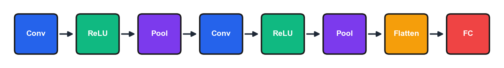

# Module 7: Computer Vision & CNNs

## Introduction

Last module we learned neural network fundamentals—layers, activations, backpropagation, PyTorch. Today we specialize those concepts for images.

Images are everywhere in business: quality control in manufacturing, inventory management in retail, medical imaging in healthcare, document processing in finance. Computer vision has transformed all of these industries.

But images present unique challenges. A single photo is millions of numbers. Fully connected networks can't scale. And we need spatial awareness—a cat in the corner is still a cat, but its pixels are in completely different positions.

Convolutional Neural Networks solve these problems. By the end of today, you'll understand how CNNs work, and critically, you'll know how to leverage **transfer learning** so you don't have to train from scratch.

---

## Learning Objectives

By the end of this module, you should be able to:

1. **Explain** how images are represented as data (matrices, channels)
2. **Describe** why fully connected networks are inefficient for images
3. **Explain** the mechanics of convolutional layers and pooling
4. **Implement** a CNN in PyTorch for image classification
5. **Apply** transfer learning using pre-trained models
6. **Understand** how Vision Transformers adapt the transformer architecture to images

---

## 7.1 Working with Images

### How Images Are Represented

Digital images are matrices of numbers, and understanding their structure is essential for working with computer vision models. A **grayscale** image is a 2D matrix (Height × Width) where each pixel is an intensity from 0 (black) to 255 (white). A **color (RGB)** image is a 3D tensor (Height × Width × 3) with three channels—Red, Green, Blue—each with its own intensity matrix.

For example, a 224×224 color image has shape (224, 224, 3) and contains 224 × 224 × 3 = **150,528 numbers**.

A helpful way to think about RGB is as a layer cake. Imagine three transparent sheets stacked on top of each other—one tinted red, one green, one blue. Each sheet has the same dimensions (Height × Width), and each position has an intensity value. When you look through all three layers at once, the colors combine to produce the full-color image. A pixel isn't just "one number"—it's a stack of three numbers, one from each color channel. This stacking concept extends to CNNs: as you go deeper, instead of 3 channels (RGB), you might have 64, 128, or 512 "feature channels"—each representing a different learned feature like edges, textures, or shapes.

In PyTorch, image tensors follow the NCHW convention: (Batch, Channels, Height, Width). This ordering places channels before spatial dimensions, which differs from the (Height, Width, Channels) layout used by NumPy and PIL. When you load images through `torchvision.transforms.ToTensor()`, the conversion from HWC to CHW happens automatically, along with rescaling pixel values from the 0–255 integer range to 0.0–1.0 floats. This transform is almost always the first step in a torchvision pipeline.

```python
from PIL import Image
import numpy as np

img = Image.open('photo.jpg')
img_array = np.array(img)
print(f"Shape: {img_array.shape}")  # (Height, Width, Channels)
```

### ImageNet: The Benchmark That Changed Everything

The ImageNet Large Scale Visual Recognition Challenge tracked the rapid progress of deep learning in image classification.

| Year | Winner | Top-5 Error | Significance |
|------|--------|-------------|--------------|
| 2010 | Traditional | 28.2% | Pre-deep learning |
| 2012 | AlexNet | 16.4% | CNN breakthrough |
| 2015 | ResNet | 3.6% | Beat humans (~5%) |

In 2012, AlexNet—a convolutional neural network—crushed the competition. Error dropped from 28% to 16%. That's not incremental improvement; that's a paradigm shift. By 2015, ResNet beat human performance on ImageNet classification.

### Why Fully Connected Networks Fail

Fully connected networks encounter two fundamental obstacles when applied to image data.

#### Problem 1: Too Many Parameters

A 224×224×3 input connected to 1000 hidden neurons produces 150 million parameters in the first layer alone. That volume is impossible to train effectively and will overfit immediately.

#### Problem 2: No Spatial Understanding

Fully connected layers treat each pixel independently. A cat in the corner has completely different pixel positions than a cat in the center, so the network cannot generalize across spatial locations. For a 224×224 image, there are over 50,000 possible spatial positions where an object could appear—each position looks like a completely different input to a fully connected layer.

Convolutional Neural Networks solve both of these problems by connecting each neuron to only a small local region and sharing weights across all spatial positions.

!!! example "Numerical Example: Parameter Explosion in Fully Connected Networks"

    ```python
    # Calculate first FC layer parameters for different image sizes
    image_configs = [
        ("MNIST", 28, 28, 1),      # Grayscale
        ("CIFAR-10", 32, 32, 3),   # Color
        ("ImageNet", 224, 224, 3), # Standard photo
    ]
    hidden_neurons = 1000

    for name, h, w, c in image_configs:
        input_features = h * w * c
        parameters = input_features * hidden_neurons + hidden_neurons
        print(f"{name}: {input_features:,} inputs → {parameters:,} parameters")
    ```

    **Output:**

    ```
    MNIST: 784 inputs → 785,000 parameters
    CIFAR-10: 3,072 inputs → 3,073,000 parameters
    ImageNet: 150,528 inputs → 150,529,000 parameters
    ```

    **Interpretation:** A single FC layer on a 224×224 image requires 150 million parameters—just to connect inputs to the first hidden layer! This is why FC networks are impractical for images. CNNs achieve the same task with ~100x fewer parameters through local connectivity and weight sharing.

    *Source: `computations/module7_examples.py` — `demo_fc_parameter_explosion()`*


Position matters because a fully connected network treats each pixel independently—"pixel 1,000 is orange" vs. "pixel 50,000 is orange" are completely different inputs. To recognize cats anywhere, it would need examples at every possible position (billions of configurations). CNNs solve this with weight sharing: the same filter scans all positions, so learning to detect a cat's eye at one position automatically applies everywhere.

---

## 7.2 Convolutional Neural Networks

> **Three-Component Framework: CNNs**
>
> | Component | CNN Implementation |
> |-----------|-------------------|
> | **Decision Model** | A hierarchy of learned convolution filters extracts spatial features, followed by a fully connected classifier that maps those features to class scores |
> | **Quality Measure** | Cross-entropy loss between predicted class probabilities and true labels |
> | **Update Method** | Backpropagation propagates gradients through pooling and convolution operations, updating filter weights via gradient descent |

### The Convolution Operation

Instead of connecting every input to every output, convolution slides a small filter across the image, computing a local summary at each position. This local approach is what gives CNNs their efficiency and spatial awareness.

#### The Operation

The operation begins with a small filter (e.g., 3×3) that slides across the image. At each position, the dot product of the filter weights and the corresponding image patch is computed, and the results are collected into a "feature map."

#### Key Parameters

Several parameters govern how the convolution operates. The filter size is typically 3×3 or 5×5. The stride controls how many pixels the filter moves at each step (usually 1 or 2). Padding adds zeros around the edges to control the output size. Finally, the number of filters determines how many different features the layer can learn, since each filter detects a different pattern.

The output spatial dimension along one axis is given by:

$$\text{output size} = \frac{W - K + 2P}{S} + 1$$

where $W$ is the input size, $K$ is the kernel (filter) size, $P$ is the padding, and $S$ is the stride. For example, a 32×32 input with a 3×3 kernel, padding 1, and stride 1 gives $(32 - 3 + 2)/1 + 1 = 32$—the spatial size is preserved. With stride 2, the same settings give $(32 - 3 + 2)/2 + 1 = 16.5$, truncated to 16, halving each dimension.

The sliding window intuition helps clarify this operation. Imagine holding a magnifying glass (the filter) over a photograph (the input image). You look at a small 3×3 patch, write down a summary number, then slide the magnifying glass one position to the right and repeat. When you reach the edge, you move down one row and start from the left again. The "summary number" is the dot product: multiply each pixel by the corresponding filter weight and sum them all. After scanning the entire image, you've produced a new, smaller image called a "feature map"—where each position tells you "how strongly does this local region match what this filter is looking for?"

!!! example "Numerical Example: Convolution by Hand"

    ```python
    import numpy as np

    # 5×5 image with bright center
    image = np.array([
        [10, 10, 10, 10, 10],
        [10, 50, 50, 50, 10],
        [10, 50, 100, 50, 10],
        [10, 50, 50, 50, 10],
        [10, 10, 10, 10, 10],
    ])

    # Horizontal edge detector
    filter_h = np.array([[-1, -2, -1],
                         [ 0,  0,  0],
                         [ 1,  2,  1]])

    # Convolve center position (1,1)
    patch = image[1:4, 1:4]  # Extract 3×3 patch
    result = np.sum(patch * filter_h)
    print(f"Patch:\n{patch}")
    print(f"Element-wise product sum: {result}")
    ```

    **Output:**

    ```
    Patch:
    [[50 50 50]
     [50 100 50]
     [50 50 50]]
    Element-wise product sum: 0
    ```

    **Interpretation:** The center patch is symmetric top-to-bottom, so the horizontal edge detector outputs 0 (no horizontal edge). At the top of the image where intensity changes from 10→50, the filter outputs +170, detecting the edge. The filter automatically responds to edges wherever they occur.

    *Source: `computations/module7_examples.py` — `demo_convolution_by_hand()`*


### Multi-Channel Convolution

A "3×3 filter" on an RGB image is actually a 3×3×3 tensor. When we say "3×3 filter," we're describing the spatial dimensions, but the filter must match the depth of the input.

For an RGB image with 3 channels, the filter shape is 3 × 3 × 3 = **27 weights** (plus 1 bias), and each channel (R, G, B) has its own 3×3 slice.

#### How the Computation Works

```
At each spatial position:
1. Extract the 3×3×3 patch from the input
2. Multiply element-wise with the 3×3×3 filter (27 multiplications)
3. Sum ALL 27 products + bias → ONE output value
```

Multiple filters produce multiple output channels. If we want 64 output channels, we need 64 separate filters, each with shape 3×3×3. Total parameters: 64 × (27 + 1) = **1,792**. The number of filters (here, 64) is a hyperparameter controlling the layer's representational capacity—more filters means the layer can detect more distinct patterns, at the cost of more parameters and computation. Common choices are powers of 2 (32, 64, 128, 256), and deeper layers typically use more filters because they model more complex features.

The "deep handshake" intuition captures this well: a filter doesn't just look at one color—it reaches through all input channels simultaneously, like a hand reaching through stacked sheets to grab information from every layer at once. If the input has 3 channels (RGB), the filter has 3 slices. If the input has 64 feature channels from a previous layer, the filter has 64 slices. Each slice learns what to look for in that specific input channel, and the results are summed into a single output value. This is why deeper layers can detect complex combinations: a filter might learn "look for vertical edges in channel 12 and horizontal edges in channel 37" by having strong weights in those specific filter slices.

```python
conv = nn.Conv2d(
    in_channels=3,      # RGB input
    out_channels=64,    # Number of filters
    kernel_size=3,      # 3×3 filter
    stride=1,
    padding=1
)
```

!!! example "Numerical Example: Output Size Formula in Action"

    ```python
    # Formula: output = (W - K + 2P) / S + 1
    # W=input, K=kernel, P=padding, S=stride

    # Trace 32×32 image through 3 conv+pool blocks
    size = 32
    print(f"Input: {size}×{size}")

    for i in range(3):
        # Conv with padding=1 preserves size
        size = (size - 3 + 2*1) // 1 + 1
        print(f"After Conv{i+1}: {size}×{size}")
        # MaxPool 2×2 halves dimensions
        size = size // 2
        print(f"After Pool{i+1}: {size}×{size}")
    ```

    **Output:**

    ```
    Input: 32×32
    After Conv1: 32×32
    After Pool1: 16×16
    After Conv2: 16×16
    After Pool2: 8×8
    After Conv3: 8×8
    After Pool3: 4×4
    ```

    **Interpretation:** With padding=1 on 3×3 convolutions, spatial dimensions are preserved. Each 2×2 max pool halves the dimensions. A 32×32 image becomes 4×4 after three pool layers—a 64x reduction in spatial positions, concentrating information into fewer, more meaningful locations.

    *Source: `computations/module7_examples.py` — `demo_output_size_formula()`*


### What Filters Learn

Filters automatically learn features through training. Early layers detect edges, colors, and simple textures. Middle layers combine those into textures, patterns, and shapes. Deep layers assemble object parts and semantic concepts.

The first layer might learn vertical edges, horizontal edges, color gradients. The second combines those into textures. The third combines textures into shapes. This is **hierarchical feature learning**.

To see what an edge detector actually looks like, consider a horizontal edge detector with weights like:
```
[-1, -1, -1]
[ 0,  0,  0]
[ 1,  1,  1]
```
This filter responds strongly when it sees dark pixels above and bright pixels below (a horizontal edge). The negative weights say "penalize brightness here," the positive weights say "reward brightness here," and zeros mean "don't care." When this filter slides over a horizontal edge in the image, the dark-above-light-below pattern produces a large positive output. Over uniform regions, positives and negatives cancel out. The network learns these patterns automatically through backpropagation—we don't hand-design them.

This hierarchy emerges automatically—you don't design what each layer learns. Early layers only see raw pixels (can only learn edges); deep layers receive processed representations (can combine into complex features). When researchers visualize trained networks, they find edges in layer 1, textures in layers 2-3, object parts in mid-layers—discovered, not programmed.

A key mechanism behind this hierarchy is **receptive field growth**. A neuron in layer 1 "sees" a 3×3 region of the original image. A neuron in layer 2 applies another 3×3 filter over layer-1 outputs, each of which already summarizes a 3×3 patch—so the layer-2 neuron effectively sees a 5×5 region of the original image. By layer 3, the receptive field grows to 7×7. Stack enough layers and each neuron integrates information from most of the image, even though each individual convolution is only 3×3. This is how deep layers achieve global context without ever using a large filter.

### Pooling Layers

After convolution, we reduce spatial dimensions with pooling. Pooling compresses the feature maps, lowering computational cost and making the network more robust to small shifts in the input.

The most common variant, max pooling, takes the maximum value in each patch. It reduces spatial dimensions (224 → 112 → 56...), adds translation invariance so that slight shifts do not change the output, and keeps the strongest activations.

```python
pool = nn.MaxPool2d(kernel_size=2, stride=2)
# 224×224 → 112×112
```

A 2×2 max pool with stride 2 halves each dimension, so stacking multiple pooling layers progressively compresses the spatial representation.

Max pooling dominates over average pooling in practice for a clear reason. Imagine a feature map where most values are near zero (no edge detected) but one position has a strong response (edge found). Max pooling preserves that strong signal—"there is an edge somewhere in this 2×2 region." Average pooling would dilute it with the zeros: "there's maybe a weak edge here." For detecting features, we care that a feature is *present*, not its average strength. The exception is Global Average Pooling at the very end of a network (averaging across the entire spatial dimension), which works well because by that point, strong features have already been isolated.

!!! example "Numerical Example: Pooling Dimension Tracking"

    ```python
    # Track ImageNet-standard 224×224 through pooling layers
    size = 224
    print(f"Input: {size}×{size} = {size*size:,} positions")

    for i in range(5):
        size = size // 2
        reduction = (224*224) / (size*size)
        print(f"Pool {i+1}: {size}×{size} = {size*size:,} positions ({reduction:.0f}x smaller)")
    ```

    **Output:**

    ```
    Input: 224×224 = 50,176 positions
    Pool 1: 112×112 = 12,544 positions (4x smaller)
    Pool 2: 56×56 = 3,136 positions (16x smaller)
    Pool 3: 28×28 = 784 positions (64x smaller)
    Pool 4: 14×14 = 196 positions (256x smaller)
    Pool 5: 7×7 = 49 positions (1024x smaller)
    ```

    **Interpretation:** Each 2×2 max pool halves each dimension, quartering the spatial positions. After 5 pooling layers, 50,176 positions compress to just 49—over 1000x reduction. This progressive compression forces the network to distill spatial information into increasingly abstract "what is here" representations rather than "where exactly is it."

    *Source: `computations/module7_examples.py` — `demo_pooling_dimension_tracking()`*


### Classic CNN Pattern

The standard CNN architecture stacks convolution, activation, and pooling layers before a fully connected classifier at the end.



The diagram shows the classic CNN architecture pattern as a data flow pipeline. Data enters from the left and flows through repeated blocks: **Conv** (blue) applies learned filters to detect features, **ReLU** (green) introduces non-linearity by zeroing negative values, and **Pool** (purple) reduces spatial dimensions. This Conv→ReLU→Pool pattern typically repeats 2-5 times, with each cycle detecting higher-level features while shrinking the spatial dimensions. After the final pooling layer, **Flatten** (orange) reshapes the 2D feature maps into a 1D vector, which feeds into **FC** (red)—a fully connected layer that makes the final classification. The key insight is that early stages are "looking" (detecting edges, textures, shapes), while the final FC layer is "deciding" (combining features into class predictions).

```python
class SimpleCNN(nn.Module):
    def __init__(self, num_classes=10):
        super().__init__()
        # Dimension flow for 32×32 RGB input (post-conv, pre-pool → post-pool):
        self.conv1 = nn.Conv2d(3, 32, kernel_size=3, padding=1)   # (B,3,32,32) → (B,32,32,32) → pool → (B,32,16,16)
        self.conv2 = nn.Conv2d(32, 64, kernel_size=3, padding=1)  # (B,32,16,16) → (B,64,16,16) → pool → (B,64,8,8)
        self.conv3 = nn.Conv2d(64, 128, kernel_size=3, padding=1) # (B,64,8,8)  → (B,128,8,8)  → pool → (B,128,4,4)
        self.pool = nn.MaxPool2d(2, 2)                             # halves each spatial dim
        self.fc1 = nn.Linear(128 * 4 * 4, 512)  # 128 channels × 4×4 spatial = 2,048 inputs
        self.fc2 = nn.Linear(512, num_classes)
        self.dropout = nn.Dropout(0.5)

    def forward(self, x):
        x = self.pool(torch.relu(self.conv1(x)))  # (B, 32, 16, 16)
        x = self.pool(torch.relu(self.conv2(x)))  # (B, 64, 8, 8)
        x = self.pool(torch.relu(self.conv3(x)))  # (B, 128, 4, 4)
        x = x.view(x.size(0), -1)  # Flatten → (B, 2048)
        x = torch.relu(self.fc1(x))
        x = self.dropout(x)
        return self.fc2(x)
```

### Parameter Efficiency

CNNs achieve dramatic parameter savings over fully connected layers. The following table compares parameter counts for a 32×32 RGB image mapped to 64 outputs.

| Layer Type | Parameters |
|-----------|------------|
| Fully Connected | 196,672 |
| Conv2d (3×3) | 1,792 |

This amounts to roughly 100x fewer parameters. The savings come from two properties: (i) local connectivity, where each neuron connects only to a small patch, and (ii) weight sharing, where the same filter is applied everywhere.

!!! example "Numerical Example: CNN vs FC Parameter Comparison"

    ```python
    # Task: 32×32×3 input → 64 output features
    input_size = 32 * 32 * 3  # 3,072
    output_channels = 64

    # Fully connected
    fc_params = input_size * output_channels + output_channels
    print(f"FC layer: {fc_params:,} parameters")

    # Conv2d (3×3 filter)
    conv_params = (3 * 3 * 3) * output_channels + output_channels
    print(f"Conv layer: {conv_params:,} parameters")
    print(f"Ratio: {fc_params / conv_params:.1f}x fewer with CNN")
    ```

    **Output:**

    ```
    FC layer: 196,672 parameters
    Conv layer: 1,792 parameters
    Ratio: 109.8x fewer with CNN
    ```

    **Interpretation:** For the same input→output mapping, CNNs use ~110x fewer parameters. The FC layer needs a separate weight for every input-output pair. The CNN reuses 27 weights (3×3×3 filter) across all 1,024 spatial positions. This efficiency enables training on limited data and reduces overfitting risk.

    *Source: `computations/module7_examples.py` — `demo_cnn_vs_fc_parameters()`*


### Historical Architectures

Three landmark architectures defined the trajectory of modern CNNs.

AlexNet (2012) was the breakthrough—an 8-layer network using ReLU, dropout, and GPU training that proved deep learning could dominate image classification. VGG (2014) pushed further with 16-19 layers built entirely from 3×3 convolutions, demonstrating that depth matters. The VGG design established an important principle: two stacked 3×3 filters cover the same receptive field as one 5×5 filter (and three 3×3 filters equal one 7×7 filter), but with fewer parameters and more non-linearities. A single 5×5 filter on a 3-channel input has $5 \times 5 \times 3 = 75$ weights; two 3×3 filters have $2 \times (3 \times 3 \times 3) = 54$ weights—28% fewer, while also applying ReLU twice instead of once, introducing more representational depth. ResNet (2015) introduced skip connections that enabled training networks with 150+ layers, surpassing human-level accuracy on ImageNet.

### Skip (Residual) Connections

Very deep networks suffer from vanishing gradients, where error signals shrink as they propagate backward through many layers. Skip connections address this by adding the input directly to the output.

$$\text{Output} = F(x) + x$$

Here $x$ is the block's input and $F(x)$ is the transformation learned by the two convolutional layers inside the block (the "residual"). The network only needs to learn the difference between the desired output and the identity mapping, rather than the full transformation from scratch. If a layer is unhelpful, the optimal solution is $F(x) \approx 0$, leaving the output as $x$ unchanged.

```python
class ResidualBlock(nn.Module):
    def __init__(self, channels):
        super().__init__()
        self.conv1 = nn.Conv2d(channels, channels, 3, padding=1)
        self.bn1 = nn.BatchNorm2d(channels)
        self.conv2 = nn.Conv2d(channels, channels, 3, padding=1)
        self.bn2 = nn.BatchNorm2d(channels)

    def forward(self, x):
        residual = x
        out = torch.relu(self.bn1(self.conv1(x)))
        out = self.bn2(self.conv2(out))
        out += residual  # Skip connection
        return torch.relu(out)
```

!!! info "Sidebar: Batch Normalization"

    `nn.BatchNorm2d` appears in `ResidualBlock` (and throughout modern CNNs) but is easy to overlook. Batch normalization normalizes the output of a layer across the current mini-batch: for each channel, it subtracts the batch mean and divides by the batch standard deviation, then applies learned scale ($\gamma$) and shift ($\beta$) parameters. The effect is that each layer's input stays in a consistent range regardless of how weights change elsewhere in the network.

    Without batch normalization, as weights update during training, the distribution of each layer's inputs can shift dramatically—a phenomenon called internal covariate shift—forcing subsequent layers to constantly re-adapt. Batch normalization stabilizes these distributions, which allows higher learning rates, reduces sensitivity to weight initialization, and acts as a mild regularizer. In practice it almost always improves training speed and final accuracy in deep networks. It is applied after the convolution and before the activation function (as shown in `ResidualBlock`).

If the network can't improve on the input, it can at least pass it through unchanged. This creates direct paths for gradients and enables training 100+ layer networks.

A helpful analogy is the "highway on-ramp." In a deep network without skip connections, gradients must travel through every layer sequentially—like driving through 100 stoplights to get across town. Each layer can shrink the gradient (vanishing) or explode it. Skip connections add highway on-ramps: gradients can take the direct route (the skip) or the scenic route (through the layers), or both. Even if the scenic route has problems, the highway ensures signals get through. During training, early layers actually receive useful gradient information because it doesn't have to survive passage through dozens of potentially problematic layers.

Skip connections do involve trade-offs, including memory overhead (earlier activations must be stored) and architectural constraints (dimensions must match, which may require 1×1 convolutions). In shallow networks of 3-5 layers, the benefit is minimal since skip connections solve a deep network problem. For networks with more than 10 layers, however, skip connections almost always help and are now considered essential in modern architectures.

### Common Misconceptions

Several persistent misconceptions can lead practitioners astray when working with CNNs.

| Misconception | Reality |
|--------------|---------|
| "CNNs only work for images" | CNNs work on any grid data: audio, time series, etc. |
| "Deeper is always better" | Without skip connections, very deep nets fail. Architecture matters. |
| "You need to design CNNs from scratch" | Transfer learning is usually better. |

---

## 7.3 Transfer Learning

### The Core Idea

Pre-trained ImageNet models learned **general visual features**: edges, textures, shapes, patterns. These features are useful for almost any image task.

Think of it as learning to see before learning your task. A child doesn't learn "what is a cat" from scratch—they already know how to see edges, shapes, colors, and textures from years of visual experience. Teaching them "cat" is just connecting those existing visual concepts to a new label. Transfer learning works the same way: ImageNet training teaches a network "how to see" (edges, textures, shapes, object parts), and your task-specific training just connects those visual features to your labels. That's why 500 images can work: you're not teaching the network to see—you're just teaching it what to call things it can already perceive.

There are two main approaches: (i) **feature extraction**, where you freeze the pre-trained layers and train only a new classifier, and (ii) **fine-tuning**, where you train all layers but with a lower learning rate for the pre-trained ones. This is how most real-world computer vision is done—you rarely train from scratch anymore.

### Feature Extraction

In feature extraction, you freeze the pre-trained layers and train only a new classifier on top.

```python
import torch.nn as nn
import torch.optim as optim
import torchvision.models as models
from torchvision.models import ResNet50_Weights

model = models.resnet50(weights=ResNet50_Weights.DEFAULT)

# Freeze all layers
for param in model.parameters():
    param.requires_grad = False

# Replace final classifier
model.fc = nn.Linear(model.fc.in_features, num_classes)

# Only train new classifier
optimizer = optim.Adam(model.fc.parameters(), lr=0.001)
```

The pre-trained ResNet extracts features, and you just train a simple classifier on top.

### Fine-Tuning

Fine-tuning allows the pre-trained layers to update, but at a lower learning rate than the new classifier head.

```python
model = models.resnet50(weights=ResNet50_Weights.DEFAULT)
model.fc = nn.Linear(model.fc.in_features, num_classes)

# Freeze all layers first
for param in model.parameters():
    param.requires_grad = False

# Unfreeze layer4 and fc for fine-tuning
for param in model.layer4.parameters():
    param.requires_grad = True
for param in model.fc.parameters():
    param.requires_grad = True

# Different learning rates
optimizer = optim.Adam([
    {'params': model.layer4.parameters(), 'lr': 1e-4},
    {'params': model.fc.parameters(), 'lr': 1e-3}
])
```

Pre-trained layers get a smaller learning rate because they're already good, while new layers get a larger learning rate to train from their random initialization.

The choice to unfreeze `layer4` specifically reflects how CNN features are organized by depth. Early layers (layer1, layer2) learn general low-level features—edges, color gradients, simple textures—that are domain-agnostic and useful for nearly any vision task. Late layers (layer4 in ResNet-50) learn high-level, task-specific features tuned to ImageNet categories like "dog fur texture" or "wheel shape." When your target domain differs from ImageNet, those late-layer features may be too specific to the original training task and benefit from adaptation. Fine-tuning `layer4` allows the network to re-specialize its high-level representations for your domain while keeping the lower-level visual vocabulary intact. A common heuristic: the more your data differs from ImageNet, the more layers you should unfreeze, starting from the last layer and working backward.

### When to Use Which

The choice between feature extraction, fine-tuning, and training from scratch depends on your dataset size and its similarity to the ImageNet domain.

| Dataset Size | Similarity to ImageNet | Approach |
|-------------|------------------------|----------|
| Small | High | Feature extraction |
| Small | Low | Light fine-tuning |
| Large | High | Fine-tuning |
| Large | Low | Train from scratch |

Consider an example: you have 500 X-ray images. Should you train from scratch or use transfer learning? Transfer learning is the clear choice. 500 images is not enough to train from scratch, and even though X-rays look different from ImageNet photos, early-layer features (edges, textures) are still useful.

A natural question is how similar is "similar enough" for transfer to help. There's no bright line—the best approach is to empirically test by training a classifier on frozen pre-trained features versus random features. If pre-trained beats random, transfer helps. Even domains that seem "completely different" (medical imaging, industrial defects) usually benefit. The practical recommendation is to start with transfer learning, try fine-tuning if results are unsatisfactory, and consider training from scratch only with millions of examples and truly foreign image statistics.

!!! example "Numerical Example: Transfer Learning vs Random Features"

    ```python
    # Simulate: classify images with limited training data
    # Pre-trained CNN extracts meaningful features
    # Random CNN outputs noise

    from sklearn.linear_model import LogisticRegression

    train_sizes = [25, 50, 100, 200, 500]
    for n in train_sizes:
        # Train classifier on pre-trained features
        acc_pretrained = train_on_features(X_pretrained[:n], y[:n])
        # Train classifier on random features
        acc_random = train_on_features(X_random[:n], y[:n])
        print(f"n={n}: Pre-trained={acc_pretrained:.0%}, Random={acc_random:.0%}")
    ```

    **Output:**

    ```
    n=25:  Pre-trained=40%, Random=12%
    n=50:  Pre-trained=61%, Random=18%
    n=100: Pre-trained=74%, Random=18%
    n=200: Pre-trained=82%, Random=25%
    n=500: Pre-trained=89%, Random=19%
    ```

    **Interpretation:** With only 25 training examples, pre-trained features achieve 40% accuracy vs 12% for random (5-class chance = 20%). The gap widens with more data. Random features plateau near chance because they contain no useful information—the classifier is guessing. Pre-trained features capture real visual patterns that generalize to new images.

    *Source: `computations/module7_examples.py` — `demo_transfer_learning_comparison()`*


### Business Value of Transfer Learning

Transfer learning delivers substantial business value across three dimensions: compute cost, data labeling cost, and time-to-value.

**Compute savings.** Training a ResNet-50 from scratch on ImageNet requires roughly 90 GPU-hours on modern hardware. Fine-tuning the same model on a domain-specific dataset of a few thousand images takes 1–4 GPU-hours—often less than $5 in cloud compute. Feature extraction (frozen backbone, new head only) can complete in minutes on a CPU.

**Data labeling savings.** Labeling images is the most expensive part of most computer vision projects, often costing $0.50–$5.00 per labeled image depending on task complexity. Transfer learning routinely achieves strong performance with 500–2,000 labeled examples rather than the 50,000–1,000,000 required for training from scratch. At $2 per image, that difference represents $96,000–$2,000,000 in avoided labeling cost on a single project.

**Case study — manufacturing defect detection.** A mid-size electronics manufacturer needed to classify solder joint defects across five categories. Starting from ImageNet-pretrained ResNet-18 and fine-tuning on 800 labeled images, the team reached 94% accuracy in three days. An earlier attempt at training from scratch with the same 800 images yielded 61% accuracy after two weeks of experimentation. The transfer learning approach reached production quality roughly five times faster and at a fraction of the labeling cost.

Transfer learning works broadly because early CNN layers learn universal visual primitives (edges, textures, color gradients) that transfer to any domain—X-rays, satellite images, microscopy, document scans. Studies consistently show that ImageNet-pretrained weights provide better initialization than random weights even when the target domain looks very different from natural photos. Train from scratch only when you have millions of domain-specific images and image statistics that genuinely differ from natural scenes.

---

## 7.4 Vision Transformers (ViT)

Vision Transformers represent the latest revolution in computer vision by applying the transformer architecture directly to images.

### Patch-Based Tokenization

The key idea is treating image patches as tokens—the same abstraction used for words in NLP. The image is split into fixed-size patches (typically 16×16 pixels), each patch is flattened into a vector and projected through a linear layer, and the resulting sequence of patch embeddings is fed into a standard transformer encoder.

A 224×224 image becomes a sequence of (224/16)² = 196 patch tokens, plus a special [CLS] classification token prepended at the start (197 total). Each patch embedding has the same dimensionality as word embeddings in a language model, so the transformer architecture can be applied without modification.

### How ViT Adapts the Transformer Architecture

ViT uses the same self-attention mechanism from Module 8: each patch attends to every other patch, learning spatial relationships. The transformer asks "how does patch 45 relate to patch 120?" just as it asks "how does word 3 relate to word 15?" in text. Positional embeddings (learned, not sinusoidal) encode each patch's location in the image grid.

The [CLS] token aggregates information from all patches through attention and is used for the final classification prediction, just as BERT uses its [CLS] token for sentence-level tasks.

Patches function as visual words. In NLP, transformers process sequences of word tokens, and ViT creates a similar setup for images: each 16×16 patch becomes a "visual word." The same attention mechanism that learns "the word 'cat' relates to 'furry'" can learn "this patch of fur relates to that patch showing ears." This unification is powerful—it is why models like CLIP can connect images and text, processing both as sequences of tokens.

One cost of this flexibility is computational: self-attention scales as $O(n^2)$ in the sequence length $n$, where $n$ is the number of patches. For a 224×224 image with 16×16 patches, $n = 196$, which is manageable. Doubling image width and height with fixed patch size quadruples the token count and therefore raises full attention cost by roughly 16×; for a 512×512 input, $n$ grows to 1,024 (about 5.2× more tokens than 196), which translates to about 27× the 224×224 attention cost. This is why CNNs remain competitive for high-resolution tasks and why researchers have developed efficient attention variants (linear attention, windowed attention) to address the scaling cost.

### CNN vs ViT: Architectural Comparison

| Dimension | CNN | Vision Transformer (ViT) |
|-----------|-----|--------------------------|
| **Inductive bias** | Strong: translation equivariance and local connectivity are built in | Weak: learns spatial relationships purely from data |
| **Data requirements** | Works well from ~1,000 labeled images | Typically needs 10,000+ images; benefits greatly from pre-training |
| **Scalability** | Performance gains taper off past ~100M parameters | Scales well with model size and data; large ViTs outperform large CNNs |
| **Compute per image** | Efficient at high resolution | $O(n^2)$ attention cost makes high-resolution inputs expensive |
| **Transfer learning** | Mature ecosystem; ResNet/EfficientNet widely available | Strong pre-trained models available (ViT-B/16, ViT-L/16 via torchvision) |
| **Interpretability** | Attention maps not native; requires Grad-CAM etc. | Attention maps over patches are a natural output |

The practical implication: for most business applications with limited data and moderate image resolution, CNNs with transfer learning remain the default starting point. ViT becomes the stronger choice when you have large datasets, need to scale model size, or want to integrate vision with language in a unified architecture.

### Loading a Pre-trained ViT in PyTorch

```python
import torchvision.models as models
from torchvision.models import ViT_B_16_Weights

# Load ViT-B/16 pre-trained on ImageNet
vit = models.vit_b_16(weights=ViT_B_16_Weights.DEFAULT)

# Adapt for a different number of classes
import torch.nn as nn
vit.heads.head = nn.Linear(vit.heads.head.in_features, num_classes)

# Check expected input: 224×224, normalized with ImageNet stats
print(vit)
```

The `vit_b_16` model expects 224×224 inputs and produces 197 tokens (196 patch tokens + 1 CLS token) internally. The classification head reads only the CLS token output. Fine-tuning follows the same pattern as ResNet: freeze most layers, unfreeze the last transformer blocks and the head, then train with a small learning rate for the pre-trained layers.

---

## Deep Dives

For supplementary material that extends this module:

- **[Deep Dive: CNN Architecture](../appendices/cnn-architecture.md)** — convolution mechanics worked end-to-end, multi-channel arithmetic, pooling variants, and how AlexNet, VGG, and ResNet evolved.

---

## Reflection Questions

1. An image is 1000×1000 pixels RGB. How many input features? Why is this problematic for fully connected networks?

2. If you shift a cat 10 pixels to the right, how would a fully connected network's perception change vs. a CNN?

3. A 3×3 conv filter has 9 weights per channel. How does this compare to fully connected for the same output?

4. After 3 max pooling layers of 2×2, what happens to a 224×224 image?

5. How do skip connections help train very deep networks?

6. You have 500 X-ray images. Train from scratch or transfer learning? Why?

7. Why fine-tune later layers before earlier layers?

---

## Practice Problems

1. Calculate output size: 64×64 input, 3×3 kernel, stride=1, padding=0

2. Calculate parameters: Conv2d with in_channels=32, out_channels=64, kernel_size=3

3. Design a CNN for 28×28 grayscale images (MNIST) with 3 conv layers

4. Set up transfer learning code for a 5-class classification problem using ResNet18

5. Explain why a 7×7 filter might be replaced by three 3×3 filters

---

## Chapter Summary

Images are high-dimensional data, and fully connected networks cannot scale to handle them effectively. CNNs solve this by using local filters with weight sharing, achieving roughly 100x fewer parameters than their fully connected counterparts. Pooling layers further reduce spatial dimensions while adding translation invariance. For very deep networks, skip connections provide direct gradient paths that make training feasible beyond 100 layers. In practice, transfer learning from pre-trained models is usually more effective than training from scratch, especially with limited data. Finally, Vision Transformers have extended the transformer architecture from NLP to image patches, unifying the two domains under a single attention-based framework.

---

## What's Next

In Module 8, we tackle **Natural Language Processing**, covering text as sequences, word embeddings, transformers and attention, and pre-trained language models. Vision Transformers connect both domains—the same architecture that powers GPT and BERT can also process images.
