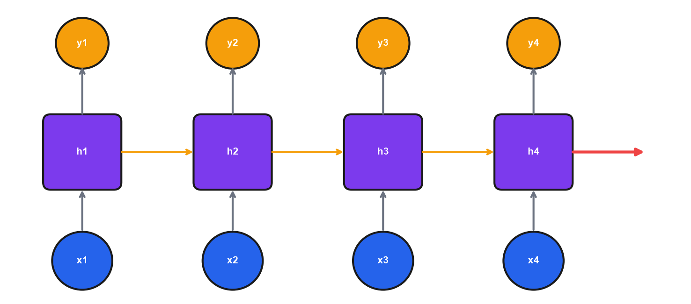

# Module 8: Natural Language Processing

## Introduction

Today we tackle natural language processing—teaching machines to understand and generate text.

Text is everywhere in business: customer reviews, support tickets, emails, social media, contracts, reports. Being able to automatically classify, extract information from, and generate text is valuable.

In Module 7, we saw how CNNs revolutionized image processing. Today, we'll see how transformers revolutionized NLP. The transformer architecture—introduced in 2017—is the foundation for BERT, GPT, and essentially every language model you've heard of.

By the end of this module, you'll understand how text becomes numbers, why transformers work so well, and how to leverage pre-trained models for your own applications.

#### What Is Machine "Understanding"?

Machines don't understand text like humans—they operate on statistical representations where similar meanings cluster together. What we call "understanding" is sophisticated pattern matching: a model that predicts masked words correctly has learned syntax, semantics, and world knowledge encoded as neural network weights. Whether this constitutes "understanding" or merely simulates it remains philosophically contested.

---

## Learning Objectives

By the end of this module, you should be able to:

1. **Explain** different text representation methods (BoW, TF-IDF, embeddings)
2. **Understand** why word order and context matter in NLP
3. **Describe** RNN architecture and the vanishing gradient problem
4. **Explain** the transformer architecture including self-attention, feed-forward layers, residual connections, and layer normalization
5. **Apply** pre-trained language models (BERT, GPT) for NLP tasks
6. **Identify** appropriate NLP approaches for business problems
7. **Explain** how transformers generalize beyond text to image patches, audio spectrograms, and multimodal alignment

---

## 8.1 Text Representation

This section explores how text can be converted into numerical representations suitable for machine learning, progressing from simple counting methods to dense learned embeddings.

### The Challenge of Text

Text is fundamentally different from tabular data. Sentences vary in length from 5 words to 500, word order carries meaning ("Dog bites man" is not the same as "Man bites dog"), identical words can have different senses ("bank" as a river feature versus a financial institution), and vocabularies span hundreds of thousands of words. The goal of text representation is to convert text into numerical vectors that capture meaning.

### Bag of Words (BoW)

The simplest approach to text representation is counting how often each word occurs in a document.

| Document | "love" | "machine" | "learning" |
|----------|--------|-----------|------------|
| "I love machine learning" | 1 | 1 | 1 |
| "Machine learning is great" | 0 | 1 | 1 |

Each document becomes a vector of word counts, as the following code illustrates.

```python
from sklearn.feature_extraction.text import CountVectorizer

corpus = [
    "I love machine learning",
    "Machine learning is great",
    "I love deep learning"
]

vectorizer = CountVectorizer()
X = vectorizer.fit_transform(corpus)
print(vectorizer.get_feature_names_out())
# ['deep', 'great', 'is', 'learning', 'love', 'machine']
```

#### Limitations

Bag of Words ignores word order entirely, treating "dog bites man" and "man bites dog" as identical. The resulting vectors are sparse and high-dimensional, and words with similar meanings like "good" and "great" receive unrelated representations.

Think of the difference as a recipe versus a shopping list. BoW gives you the ingredients (flour, eggs, sugar, butter) but loses the recipe (the order and method matter). "Cream butter and sugar, then add eggs" produces cake. "Add eggs, then cream butter and sugar" produces scrambled eggs with a butter problem. Same ingredients, completely different outcomes. BoW can't tell these apart.

!!! example "Numerical Example: BoW Sparsity Problem"

    ```python
    # Compare BoW vs embedding representations
    vocab_size = 10000
    embedding_dim = 300
    sentence_words = 4  # "I love machine learning"

    # BoW: huge sparse vector
    bow_nonzero = sentence_words
    bow_sparsity = (vocab_size - bow_nonzero) / vocab_size * 100
    bow_memory = vocab_size * 4 / 1024  # KB (float32)

    # Embeddings: small dense vector
    emb_memory = embedding_dim * 4 / 1024  # KB

    print(f"BoW vector:       {vocab_size:,} dims, {bow_nonzero} non-zero, {bow_sparsity:.2f}% sparse")
    print(f"Embedding vector: {embedding_dim} dims, all non-zero, 0% sparse")
    print(f"Memory: BoW={bow_memory:.1f} KB vs Embedding={emb_memory:.1f} KB")
    print(f"Dimensionality reduction: {vocab_size/embedding_dim:.0f}x")
    ```

    **Output:**

    ```
    BoW vector:       10,000 dims, 4 non-zero, 99.96% sparse
    Embedding vector: 300 dims, all non-zero, 0% sparse
    Memory: BoW=39.1 KB vs Embedding=1.2 KB
    Dimensionality reduction: 33x
    ```

    **Interpretation:** A 4-word sentence creates a 10,000-dimensional vector that's 99.96% zeros—wasteful and uninformative. Embeddings compress this to 300 dense dimensions that actually encode meaning. For a corpus of 1 million documents, that's 39 GB vs 1.2 GB.

    *Source: `computations/module8_examples.py` — `demo_bow_sparsity()`*


### TF-IDF

TF-IDF improves on Bag of Words by weighting words according to their importance.

$$\text{TF-IDF} = \text{TF}(t,d) \times \log\frac{N}{\text{DF}(t)}$$

The TF (Term Frequency) component measures how often a word appears in a given document, while the IDF (Inverse Document Frequency) component measures how rare the word is across all documents. Together, they ensure that common words like "the" and "is" receive low weight, while distinctive words receive high weight.

#### Why the Log in IDF

The logarithm serves two purposes. First, it provides a dampening effect: without the log, a word appearing in 1 versus 1,000 documents would show a 1,000x difference, but the log compresses this to about 3x. Second, it prevents rare words from dominating all other terms. The difference between appearing in 1 versus 10 documents is more meaningful than 10,000 versus 10,010, and the log captures this diminishing-returns intuition.

```python
from sklearn.feature_extraction.text import TfidfVectorizer

tfidf = TfidfVectorizer()
X = tfidf.fit_transform(corpus)
```

*Note: scikit-learn's `TfidfVectorizer` uses smoothed IDF: log((1 + n)/(1 + df)) + 1, and L2-normalizes the output. The formula above is the classic textbook version.*

!!! example "Numerical Example: TF-IDF Calculation by Hand"

    ```python
    import numpy as np

    # Small corpus
    corpus = [
        "the cat sat on the mat",
        "the dog ran in the park",
        "the cat chased the dog",
        "bankruptcy filing announced today",
    ]
    n_docs = 4

    # Analyze "the" vs "bankruptcy" in Doc 1
    doc1_words = corpus[0].split()
    doc1_len = len(doc1_words)  # 6 words

    # "the": appears 2x in doc1, in 3/4 docs
    tf_the = 2 / 6  # 0.333
    idf_the = np.log(4 / 3) + 1  # 1.288
    tfidf_the = tf_the * idf_the
    print(f"'the':        TF={tf_the:.3f}, IDF={idf_the:.3f}, TF-IDF={tfidf_the:.3f}")

    # "bankruptcy": appears 0x in doc1, in 1/4 docs
    tf_bank = 0 / 6  # 0.000
    idf_bank = np.log(4 / 1) + 1  # 2.386
    tfidf_bank = tf_bank * idf_bank
    print(f"'bankruptcy': TF={tf_bank:.3f}, IDF={idf_bank:.3f}, TF-IDF={tfidf_bank:.3f}")
    ```

    **Output:**

    ```
    'the':        TF=0.333, IDF=1.288, TF-IDF=0.429
    'bankruptcy': TF=0.000, IDF=2.386, TF-IDF=0.000
    ```

    **Interpretation:** Even though "the" appears twice in Doc 1, its TF-IDF is low because it appears in almost every document (low IDF). "Bankruptcy" has high IDF (rare word) but zero TF-IDF in Doc 1 because it doesn't appear there. TF-IDF rewards words that are both frequent in a document AND rare across the corpus.

    *Source: `computations/module8_examples.py` — `demo_tfidf_by_hand()`*


### Tokenization

Before text can be processed by any NLP model, it must be split into discrete units called tokens. The choice of tokenization strategy affects vocabulary size, the ability to handle unknown words, and model performance.

Word-level tokenization splits on whitespace and punctuation. It is simple and interpretable, but creates large vocabularies and cannot handle misspellings or novel words (they become `[UNK]` tokens).

Subword tokenization, used by modern models, breaks words into frequent subword units. For example, "unhappiness" might become ["un", "happi", "ness"]. This balances vocabulary size with coverage. The three main subword approaches are Byte Pair Encoding (BPE), WordPiece, and SentencePiece. BPE, used by GPT models, iteratively merges the most frequent character pairs—for instance, "lower" + "est" becomes "lowest." WordPiece, used by BERT, is similar to BPE but selects merges that maximize likelihood; subword fragments are prefixed with `##`, as in ["un", "##happi", "##ness"]. SentencePiece is a language-agnostic tokenizer that treats the input as a raw character stream with no pre-tokenization needed, and it is used by T5 and many multilingual models.

Most modern NLP pipelines use the tokenizer associated with their pretrained model:

```python
from transformers import AutoTokenizer

tokenizer = AutoTokenizer.from_pretrained("bert-base-uncased")
tokens = tokenizer.tokenize("Machine learning is transformative")
# ['machine', 'learning', 'is', 'transform', '##ative']
```

### Word Embeddings

The breakthrough in word embeddings was learning dense vectors where similar words are close together in the vector space.

#### Word2Vec (2013)

Word2Vec trains a neural network on word prediction using one of two approaches. **Skip-gram** takes a center word and predicts the surrounding context words (e.g., given "learning," predict "machine" and "deep" within a window of 2). **CBOW** (Continuous Bag of Words) does the reverse: given the context words, predict the center word. Both produce 100-300 dimensional vectors per word. The key insight is that the embedding layer weights are the word vectors themselves—words appearing in similar contexts receive similar embeddings.

Skip-gram tends to produce better representations for rare words because each word is used many times as a prediction target, whereas CBOW averages context vectors (which dilutes signal for infrequent words). CBOW trains faster because it makes a single prediction per target rather than one prediction per context word. In practice, Skip-gram with negative sampling is the most widely used configuration.

A famous example of this learned structure:

$$king - man + woman \approx queen$$

```python
from gensim.models import Word2Vec

model = Word2Vec(sentences, vector_size=100, window=5, min_count=1)
model.wv.most_similar(positive=['king', 'woman'], negative=['man'])
```

This works because the embedding captures semantic relationships. "King" and "queen" differ in the same way that "man" and "woman" differ.

#### GloVe (2014)

GloVe (Global Vectors for Word Representation) takes a different approach from Word2Vec. Rather than predicting context words from a sliding window, GloVe constructs a global word co-occurrence matrix—counting how often each pair of words appears together across the entire corpus—and then factorizes that matrix to produce embeddings. The optimization objective ensures that the dot product of two word vectors approximates the log of their co-occurrence probability.

The practical result is similar to Word2Vec: 100-300 dimensional vectors where semantically related words are close together. GloVe embeddings tend to perform slightly better on word analogy tasks because they capture global statistical information that the local-window approach of Word2Vec may miss. Pre-trained GloVe vectors (trained on Wikipedia and web text) are freely available and widely used as initialization for downstream models.

```python
# Loading pre-trained GloVe embeddings (via gensim)
import gensim.downloader as api

glove_vectors = api.load("glove-wiki-gigaword-100")  # 100-dim GloVe
glove_vectors.most_similar("king")
```

#### Doc2Vec

While Word2Vec and GloVe produce vectors for individual words, Doc2Vec extends the idea to entire documents. Each document receives its own unique vector that is trained alongside word vectors to predict words in that document. The result is a fixed-length vector for each document, regardless of document length, that captures the document's overall semantic content.

Doc2Vec is useful when you need to compare documents as a whole rather than individual words—for example, finding similar customer reviews, clustering support tickets, or building a document retrieval system.

```python
from gensim.models.doc2vec import Doc2Vec, TaggedDocument

documents = [
    TaggedDocument(words=doc.split(), tags=[str(i)])
    for i, doc in enumerate(corpus)
]

model = Doc2Vec(documents, vector_size=100, window=5, min_count=1, epochs=20)
doc_vector = model.infer_vector("new document text".split())
```

Embeddings can be thought of as neighborhoods. In the embedding space, similar words are neighbors. The "royalty neighborhood" contains king, queen, prince, throne. The "food neighborhood" contains apple, banana, pizza. Words can belong to multiple neighborhoods—"apple" is near both "banana" (fruit) and "iPhone" (company). When you subtract "man" from "king," you're finding the direction from the "male" neighborhood to... somewhere. Adding "woman" then moves in the "female" direction. You end up in the same relative position as queen.

#### How Word2Vec Learns Relationships

Word2Vec never sees labeled examples of gender or royalty—these emerge from the distributional hypothesis (words in similar contexts have similar meanings). The model sees "king" near "throne," "crown," "ruled"; so does "queen." To minimize prediction error, the embedding must encode that "king → queen" is the same direction as "man → woman." This emergent structure falls out naturally from simple prediction tasks on large corpora.

!!! example "Numerical Example: Embedding Similarity"

    ```python
    import numpy as np

    # Simulated word embeddings (50 dimensions, normalized)
    # Constructed so king-man+woman ≈ queen
    np.random.seed(42)

    def cosine_sim(a, b):
        return np.dot(a, b) / (np.linalg.norm(a) * np.linalg.norm(b))

    # Create embeddings with semantic structure
    base = np.random.randn(50)
    gender_dir = np.random.randn(50) * 0.5
    royalty_dir = np.random.randn(50) * 0.5

    embeddings = {
        "man": base,
        "woman": base + gender_dir,
        "king": base + royalty_dir,
        "queen": base + gender_dir + royalty_dir,
        "banana": np.random.randn(50),
    }

    # Cosine similarities
    print("Cosine similarities:")
    print(f"  king ↔ queen:  {cosine_sim(embeddings['king'], embeddings['queen']):+.3f}")
    print(f"  king ↔ man:    {cosine_sim(embeddings['king'], embeddings['man']):+.3f}")
    print(f"  king ↔ banana: {cosine_sim(embeddings['king'], embeddings['banana']):+.3f}")

    # Analogy: king - man + woman = ?
    result = embeddings["king"] - embeddings["man"] + embeddings["woman"]
    print(f"\nking - man + woman closest to:")
    for word, emb in embeddings.items():
        print(f"  {word}: {cosine_sim(result, emb):+.3f}")
    ```

    **Output:**

    ```
    Cosine similarities:
      king ↔ queen:  +0.915
      king ↔ man:    +0.860
      king ↔ banana: +0.233

    king - man + woman closest to:
      man: +0.765
      woman: +0.863
      king: +0.920
      queen: +1.000 ← closest!
      banana: +0.228
    ```

    **Interpretation:** Similar words (king/queen) have high cosine similarity (~0.9), while unrelated words (king/banana) have low similarity (~0.2). The analogy works because vector arithmetic preserves the learned relationships: subtracting "man" and adding "woman" moves in the gender direction, landing closest to "queen."

    *Source: `computations/module8_examples.py` — `demo_embedding_similarity()`*


### Why Context Matters

Word embeddings are powerful, but they miss context. Word order matters: "Nick ate the pizza" and "The pizza ate Nick" use the same words but carry completely different meanings. Negation is another challenge: "The movie was good" and "The movie was not good" are indistinguishable to BoW and simple embeddings. Reference resolution also depends on context—in "The dog didn't cross the road because *it* was tired," the word "it" refers to the dog, but in "The dog didn't cross the road because *it* was wide," "it" refers to the road.

These examples illustrate why we need models that understand sequences and context, which motivates the recurrent and attention-based architectures covered in the next sections.

### Common Misconceptions

Several misunderstandings about text representation are worth addressing directly.

| Misconception | Reality |
|--------------|---------|
| "Word embeddings understand meaning" | Embeddings capture statistical patterns, not true understanding |
| "Pre-trained embeddings work for any domain" | Domain-specific training often helps (medical, legal) |
| "More dimensions = better embeddings" | Diminishing returns; 100-300 usually sufficient |

---

## 8.2 Recurrent Neural Networks

This section introduces recurrent neural networks, which process text as sequences, and examines both their strengths and the limitations that motivated the transformer architecture.

### RNN Architecture

Standard neural networks cannot handle variable-length sequences or remember previous inputs. Recurrent neural networks solve this by processing sequences one element at a time while maintaining memory across steps.

$$h_t = \tanh(W_{xh}x_t + W_{hh}h_{t-1} + b)$$



The diagram shows an RNN "unrolled" through time—the same network repeated at each timestep. Reading left to right, the blue circles (x1, x2, x3, x4) are inputs at each timestep (e.g., word embeddings). Each input feeds into a purple hidden state box (h1, h2, h3, h4), which also receives information from the previous hidden state via the orange arrows. Orange outputs (y1, y2, y3, y4) can be produced at each step. The key insight is that h2 contains information from both x2 AND x1 (via h1). By h4, the hidden state has seen the entire sequence—but early information may be degraded after passing through multiple transformations.

The hidden state $h$ carries information through time. Think of it like passing notes in class: each student (timestep) receives a note from the previous student, reads the new information (input), writes a combined summary, and passes it forward. By the end of the row, the final note contains a compressed summary of everything—but details from early students may be garbled or lost. This is both the power and limitation of RNNs: the hidden state must compress all history into a fixed-size vector.

#### Why Tanh

The tanh activation is well-suited for RNN hidden states for several reasons. Its output range of [-1, 1] allows it to represent "opposite" concepts. Being zero-centered helps gradients flow in both directions. Its maximum gradient of 1 (compared to 0.25 for sigmoid) provides stronger gradient signal. Finally, its bounded output prevents hidden states from exploding.

!!! example "Numerical Example: RNN Hidden State Evolution"

    ```python
    import numpy as np

    np.random.seed(42)

    # Simple RNN: h_t = tanh(W_xh @ x_t + W_hh @ h_{t-1})
    input_dim, hidden_dim = 4, 3
    W_xh = np.random.randn(hidden_dim, input_dim) * 0.5
    W_hh = np.random.randn(hidden_dim, hidden_dim) * 0.5

    # Word embeddings for "I love ML"
    words = ["I", "love", "ML"]
    embeddings = {
        "I": np.array([0.2, -0.1, 0.3, 0.1]),
        "love": np.array([0.8, 0.5, -0.2, 0.3]),
        "ML": np.array([0.1, 0.4, 0.6, -0.1]),
    }

    h = np.zeros(hidden_dim)  # Initial hidden state

    for t, word in enumerate(words):
        x = embeddings[word]
        h_new = np.tanh(W_xh @ x + W_hh @ h)
        print(f"t={t+1} '{word}': h = [{', '.join(f'{v:+.2f}' for v in h_new)}]")
        h = h_new

    print(f"\nFinal h encodes: 'I' → 'love' → 'ML'")
    ```

    **Output:**

    ```
    t=1 'I':    h = [+0.23, +0.26, -0.17]
    t=2 'love': h = [+0.25, -0.39, -0.45]
    t=3 'ML':   h = [+0.72, +0.41, -0.19]

    Final h encodes: 'I' → 'love' → 'ML'
    ```

    **Interpretation:** Each hidden state combines the current input with the previous hidden state. By t=3, h₃ contains information from all three words—but compressed into just 3 numbers. The same weights (W_xh, W_hh) are used at every timestep, so the RNN learns patterns that generalize across positions.

    *Source: `computations/module8_examples.py` — `demo_rnn_hidden_state()`*


### The Vanishing Gradient Problem

The central challenge of training RNNs is that gradients shrink exponentially through timesteps. If you're processing a 100-word sentence, gradients from word 100 need to flow back to word 1, but multiplied through 100 steps, they become tiny.

#### The Multiplicative Decay Problem

If each backpropagation step multiplies the gradient by 0.9 (a reasonable value for tanh derivatives), after 100 steps you have 0.9¹⁰⁰ ≈ 0.00003. The gradient has shrunk to 0.003% of its original size, and information from word 1 has no meaningful influence on learning by the time the gradient reaches it. As a result, the RNN "forgets" early parts of long sequences.

!!! example "Numerical Example: Vanishing Gradient"

    ```python
    import numpy as np

    # Gradient multiplied at each timestep by factor < 1
    factor = 0.9  # Typical tanh derivative average

    print("Gradient decay through sequence:")
    print(f"{'Timesteps':>12} {'Remaining Gradient':>20}")
    print("-" * 35)

    for t in [1, 10, 25, 50, 100]:
        remaining = factor ** t
        print(f"{t:>12} {remaining:>20.10f}")

    # What this means for learning
    print(f"\nAfter 100 timesteps:")
    print(f"  Gradient reduced to: {0.9**100:.6f} = {0.9**100*100:.4f}%")
    print(f"  Information from word 1 has almost no influence on learning")
    ```

    **Output:**

    ```
    Gradient decay through sequence:
       Timesteps    Remaining Gradient
    -----------------------------------
               1           0.9000000000
              10           0.3486784401
              25           0.0717897988
              50           0.0051537752
             100           0.0000265614

    After 100 timesteps:
      Gradient reduced to: 0.000027 = 0.0027%
      Information from word 1 has almost no influence on learning
    ```

    **Interpretation:** With each timestep, gradients are multiplied by ~0.9. After just 50 steps, only 0.5% of the gradient remains. After 100 steps, the gradient is 0.003% of its original value—essentially zero. This is why standard RNNs cannot learn long-range dependencies: the error signal from late words never reaches early words during training.

    *Source: `computations/module8_examples.py` — `demo_vanishing_gradient()`*


### LSTM: Long Short-Term Memory

LSTMs address the vanishing gradient problem through a gated architecture with explicit memory. The key innovation is a separate cell state $c_t$ that acts as a gradient highway—information can flow through it for many timesteps with minimal multiplicative decay. Three learned gates control what enters, exits, and passes through this highway:

$$f_t = \sigma(W_f x_t + U_f h_{t-1} + b_f) \quad \text{(forget gate)}$$

$$i_t = \sigma(W_i x_t + U_i h_{t-1} + b_i) \quad \text{(input gate)}$$

$$\tilde{c}_t = \tanh(W_c x_t + U_c h_{t-1} + b_c) \quad \text{(candidate cell)}$$

$$c_t = f_t \odot c_{t-1} + i_t \odot \tilde{c}_t \quad \text{(cell state update)}$$

$$o_t = \sigma(W_o x_t + U_o h_{t-1} + b_o) \quad \text{(output gate)}$$

$$h_t = o_t \odot \tanh(c_t) \quad \text{(hidden state)}$$

The **forget gate** $f_t$ outputs values in $(0, 1)$ for each element of $c_{t-1}$, determining what fraction of old memory to retain—values near 0 erase, values near 1 preserve. The **input gate** $i_t$ controls how much of the candidate $\tilde{c}_t$ (a tanh-gated combination of current input and previous hidden state) to write into cell memory. The **output gate** $o_t$ decides which parts of the cell state to expose as the hidden state $h_t$.

Think of this like a secretary managing a filing cabinet. The filing cabinet (cell state) holds long-term memory. When new information arrives, the secretary decides: (i) what old files to shred (forget gate), (ii) what new information to file away (input gate), and (iii) what to pull out for the current task (output gate). Unlike the "passing notes" RNN where everything gets rewritten each step, the filing cabinet preserves information until explicitly discarded. The gates learn when to keep information and when to forget it.

```python
lstm = nn.LSTM(
    input_size=100,
    hidden_size=256,
    num_layers=2,
    batch_first=True,
    bidirectional=True
)
```

LSTM gates pioneered the idea of selective information access, and attention generalizes this concept—instead of a single memory cell, attention lets the model look back at any previous position.

### GRU: Gated Recurrent Unit

The GRU is a simplified variant of the LSTM introduced in 2014. By merging the cell state and hidden state into a single vector, it reduces the LSTM's three-gate structure to two gates: (i) the reset gate $r_t$, which controls how much of the previous hidden state to use when computing a candidate update (setting $r_t \approx 0$ makes the GRU behave as if it is starting fresh), and (ii) the update gate $z_t$, which interpolates between the previous hidden state and the candidate, determining how much the hidden state actually changes at this step.

$$z_t = \sigma(W_z x_t + U_z h_{t-1})$$

$$r_t = \sigma(W_r x_t + U_r h_{t-1})$$

$$\tilde{h}_t = \tanh(W_h x_t + U_h (r_t \odot h_{t-1}))$$

$$h_t = (1 - z_t) \odot h_{t-1} + z_t \odot \tilde{h}_t$$

When the update gate is close to 0, the hidden state barely changes and the GRU preserves what it has learned. When it is close to 1, the hidden state is replaced by the candidate. This interpolation mechanism gives GRUs similar long-range memory capability as LSTMs but with fewer parameters. In practice, GRUs train faster and converge with less data, making them a reasonable first choice when sequence length is moderate and compute is a constraint.

### RNN Limitations

Despite their advances, RNNs have three fundamental limitations. First, sequential processing prevents parallelization because each step depends on the previous one. Second, even LSTMs struggle with long-range dependencies in very long sequences. Third, a single hidden vector must capture everything about the sequence, creating a fixed-representation bottleneck. These limitations motivated the development of transformers.

#### Why RNNs Dominated Before Transformers

RNNs were simply the best available option. Before RNNs, the field relied on n-gram models (limited context, exponential parameters) and HMMs (restrictive assumptions). LSTMs and GRUs mitigated vanishing gradients, and attention mechanisms (2014-2015) addressed the fixed-representation bottleneck. The 2017 transformer paper showed attention alone was sufficient, but required significant innovations (positional encoding, Q/K/V formulation) plus computational resources. Progress looks obvious in retrospect.

---

## 8.3 Transformers

This section covers the transformer architecture, which replaced recurrence with attention and now serves as the foundation for virtually all modern language models.

### From RNN Attention to Self-Attention

The idea of attention predates transformers. In 2014, Bahdanau et al. introduced additive (Bahdanau) attention as an extension to encoder-decoder RNNs for machine translation. The problem was the fixed-size bottleneck: a single context vector had to compress an entire source sentence. Bahdanau attention solved this by allowing the decoder to look back at all encoder hidden states at each decoding step, computing a learned alignment score between the current decoder state and each encoder state.

$$e_{tj} = v^T \tanh(W_s s_{t-1} + W_h h_j)$$

where $s_{t-1}$ is the decoder's previous hidden state, $h_j$ is the $j$-th encoder hidden state, and the weights are learned. Softmax over $e_{tj}$ produces attention weights that sum to 1 over encoder positions, and the context vector is the weighted sum of encoder states. This let the decoder focus on the relevant part of the input at each output step—a major improvement.

Bahdanau attention is sometimes called "soft attention" because it produces a continuous weighted mixture over all positions, contrasting with "hard attention" approaches that select a single position. Self-attention, introduced in 2017, generalizes this idea: rather than attending from a decoder to an encoder, every position attends to every other position in the same sequence, and the computation is reformulated using the Query/Key/Value abstraction.

### "Attention Is All You Need" (2017)

The 2017 paper "Attention Is All You Need" transformed the field of NLP. Its key insight is replacing recurrence with attention entirely. This yields three major benefits: (i) parallel processing, since all tokens can be processed simultaneously rather than sequentially, (ii) direct connections, where any position can attend to any other regardless of distance, and (iii) elimination of the vanishing gradient problem that plagued RNNs across long sequences.

### Self-Attention

The core idea of self-attention is that each word looks at all other words to understand context. The mechanism relies on three learned projections: the Query (Q) represents "what am I looking for?", the Key (K) represents "what do I contain?", and the Value (V) represents "what information do I provide?"

Think of this like searching a library. You have a question (Query). Each book has a title and keywords (Keys) that describe what it contains. The book's actual content is the Value. You compare your question against all book titles (Q·K), find the most relevant matches (softmax), then read and combine information from those books (weighted sum of Values). A word asking "what does 'it' refer to?" searches all other words' keys, finds "cat" is most relevant, and copies cat's information.

$$\text{Attention}(Q, K, V) = \text{softmax}\left(\frac{QK^T}{\sqrt{d_k}}\right)V$$

The intuition is straightforward: first, compute the similarity between the query and all keys; next, normalize with softmax to produce attention weights; finally, take a weighted sum of the values.

Consider the sentence "The cat sat on the mat because **it** was tired." When processing "it," the model computes similarity with all words, attends most strongly to "cat," and copies information from "cat" to resolve the reference.

#### How Attention Learns Coreference

This behavior emerges entirely through training—nothing is programmed in. "It was tired" makes sense if "it" attends to "cat" (animals get tired), not "mat." The Q/K/V projection matrices adjust so "it" and "cat" have a high dot product. Different heads specialize: one for coreference, another for syntax, another for local context. The model discovers these patterns; engineers did not program them.

!!! example "Numerical Example: Self-Attention Step by Step"

    ```python
    import numpy as np

    np.random.seed(42)

    # 3-word sentence, 4-dim embeddings, 3-dim Q/K/V
    words = ["The", "cat", "sat"]
    X = np.array([[0.1, 0.2, 0.3, 0.4],    # The
                  [0.5, 0.6, -0.2, 0.1],   # cat
                  [0.2, -0.1, 0.4, 0.3]])  # sat

    W_Q = np.random.randn(4, 3) * 0.5
    W_K = np.random.randn(4, 3) * 0.5
    W_V = np.random.randn(4, 3) * 0.5

    Q = X @ W_Q  # Queries
    K = X @ W_K  # Keys
    V = X @ W_V  # Values

    # Attention scores: Q @ K^T
    scores = Q @ K.T
    scaled = scores / np.sqrt(3)  # Scale by √d_k

    # Softmax
    def softmax(x):
        exp_x = np.exp(x - np.max(x, axis=-1, keepdims=True))
        return exp_x / np.sum(exp_x, axis=-1, keepdims=True)

    attention = softmax(scaled)

    # Final output: weighted sum of values
    output = attention @ V

    print("Attention weights (each row = what that word attends to):")
    print(f"       {'The':>6} {'cat':>6} {'sat':>6}")
    for i, word in enumerate(words):
        print(f"{word:>6} {attention[i,0]:>6.2f} {attention[i,1]:>6.2f} {attention[i,2]:>6.2f}")

    print(f"\nOutput (attention-weighted values):")
    for i, word in enumerate(words):
        print(f"{word:>6}: [{', '.join(f'{v:+.3f}' for v in output[i])}]")
    ```

    **Output:**

    ```
    Attention weights (each row = what that word attends to):
              The    cat    sat
       The   0.32   0.35   0.33
       cat   0.33   0.34   0.33
       sat   0.33   0.34   0.33
    ```

    **Interpretation:** Each row shows where that word "looks." With random weights, attention is nearly uniform. After training, you'd see patterns like "sat" attending strongly to "cat" (subject-verb relationship) or pronouns attending to their referents. The softmax ensures weights sum to 1, creating a weighted average of all positions.

    *Source: `computations/module8_examples.py` — `demo_self_attention()`*


### Why Scale by √d_k?

Dot products grow with dimension, so if d_k is large, dot products can be very large, pushing softmax into saturation where all attention concentrates on one token. Scaling by $\sqrt{d_k}$ keeps the variance roughly constant, ensuring that softmax produces well-distributed attention weights.

### Multi-Head Attention

Rather than computing a single attention function, transformers run multiple attention operations in parallel, each capturing different types of relationships.

#### Why Multiple Heads

Different heads can attend to different types of relationships.

```python
multihead_attn = nn.MultiheadAttention(
    embed_dim=512,
    num_heads=8
)
```

In this example, eight heads each operate with 64 dimensions, allowing the model to capture different types of relationships simultaneously. One head might focus on syntax (subject-verb agreement), another on semantics (what "it" refers to), and another on nearby context.

### The Transformer Block

A single transformer layer is not just multi-head attention—it also includes a feed-forward network, residual connections, and layer normalization. Understanding all four components is necessary to understand why transformers train stably at scale.

The full forward pass through one transformer block proceeds in two sub-layers:

**Sub-layer 1: Multi-head self-attention with Add & Norm**

$$\text{SubLayer1}(x) = \text{LayerNorm}(x + \text{MultiHeadAttention}(x))$$

**Sub-layer 2: Feed-forward network with Add & Norm**

$$\text{FFN}(z) = \max(0,\ z W_1 + b_1) W_2 + b_2$$

$$\text{SubLayer2}(z) = \text{LayerNorm}(z + \text{FFN}(z))$$

**Residual connections** (the $x +$ and $z +$ terms) add the block's input directly to its output before normalization. This creates a gradient highway analogous to what the LSTM cell state does for RNNs: gradients flow directly through the addition operation without passing through the attention or FFN transformations, which allows training very deep stacks of transformer blocks. Without residuals, a 12-layer transformer would suffer from the same gradient degradation as a deep feedforward network.

**Layer normalization** normalizes each token's representation independently across its feature dimensions (unlike batch normalization, which normalizes across the batch). This stabilizes training and is applied after the residual addition.

**The feed-forward network** applies the same two-layer MLP to each token position independently. The inner dimension is typically four times the model dimension (e.g., 2048 inner for a 512-model transformer). Although the FFN does not mix information across positions, it provides the nonlinear "reasoning" capacity that pure attention lacks—attention aggregates information from other positions, but the FFN transforms what was aggregated. Self-attention and the FFN play complementary roles: attention routes information, the FFN processes it.

A typical 12-layer BERT encoder stacks 12 of these blocks. Each block refines the token representations, building from low-level syntactic patterns in early layers to semantic and task-relevant representations in later layers.

### Positional Encoding

Attention is permutation-invariant, meaning it has no inherent notion of word order. To address this, the transformer adds position information directly to the embeddings.

$$PE_{pos,2i} = \sin(pos / 10000^{2i/d})$$

$$PE_{pos,2i+1} = \cos(pos / 10000^{2i/d})$$

Where:
- $pos$ = position in sequence (0, 1, 2, ...)
- $d$ = embedding dimension
- $i$ = dimension index, ranging from 0 to $d/2 - 1$

The encoding works like clock hands. Low dimensions are like a second hand—they cycle rapidly (short wavelength), changing noticeably between adjacent positions. High dimensions are like an hour hand—they cycle slowly (long wavelength), barely changing between nearby positions but clearly different across the sequence. Together, they create a unique "fingerprint" for each position. Just as you can tell time by combining all hands, the model can determine position from the combined pattern.

A key property of this sinusoidal design is that relative positions can be expressed as linear transformations of absolute positions. Specifically, $PE_{pos+k}$ can be computed from $PE_{pos}$ using a fixed linear transformation that depends only on $k$, not on $pos$. This means attention can learn to compute "attend to the word 5 positions back" without needing to see every possible absolute position—a useful inductive bias for generalizing to sequence lengths not seen during training. Learned positional embeddings (used in later models like GPT-2) are simpler to implement but do not share this generalization property.

!!! example "Numerical Example: Positional Encoding Patterns"

    ```python
    import numpy as np

    d_model = 8
    max_pos = 6

    # Compute positional encodings
    PE = np.zeros((max_pos, d_model))
    for pos in range(max_pos):
        for i in range(d_model // 2):
            denom = 10000 ** (2 * i / d_model)
            PE[pos, 2*i] = np.sin(pos / denom)
            PE[pos, 2*i + 1] = np.cos(pos / denom)

    print("Positional encodings (dims 0-3):")
    print(f"Pos  {'dim0':>7} {'dim1':>7} {'dim2':>7} {'dim3':>7}")
    for pos in range(max_pos):
        print(f"{pos:>3}  {PE[pos,0]:+.3f}  {PE[pos,1]:+.3f}  {PE[pos,2]:+.3f}  {PE[pos,3]:+.3f}")

    # Wavelengths
    print(f"\nWavelength (positions per cycle):")
    for i in range(d_model // 2):
        wl = 2 * np.pi * (10000 ** (2*i/d_model))
        print(f"  dims {2*i},{2*i+1}: {wl:.1f} positions")
    ```

    **Output:**

    ```
    Positional encodings (dims 0-3):
    Pos     dim0    dim1    dim2    dim3
      0  +0.000  +1.000  +0.000  +1.000
      1  +0.841  +0.540  +0.100  +0.995
      2  +0.909  -0.416  +0.199  +0.980
      3  +0.141  -0.990  +0.296  +0.955
      4  -0.757  -0.654  +0.389  +0.921
      5  -0.959  +0.284  +0.479  +0.878

    Wavelength (positions per cycle):
      dims 0,1: 6.3 positions
      dims 2,3: 62.8 positions
      dims 4,5: 628.3 positions
      dims 6,7: 6283.2 positions
    ```

    **Interpretation:** Dims 0,1 complete a full cycle every ~6 positions (fast "second hand"). Dims 6,7 take ~6,000 positions to cycle (slow "hour hand"). Each position gets a unique combination of values. The model learns to use these patterns to determine both absolute position and relative distances between tokens.

    *Source: `computations/module8_examples.py` — `demo_positional_encoding()`*


### Encoder vs Decoder

Transformers come in three architectural variants, each suited to different tasks.

#### Encoder (BERT-style)

The encoder processes the entire sequence at once with bidirectional context, allowing it to see both past and future tokens. This makes it well-suited for understanding and classification tasks.

#### Decoder (GPT-style)

The decoder generates sequences left-to-right using causal masking so that each position can only see past tokens. This design is well-suited for text generation.

#### Encoder-Decoder (T5)

In the encoder-decoder architecture, the encoder processes the input and the decoder generates the output. This combination is well-suited for tasks like translation and summarization.

### Causal vs Non-Causal Masking

The distinction between causal and non-causal masking is central to understanding why encoders and decoders behave differently.

Non-causal masking, also called bidirectional masking, is used by encoders like BERT. Every token can attend to every other token in the sequence—both preceding and following. When processing "The cat sat on the mat," the word "sat" can look at both "cat" (before it) and "on" (after it). This bidirectional context is why BERT excels at understanding tasks: it has the full picture when making predictions.

Causal masking, also called autoregressive masking, is used by decoders like GPT. Each token can only attend to tokens at the same position or earlier—never to future tokens. When generating text, the model predicts the next token based solely on what came before. This is enforced by setting attention scores to negative infinity for future positions before the softmax, effectively zeroing out those attention weights.

| Masking Type | Attention Pattern | Used By | Suited For |
|-------------|-------------------|---------|------------|
| Non-causal (bidirectional) | Token sees all positions | BERT, encoder models | Understanding, classification |
| Causal (autoregressive) | Token sees only past positions | GPT, decoder models | Generation, completion |

The causal mask is typically implemented as an upper-triangular matrix of negative infinity values added to the attention scores before softmax:

```python
import torch

seq_len = 4
# Upper triangle = -inf → future tokens get zero attention weight
causal_mask = torch.triu(
    torch.full((seq_len, seq_len), float('-inf')),
    diagonal=1,
)
# Result: position i can attend to positions 0..i only
```

Why does this matter? If a decoder could see future tokens during training, it would learn to "cheat" by looking ahead rather than learning to predict. Causal masking forces the model to develop genuine predictive ability. During inference, future tokens do not exist yet, so the model must rely on the same left-to-right pattern it learned during training.

### Common Misconceptions

Several common misconceptions about transformers deserve clarification.

| Misconception | Reality |
|--------------|---------|
| "Transformers understand language" | They learn statistical patterns, not true understanding |
| "Attention = interpretability" | Attention weights don't always align with human intuition |
| "Bigger models are always better" | Diminishing returns; efficiency matters |

---

## 8.4 Foundation Models

This section examines how large pre-trained models like BERT and GPT can be adapted for specific business tasks through fine-tuning or used directly through prompting.

### Pre-training, Fine-tuning, and Zero-shot

Foundation models follow a progression from general to task-specific.

#### Pre-training

Pre-training involves training on massive text corpora—billions of words at a cost of millions of dollars in compute. This step is performed once by large research labs. The specific objective differs by architecture: BERT uses **Masked Language Modeling (MLM)**, randomly masking 15% of input tokens and training the model to predict each masked token from its surrounding context (e.g., given "The cat [MASK] on the mat," predict "sat"). Because the model sees both left and right context simultaneously, it develops bidirectional representations. GPT-style models use **next-token prediction**: given all preceding tokens, predict the next one—a left-to-right objective that naturally trains the model to generate coherent continuations.

In both cases, the pre-training objective requires no human labels. The labels are derived from the text itself, which is why trillion-token corpora are feasible. After pre-training, the model's weights encode broad knowledge of language, grammar, world facts, and reasoning patterns.

#### Fine-tuning

Fine-tuning adapts a pre-trained model to a specific task. The pre-trained weights serve as initialization, and the entire model (or a subset of layers) is updated using task-specific labeled data with a small learning rate $\alpha$. For a classification task, a linear classification head is attached to the model's output and the combined system is trained end-to-end. Typically, only a few thousand labeled examples are needed to achieve strong performance because the pre-trained weights already encode most of the language understanding required—fine-tuning teaches the model how to apply that understanding to the specific task format and label space.

The key distinction: pre-training determines what the model knows about language; fine-tuning determines what task the model performs with that knowledge.

#### Zero-shot

Zero-shot learning uses the model directly through prompts with no additional training. The model applies patterns learned during pre-training to follow instructions described in plain text. This works best with large decoder models (GPT-3, GPT-4) where instruction-following ability emerges from scale and instruction tuning.

### BERT

BERT (Bidirectional Encoder Representations from Transformers) is the most widely used encoder-only foundation model. It is pre-trained with two objectives: (i) Masked Language Modeling, which predicts masked words from context, and (ii) Next Sentence Prediction, which determines whether sentence B follows sentence A.

Common use cases include text classification, named entity recognition, question answering, and semantic similarity.

```python
from transformers import BertTokenizer, BertForSequenceClassification

tokenizer = BertTokenizer.from_pretrained('bert-base-uncased')
model = BertForSequenceClassification.from_pretrained(
    'bert-base-uncased',
    num_labels=2
)

inputs = tokenizer(
    "This movie was great!",
    return_tensors="pt",
    padding=True,
    truncation=True
)
outputs = model(**inputs)
```

### GPT Family

The GPT (Generative Pre-trained Transformer) family represents the decoder-only branch of foundation models. Its autoregressive architecture generates text one token at a time, enabling capabilities that include text generation, zero/few-shot learning, and instruction following (as in ChatGPT).

The family has scaled rapidly: GPT (2018) had 117M parameters, GPT-2 (2019) grew to 1.5B, GPT-3 (2020) reached 175B, and GPT-4 (2023) introduced multimodal capabilities with architecture details not publicly disclosed.

### BERT vs GPT

The two dominant families of foundation models differ in architecture, training approach, and best-fit applications.

| Aspect | BERT | GPT |
|--------|------|-----|
| Architecture | Encoder | Decoder |
| Context | Bidirectional | Left-to-right |
| Best for | Understanding | Generation |
| Training | Masked LM | Next token prediction |

#### When to Use Which

Use BERT for classification, NER, and understanding tasks—especially with labeled training data. Use GPT for generation tasks, or when you want to leverage prompting without training data.

#### A Practical Decision Framework

The amount of labeled data you have is often the deciding factor.

| Your Situation | Recommendation |
|----------------|----------------|
| <100 labeled examples | GPT zero/few-shot |
| 100-1,000 labeled examples | Try both, compare |
| >1,000 labeled examples | Fine-tune BERT (likely wins) |
| Need real-time inference | BERT (faster, cheaper) |
| Need to generate text | GPT |
| Domain-specific vocabulary | Fine-tune either on domain text |

#### Why Fine-tune BERT vs. Zero-shot GPT

Several factors favor fine-tuning BERT: (i) task-specific performance, since fine-tuned BERT typically achieves higher accuracy with sufficient training data, (ii) cost and latency, because BERT-base (110M params) is orders of magnitude cheaper than GPT-4, (iii) consistency, since fine-tuned models are deterministic while GPT varies with temperature and prompts, and (iv) domain adaptation and data privacy through local training versus API calls. Use both strategically: GPT for exploration, fine-tuned BERT for production systems.

!!! example "Numerical Example: BERT vs GPT Scale Comparison"

    ```python
    models = {
        "BERT-base":  {"params": 110_000_000,  "layers": 12, "hidden": 768},
        "BERT-large": {"params": 340_000_000,  "layers": 24, "hidden": 1024},
        "GPT-2 XL":   {"params": 1_500_000_000, "layers": 48, "hidden": 1600},  # Base GPT-2 has 12 layers and 117M parameters
        "GPT-3":      {"params": 175_000_000_000, "layers": 96, "hidden": 12288},
    }

    print(f"{'Model':<12} {'Parameters':>12} {'Layers':>8} {'Hidden':>8}")
    print("-" * 45)
    for name, specs in models.items():
        p = specs['params']
        p_str = f"{p/1e9:.1f}B" if p >= 1e9 else f"{p/1e6:.0f}M"
        print(f"{name:<12} {p_str:>12} {specs['layers']:>8} {specs['hidden']:>8}")

    # Relative cost (rough)
    bert_base = 110e6
    print(f"\nRelative inference cost (vs BERT-base):")
    for name, specs in models.items():
        ratio = specs['params'] / bert_base
        print(f"  {name}: ~{ratio:.0f}x")
    ```

    **Output:**

    ```
    Model         Parameters   Layers   Hidden
    ---------------------------------------------
    BERT-base          110M       12      768
    BERT-large         340M       24     1024
    GPT-2 XL           1.5B       48     1600
    GPT-3            175.0B       96    12288

    Relative inference cost (vs BERT-base):
      BERT-base: ~1x
      BERT-large: ~3x
      GPT-2 XL: ~14x
      GPT-3: ~1600x
    ```

    **Interpretation:** GPT-3 is ~1,600x more expensive to run than BERT-base. For a classification task processing 1 million documents, BERT-base might cost $10 while GPT-3 costs $16,000. This is why production systems often use fine-tuned BERT for tasks where it performs well—the cost difference is dramatic.

    *Source: `computations/module8_examples.py` — `demo_bert_vs_gpt_scale()`*


### Transformer Training: Decision, Quality, Update

Applying the course framework to transformer fine-tuning:

**Decision Model**: The transformer maps an input token sequence to output representations (for encoders) or output token probabilities (for decoders). For a classification fine-tuning task, the decision model is a linear layer on top of the encoder's [CLS] token representation, producing logits over $C$ classes.

**Quality Measure**: For classification, cross-entropy loss over the labeled examples:

$$\mathcal{L} = -\frac{1}{n}\sum_{i=1}^n \sum_{c=1}^{C} y_{ic} \log \hat{p}_{ic}$$

For pre-training BERT, the quality measure is cross-entropy over masked token predictions. For GPT pre-training, it is cross-entropy over next-token predictions.

**Update Method**: Adam optimizer with a warmup schedule. The learning rate $\alpha$ is linearly increased for the first few thousand steps (warmup), then decayed. Warmup is important for transformers because large gradient updates early in training—before the attention patterns stabilize—can destabilize the model. Typical fine-tuning learning rates are in the range $1 \times 10^{-5}$ to $5 \times 10^{-5}$, much smaller than learning rates used for training from scratch.

### Business Applications

Foundation models support a wide range of business applications, with the choice of model depending on the task.

| Application | Model | Concrete Example |
|-------------|-------|-----------------|
| Sentiment Analysis | BERT | Score 50,000 product reviews daily; route negative reviews to a customer care team |
| Chatbot | GPT | Draft first responses to customer support tickets; human agent reviews before sending |
| Document Classification | BERT | Route incoming emails to the correct department (billing, technical, returns) |
| Named Entity Recognition | BERT | Extract company names, dollar amounts, and dates from financial filings for a database |
| Text Generation | GPT | Generate first-draft product descriptions from structured attribute lists |
| Summarization | T5, BART | Compress 10-page meeting transcripts into a 5-bullet executive summary |

**Sentiment analysis** with fine-tuned BERT is one of the most deployment-ready NLP applications: label a few thousand reviews as positive/neutral/negative, fine-tune BERT, and the model generalizes well to new product lines. The [CLS] token representation after fine-tuning encodes overall sentiment, and the logit output maps directly to a star-rating prediction.

**Named entity recognition (NER)** treats each token as a classification problem (is this token the beginning of a company name, inside a company name, a person name, a date, or none of the above?). BERT's per-token representations make this natural: pass each token's representation through a linear layer to produce entity-type logits. A financial services firm might use this to automatically extract counterparty names and transaction amounts from unstructured contract text, populating a structured database without manual entry.

**Document classification** at scale—routing millions of support tickets or emails—benefits from BERT's speed and consistency. With 1,000 labeled examples per category, a fine-tuned BERT-base typically achieves 90%+ accuracy on well-defined categories, operates at millisecond latency, and costs a fraction of a GPT-4 API call per document.

---

## 8.5 Transformer Applications Beyond Text

The transformer architecture has proven remarkably versatile, extending well beyond its original text processing domain into vision, audio, and multimodal applications.

### Vision Transformers (ViT)

Convolutional networks (Module 7) process images using local filters with translation equivariance baked into the architecture. Vision Transformers (ViT, Dosovitskiy et al. 2020) take a different approach: divide an image into a grid of fixed-size patches, flatten each patch into a vector, project each patch vector linearly, and treat the resulting sequence of patch embeddings as tokens.

For a 224×224 image with 16×16 patches, this produces $(224/16)^2 = 196$ patch tokens. Each patch is a 16×16×3 = 768-dimensional vector, which is linearly projected to the model dimension. A learnable [CLS] token is prepended, positional embeddings are added to encode spatial location, and the entire sequence is passed through a standard transformer encoder. The [CLS] token's output representation is used for image classification, analogous to its role in BERT.

ViT requires large datasets to train from scratch—without the built-in spatial inductive bias of convolutions, the model must learn from data what CNNs assume by design. In practice, ViT is almost always used with pre-training: models pre-trained on ImageNet-21k or JFT-300M and then fine-tuned match or exceed CNN performance with far fewer domain-specific labeled examples. For moderate-sized datasets (tens of thousands of images), fine-tuned ViT is a strong choice.

### Audio Processing

Audio presents a different tokenization challenge. Raw waveforms are high-frequency signals (e.g., 16,000 samples per second for speech), which is too granular for direct token-by-token processing. The standard approach is to convert waveforms to **log-mel spectrograms**—a 2D time-frequency representation where the horizontal axis is time frames, the vertical axis is mel-scale frequency bins, and pixel intensity represents energy. A 30-second audio clip might produce a 3000×128 spectrogram.

Whisper (OpenAI, 2022) processes spectrograms by treating them like images: the spectrogram is divided into chunks and passed through a convolutional stem followed by a transformer encoder. The encoder output is decoded by a transformer decoder that produces text transcripts, making Whisper an encoder-decoder model trained on 680,000 hours of labeled speech. The result is a model that transcribes speech across 99 languages without language-specific fine-tuning.

Wav2Vec 2.0 (Facebook AI, 2020) takes a self-supervised approach: train on unlabeled audio to learn useful representations, then fine-tune on small amounts of labeled data. It first encodes raw waveforms with a CNN to produce feature representations at roughly 50 frames per second, then applies a transformer to produce contextualized audio representations. This mirrors the BERT paradigm applied to audio.

### Multimodal Models

Multimodal learning connects representations across data types—text, image, and audio—in a shared vector space. The central challenge is alignment: what makes a representation of "a red apple" (from text) similar to the representation of an image of a red apple?

**CLIP** (Contrastive Language-Image Pretraining, OpenAI 2021) learns this alignment through contrastive training. Given a batch of (image, text caption) pairs, CLIP trains two encoders—one for images, one for text—to produce embeddings such that matched pairs have high cosine similarity and unmatched pairs have low cosine similarity. The training objective maximizes the diagonal of the cross-modal similarity matrix:

$$\mathcal{L}_{\text{CLIP}} = -\frac{1}{B}\sum_{i=1}^B \log \frac{\exp(\text{sim}(v_i, t_i)/\tau)}{\sum_{j=1}^B \exp(\text{sim}(v_i, t_j)/\tau)}$$

where $v_i$ and $t_i$ are the image and text embeddings for the $i$-th pair, $B$ is the batch size, and $\tau$ is a learned temperature parameter. This is trained on 400 million image-caption pairs from the web.

The result is a shared embedding space where you can compare images and text directly using cosine similarity—the foundation for zero-shot image classification (compare an image embedding to embeddings of class name strings) and for DALL-E's image generation (generate images whose embedding matches a text prompt embedding).

**GPT-4V** and similar multimodal large language models extend the decoder paradigm to accept image tokens alongside text tokens, enabling visual question answering, document understanding, and cross-modal reasoning within a single autoregressive model.

The broader pattern across all these domains—text, images, audio, video—is that the transformer's ability to model relationships between arbitrary sequences of tokens, combined with an appropriate tokenization scheme for the modality, transfers remarkably well. The architecture is not inherently linguistic; it is a general sequence modeler.

---

## Deep Dives

For supplementary material that extends this module:

- **[Deep Dive: Transformer Architecture](../appendices/transformer-architecture.md)** — embedding lookup, scaled dot-product attention, multi-head reshape, layer norm, and positional encoding worked through step by step.

---

## Reflection Questions

1. Why does 'king - man + woman ≈ queen' work with word embeddings?

2. A BoW model can't tell 'dog bites man' from 'man bites dog'. Why not? What's needed to fix this?

3. You're building a document search engine. Would you use BoW, TF-IDF, or embeddings? Why?

4. Why can't a standard feedforward network process variable-length text?

5. An LSTM processes a 100-word sentence. How does information from word 1 reach the output?

6. Why is self-attention more parallelizable than RNNs?

7. In "The animal didn't cross the road because it was tired", what should 'it' attend to?

8. Why does BERT use bidirectional attention while GPT uses causal attention?

9. When would you fine-tune BERT vs use GPT with prompting?

10. A Vision Transformer processes a 224×224 image with 16×16 patches. How many tokens does the transformer encoder receive? What is the shape of each patch before projection?

11. CLIP is trained on (image, text) pairs without explicit labels. What is the training signal, and how does contrastive learning create a shared embedding space?

---

## Practice Problems

1. For a vocabulary of 10,000 words and a 5-word document, what's the dimensionality of BoW vs a 300-dim embedding?

2. Calculate TF-IDF for a word appearing 3 times in a document, when it appears in 100 of 10,000 documents.

3. Explain why RNNs suffer from vanishing gradients but LSTMs partially solve this.

4. Given Q, K, V matrices, trace through the self-attention computation.

5. A company wants to classify support tickets. Recommend BERT vs GPT and justify.

---

## Chapter Summary

Text representation has evolved from simple Bag of Words counting through TF-IDF weighting to dense embeddings. Word2Vec and GloVe produce static word vectors where the same word always maps to the same vector; this fails when context changes meaning. RNNs introduced sequential processing and hidden state memory, and LSTMs/GRUs added gating mechanisms that partially solved the vanishing gradient problem by providing selective information highways. The Bahdanau attention mechanism (2014) first addressed the fixed-representation bottleneck by letting decoders look back at all encoder states.

Transformers (2017) eliminated recurrence entirely, replacing it with self-attention: each token simultaneously attends to all others, enabling parallelism and direct gradient paths across any distance. A full transformer block consists of multi-head self-attention followed by a position-wise feed-forward network, with residual connections and layer normalization stabilizing training across depth. Positional encodings inject order information into the permutation-invariant attention mechanism.

Pre-training on massive corpora—using Masked Language Modeling for BERT or next-token prediction for GPT—produces general language understanding that transfers to specific tasks through fine-tuning on small labeled datasets. The decision of when to fine-tune versus prompt depends primarily on the amount of labeled data, latency requirements, and cost tolerance.

The transformer architecture has proven general-purpose: Vision Transformers tokenize images into patches, audio models convert spectrograms into token sequences, and multimodal models like CLIP align representations across image and text modalities through contrastive training. The same attention mechanism that resolves pronoun coreference in text identifies relevant image regions for a visual question.

---

## What's Next

In Module 9, we tackle **Model Interpretability**, exploring why models make the decisions they do through techniques like SHAP values and attention visualization, with the goal of building trust in ML systems. We'll use attention from transformers to understand what NLP models focus on.
